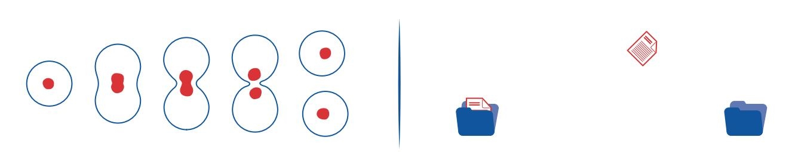
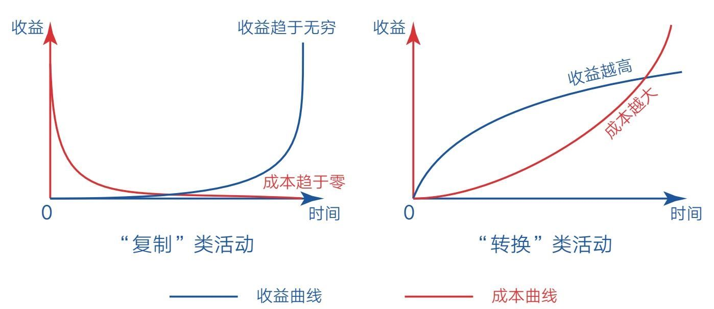
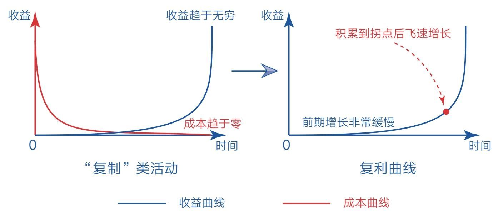
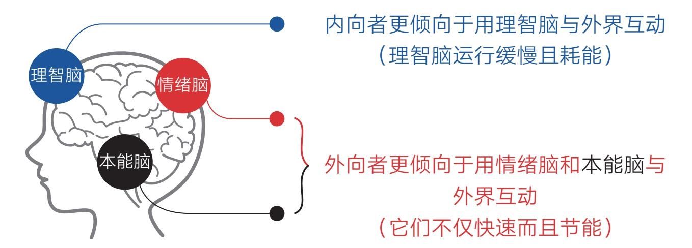

# 上篇　做成一件事的心法

## 第一章　价值——改变自己的关键是创造价值

### 第一节　复制：不要浪费生命给你的无限可能

- 36亿年前，地球出现生命。

- 20世纪40年代，第一台计算机诞生。

- 今天，人工智能已经走进我们的生活。

- 从某个角度来看，人类社会正由碳基文明向硅基文明跨越。

- 在漫长的碳基生命进化中，无论是单细胞生物还是有机生物体，生命若想得以延续，就必须不断复制自己——细胞分裂，旧细胞死亡，新细胞复制原有生物信息继续履行使命。巧的是，硅基生命得以存活的基本能力也是复制——人们每一次启动系统、打开软件、点开链接，本质上都是数据复制的过程，要么从硬盘加载到内存，要么从网络下载到终端（见图1-1）。

- 若是没有复制，生命和信息都将失去活力，只能像水那样，要么凝固成冰，要么蒸发为水汽，从一种形态转换成另一种形态。

- 事实上，“复制”和“转换”就是大自然的两种基本存在形式，但“复制”的层级显然比“转换”要高，因为它赋予物种以灵性，并繁衍出不可思议的社会和文明。那么，这两种基本形式对我们个体成长又有什么启示呢？

看到不同的世界
- 人生的差异往往源于人们看待生活的不同视角。当你掌握了“复制”和“转换”这两个底层概念时，或许会看到一个不同的世界。

- 比如大家都知道梅兰芳是著名的京剧表演艺术家，但在中国京剧史上，他的艺术造诣未必是最高的，那为什么最被世人熟知的却是他呢？因为20世纪30年代留声机刚好开始普及，梅兰芳的声音得以被录制成唱片并复制流传到民间。而此前，再有名气的京剧大师也只能在有限的剧场里表演。

- 在更早之前，人们谋生的手段几乎只能采用“转换”的形式，裁缝做衣服、小贩卖烧饼、铁匠造农具……无一不是将自己有限的体力或时间转换为生活资料然后参与交换，做多少，是多少。只有为数不多的人，比如私塾先生、杂耍艺人，才能同时面对多人，花费一份时间，收获多份回报。

- 时至今日，这规律依旧适用。外卖小哥、货车司机、酒店大厨、公司白领……绝大多数人都在通过出售自己的时间来换取有限的收入。从这个角度看，公司经理和清洁工人这两个职业在性质上是一样的——虽然收入差距较大，但本质上都是在用自己的时间和技能换取相应的收益，做多少，是多少，哪天不做了，收益也就消失了。

- 而另一些职业的底层逻辑却与之完全不同。比如企业家、作家、发明家、程序员、歌手、演员等，从事这类职业的人有机会通过雇用他人或借助机器的力量对有价值的商品进行大量复制并销售出去，或将自己创造的优秀作品通过社交媒体平台（网络）无限地复制并传播出去，从而带来不可估量的收益。

- J.K.罗琳写了《哈利·波特》，周杰伦创作了诸多华语金曲，他们的作品时刻都在被复制、产生收益。流行天王迈克尔·杰克逊即使已经去世，他作品的版权收入依旧可以惠及家人。虽然这些名人的案例不具普遍性，但这种强烈对比有助于我们看清表象背后的本质，让自己对这个世界多一分理解。

“复制”可以带来无限可能
- “转换”和“复制”的最大区别在于边际成本不同——“转换”的边际成本越来越高，“复制”的边际成本越来越低。如果你不懂“边际成本”这个经济学术语也没有关系，看两个例子就会明白。

- 比如厨师就是“转换”类职业，他想得到更多收益就必须做更多菜，或进一步提高做菜的水平。换句话说，他必须投入更多的时间和精力才能得到更高的收入，一旦投入减少，收益就会下降。而作家是“复制”类职业，当他写出一篇高质量的文章之后便可以安心睡觉去了，而这篇文章在他睡觉的时候也会被复制、传播、赞赏。只要它有长久价值，那么即使今天没有产生收益，明天、后天也可能产生，甚至五年、十年后仍能产生收益，长期收益无法估量。

- 这种带有“复制”属性的生产活动，几乎做到了“一劳永逸”，因为它们只需一次投入，随着时间的推移，其成本微乎其微，而收益则源源不断（见图1-2）。就像周杰伦早期创作了很多经典歌曲，即使今后不再创作新的歌曲，其作品的收听和购买总量依旧会随着时间的推移而增长。

- 这就带来一种可能：终有一天，我们可以不再出售自己的时间就能产生收益，从而实现财富自由或人生自由，彻底解放自己。

- 所以一个有追求的大厨可能会这样做：①持续研发新的特色菜品，并凭借自己的“秘密配方”技术入股餐饮企业，允许连锁酒店复制自己的技术，享受股份分红，此后即使不亲自做菜也能产生足够多的收益；②制作易懂的特色做菜教程，将其发布到网上，供需要学习的人免费或付费观看，这样就可以在现有基础上产生更多的收益，如果个人品牌打造顺利，这份收益可能会超过自己做菜的收益，此时便意味着自己实现了初步的人生自由。

- 若再仔细观察，我们不难发现“复制”类活动的收益曲线和复利曲线非常一致（见图1-3）——前期增长缓慢，但只要持续积累价值，收益就能在到达拐点后飞速增长。

- 这就是我选择写作的原因之一（最主要的原因是想让自己头脑清晰，脱离混沌）：这种非线性增长的“复制”力量，可以让自己的人生产生无限可能。如果你也想开始写作，其实有这么一条理由就够了。

获得无限可能的关键在于价值
- 人类科技的发展，本质上都是对自身能力的提升。

- 飞机、高铁让人走得更快；雷达、望远镜让人看得更远；手机、电话让人听得更清；计算机让大脑转得更快；而互联网则让人的“复制”能力得到极大的扩展。

- 如今，虽然不是人人都有雇用他人（机器）进行产品复制的机会，但每个人都有创造并复制自己作品的机会——只要敲起键盘写文章，打开手机拍视频，谁都可以发布自己的作品。

- 然而，并非所有的“复制”类活动都具有无限可能，因为“复制”只是一种渠道，获得无限可能的关键依旧在于价值。如果我们生产的作品是肤浅的、低价值的、博人眼球的，那它们可能会在短时间内爆发一下，但必定无法长久流传。这也是为什么网络时代出现了信息爆炸而没有出现知识爆炸，因为真正有价值的内容依旧稀缺，所以要想获得无限可能，“复制”和“价值”缺一不可，且价值越高，可能性越大。如果你对自己的人生有追求，那就应该激励自己去创造“可复制的价值”。

- 当然，现实生活中我们每个人一开始都只能通过“转换”类技能来维持自己的生活，但若你的眼光足够长远，就应该尽早储备并打磨一项“复制”类技能，让自己逐渐摆脱生活的引力，获取人生自由。

- 在这个幸运的时代，只要你愿意，随时可以踏上“复制”之旅，但请一定坚守价值并保持耐心，因为机会终将属于那些“看得清且做得到”的人。

- 每个人都有机会，不要浪费生命给你的无限可能！

### 第二节　价值：用价值规律看问题，你的人生会发生巨变

- 2017年7月，我从零开始公开写作；2020年9月，我出版了自己的第一本书《认知觉醒》。这对于我这样一个没有特别天赋、特殊资源和巧妙捷径的普通人来说，算是一个可喜的里程碑了。[1]在不到3年的时间里，写作确实给我带来了巨大的变化，不夸张地说，我在这期间的成长提升不亚于前三十几年的总和。

- 然而，有一个问题却一直萦绕在我的心头：这世上投身写作的人那么多，为什么最终获得一定影响力的只是少数呢？回想当初和我一起练习写作的伙伴们，大多数早已放弃，少部分虽然还在坚持却始终反响平平，这背后的原因又是什么呢？我想除了运气，还有一个不可忽视的因素，那就是价值。

- “价值”这两个字值得我们每一个人思考并牢记，因为当你把写作替换成任何自己想做成的事情时，这个道理同样成立。所以如果我们能把“价值”这个概念彻底想清楚，就有可能让自己的人生发生巨变。为了实现这一目标，现在我就以写作为例，向你阐释这条人人都可以借鉴的成长之道。

- 我能得到这个重要的启示归功于两次好运。

改变自己的关键是创造价值
- 第一次好运发生在2016年5月，那时我初读了李笑来的《把时间当作朋友》，其中的“交换才是硬道理”这一节触动了我，它让我联想起以前在课本中学过的“价值规律”，即商品生产好之后要以价值量为基础实行等价交换。看着这个耳熟能详的价值规律，我突然灵光一闪，悟到一个关键认知：改变自己的关键是创造价值。

- 这个结论不难理解：因为只有当自身创造的价值足够大时，我们才能被别人强烈需要，才能参与到更大的社会交换中去，并得到对方对等的回馈。想想看，如果你什么都不是、什么都不会、什么都没有，人家凭什么关注你、支持你、为你主动调用社会资源？所以成长的目的就是创造价值，在帮助他人的过程中成就自己，而且你创造的价值必须是长久的，因为越长久，价值就越大。

- 这个道理放在写作上也是一样的。我们必须想办法生产有长久价值的文章，创造对自己和他人长久有用的思考，摒弃一切不具备长久价值的内容。于是我自然选择了这样的策略：力求每篇文章都追求底层、不碰热点、不说个人碎碎念，砍掉浮夸的表情、无意义的插图及一切与主题无关的东西；同时力求每篇文章都能解决一个实际问题或改变一个观念，而不是让人情绪高涨一下之后就归于沉寂了。

- 更重要的是，每次提笔时我都要问自己这样一个问题：这篇文章在三年、五年甚至十年后再看还有价值吗？如果没有，那就没必要写了。

- 仅这一问，就能消除一切浮躁的动机。

- 事实上，生活中的每一个选择都可以用“三五年之后还能产生影响”这个标准来衡量。比如面对滚滚的信息洪流，我们就可以用它来约束自己的注意力：一篇公众号文章、一本书或是一部电视剧三五年后是否仍对自己有积极正面的影响？如果有，就值得花时间去看；如果没有，就可以考虑舍弃，不管它们看起来多么有道理、多么有趣。

- 事实证明这个选择是对的。如果我的文章没有长久价值，就不会得到《人民日报》的转载，也就不会吸引读者来咨询和求助，自然也不会有现在这本书。我能从零突围，不是因为写博人眼球的标题，也不是蹭新闻热点的流量，更不是炖煮煽动情绪的鸡汤，而是扎扎实实地生产了有长久价值的内容。这些内容抓住了读者的痛点，满足了读者的需求，最终换来了读者的关注和支持。

- 生产对别人有用的东西永远是写作的指南针，其他事情亦是如此，价值交换规律放在哪里都会起作用。比如在寻找目标这件事上，很多读者会在咨询的时候说：我想变得很有钱；我要成为一个很厉害的人；我想成为学霸；我要养成5点起床的习惯……仔细琢磨这些话，我们会发现其中隐藏着一个思维误区，那就是人们往往只单方面看到自己想要的，却忽略了自己能给的。

- 绝大多数人在确立目标时都采用“我想要”的思维模式，因为说出“我想要什么”很容易，而且这种“利己思维”驱使下的目标往往很多、很大，很容易让人陷入不切实际或急于求成的境地。所以只要我问：“那你能给予别人什么呢？”对方马上就会陷入沉默，然后幽幽地说：“好像确实没什么能给予别人的，就算是养成一个习惯，也难保自己能付出那样的行动。”

- 再想想那些我们愿意主动关注的人吧，他们是不是都在某一领域有自己独特的价值呢？因为这些价值可能对我们有用，所以我们愿意关注他们，和他们保持联系，甚至愿意付费支持他们。

- 这就是这个世界的基本规律之一。即使换作是你，结果也是一样的。只要你自己有独特的价值，且价值能够呈现出来、被他人强烈需要，别人就会关注你、支持你、给你反馈，进而与你产生密切的联系，愿意把自己的资源给你调用，最终你会发现之前你想要的一切都会自然来到你的身边。所以“利他就是利己”这句话真不是什么鸡汤，而是这个世界无比真实的运行规律，谁能早一天正视它，谁就能从中受益。

- 一旦我们把视角从“我想要”转到“我能给”的时候，很多浮躁、妄念就会马上消失；当我们开始思考做什么事能够给别人带去长久价值的时候，就会看到一个新天地；当我们开始想办法把自己打磨得更有价值的时候，就能在浮躁的人群中稳住自己、默默前行，去等待那束亮光出现。

- 当然，走价值积累之路是需要保持耐心和远见的，因为价值的产生需要过程，一旦你选定了价值之路，就要消除自我怀疑，保持坚定。

- 2018年8月，我听了国内流程管理专家金国华的一次分享，其中一句话我至今记忆犹新，他说：“对的东西，你就坚持，不需要想清楚。只要这件事情是有好处的，对别人、对自己有价值，有贡献和产出，你就坚持。人生所有的付出和经历，都会在未来的某一刻给你回报。”

- 价值积累之路就是这样，刚开始的时候不一定看得清结果，但只要牢牢盯住“价值”这个方向往前走，我们就不用担心自己会走偏。

- 所以在我看来，写作、成长和成功其实是一回事：写作就是生产有价值的内容，成长就是做一个有价值的人，而成功就是我们能为这个社会做出的贡献。究其根本，它们都遵循价值交换规律。

用知识为价值加码
- 第二次好运得益于我在写作初期上的一次写作课。课上，我接触到了“顶级信息论”和“10万：1千的输入输出比”这两个观点，它们让我直接从“经验写作”跳到了“知识写作”的层次上。

- 其实，对一个成熟的写作者来说，这两个观点再正常不过了，但对当时刚开始写作的我来说冲击非常大。因为那时的我和很多写作者一样，完全靠自己的经验码字，文章里充斥着个人的日常感想和感受。这样的文章固然容易写，但往往很局限，也没有长久价值，而且受个人经历限制，时间一长就会觉得没东西可写。

- 不过，一旦有大量的顶级信息输入就不一样了。顶级的知识可以给我们带来底层的认知、广阔的视角、丰富的素材和独特的关联，让我每次都可以用不同的知识或故事来开场，而无须用“我有一个朋友……”来开头。经常用“不知名的朋友”的案例就会显得狭窄，可信度也不高，况且经验这东西很容易枯竭，但知识不会。

- 这就解决了我素材来源和写作层次的问题，所以我经常把这堂课喻为自己的写作基因塑造课。有了这样的基因支撑，我便开始大量阅读、输入，用知识为价值加码，先后归纳并实践了刻意练习和深度学习等成长方法论，这些方法论又反哺了自己，让我开始有意识地在舒适区边缘持续打磨作品。这种循环一旦开启，文章的深度和价值便开始飞速提升，所以尽管这几年我的文章总数不是很多，但建立的影响力却比较扎实。

- 再看网上的众多文章，我们会发现它们的作者依旧缺乏价值意识。他们虽然长期坚持输出，但内容多是围绕热点事件发表见解、记录自己的生活感受，或是罗列一本书的知识要点。这样的内容通常谈不上有什么长久价值或深度价值，同质化严重，很容易被他人替代，所以即使他们每天更新、日日产出，也无法被别人强烈需要、无法参与更大的价值交换，于是就成了那些“很努力却总是看不到希望”的人。

- 这也是我们要不断学习“新知”的原因，因为“新知”永远是增加价值的有效砝码。如果我们缺少这种理念，就只能用浅薄的经验和盲目的毅力去努力，很难获取独特的能力和价值优势。所以无论我们在什么行业、什么领域、什么岗位，想要胜出，就要在心中打下这样的烙印：愿意并舍得在学习新知上投入大量资源。

永远走价值积累之路
- 无论你在哪个行业、做什么事情，价值交换规律无处不在，只要有意识地遵循这一规律，你的人生就可能发生巨变。当然，对个体成长而言，不管什么时候，我总是鼓励人们去写作，因为无论从哪个方面看，写作都是一个有百利而无一害且适用于每一个普通人的技能。

- 首先，一个人要想真正提升自己，输入和输出势必形成闭环，如果一味地满足于输入，提升效果就会大打折扣。即便你没有造福他人的梦想，仅仅梳理自己也是极好的，它不仅能让你想清楚更多事情，还能让你保持情绪平和、提高表达能力，让你在生活和工作中胜人一筹。

- 其次，如果你有造福他人的梦想，也希望创造自身的影响力，那写作就是成本最低、限制最小的途径。一台电脑、一根网线，就可以让自己行动起来。如果每次有益的思考都能通过文字把价值固化下来，再借助网络的复制力量完成扩散，你的人生就有可能酝酿出无限可能。

- 最后，文字是你在互联网上的另一张名片，任何人都可以通过它们随时认识你，这就好比自己有了“分身术”，一觉醒来就有可能收到意想不到的连接。不管你身处何种现实困境，你都能通过文字创造一个属于自己的王国，去连接一个全新的世界。当然，如果你的文字力量足够大，能够帮助很多人，那你就有机会得到无数的正反馈，这些反馈带来的成就和喜悦往往是我们在现实生活中接触不到的。

- 放眼世界，我们其实比以往任何一个时代的人都更需要类似写作这样的技能。因为随着人工智能技术的快速发展，很多重复劳动的“转换”类职业终将被机器取代，所以当人工智能崛起后，普通人又凭什么参与社会交换呢？

- 社会在巨变，但价值交换规律不变。

- 人工智能虽然让人类的一部分传统价值快速贬值，但人的认知能力依旧是技术无法替代的，而写作是磨炼这项能力的绝佳途径。目光长远的人，会尽力看向远方，并开始早早地布局，让自己靠近“价值金字塔”的顶部。

- 而本节的意义就是想告诉你，无论你选择写作还是其他，“价值产出”之路永远适合每一个人，无论何时都有效。

### 第三节　利他：毋庸置疑，利他是最好的人生

- 以前，一听到别人说“凡事要有利他之心”时，心里就会不自觉地泛起一股浓浓的鸡汤味，那感觉就像受到了强行说教。多年后才发现，这种未经审视的感觉和认知差点让自己错失个人成长中至关重要的力量。这力量强大且坚韧，缺少了它，我们人生的成就和幸福可能会大概率地被限制在某条水平线之下；而一旦拥有了它，我们便能解开那道限制人生可能性的“枷锁”，做成很多自己无法想象的事情。

- 这并非夸张，而是事实。很多人之所以感受不到这种事实，是因为他们只是简单地接受了“凡事要有利他之心”这一结论，并不真正清楚它的深层含义。所以即使他们脑子里知道这个道理，但心里并不真的认同，更别说发自内心地去实践了。如果你此刻在面对“利他”这个观念时仍有挥之不去的鸡汤感，那不妨听我细细拆解，好拂去你头上的这朵乌云。

利他的本质是爱
- 人们之所以不愿意真正地接受利他观念，是因为这个观念与我们的天性相违背。对于大脑来说，简单、直接、快速、确定的事情是它的最爱，而利己之事几乎满足上述所有条件。相对来说，利他之事通常需要先绕个弯儿。它需要我们先付出，甚至是无条件地付出，有时还要面临一些损失，忍受一些不安全感和不确定性。这会使大脑不自觉地产生抗拒，所以很多人即使知道这个道理也很难真正走出这一步。然而，利己之事让我们得到了眼前的好处，却让我们失去了更大、更长久的好处——力量！

- 这么说或许会让人有些费解，不过，看几个简单的例子你就会明白。比如我们常说：为母则刚。为什么呢？因为当我们成为父母的时候，就会天然地对孩子有责任感、有保护欲。在为人父母之前，我们可能看到一只蟑螂都会吓得跳起来；但在成为父母之后，我们也许能冲向一辆飞奔而来的汽车，把孩子抱到一边。这种超越个人得失的爱就是一种强大的利他力量。

- 当然，有人会说孩子毕竟是自己生的，换作其他事情不一定行得通。其实不然。20世纪80年代，稻盛和夫为了参与日本通信市场的竞争，每晚临睡时都会问自己：“你参与通信事业，真的是为了国民的利益吗？没有为公司、为个人的私心吗？是不是想出风头、要引人注目呢？你的动机真的纯粹吗？没有一丝杂念吗？”如此反复自问自答，不断审视自己的动机是否至真至纯。经过整整半年，他终于确信自己心中没有一丝一毫的杂念，才着手建立DDI公司，与当时几乎处于垄断地位的NTT公司展开竞争，最终在蚁象之战中，爆发出惊人的力量，使公司业绩出人意料地快速攀升，形成与NTT分庭抗礼之势。如果用一个词来描述这种毫不掺杂私心，全心为国民谋福利、做贡献的利他态度，那就是无欲则刚。

- 这里的“欲”，当然是指个人私欲，这种私欲本身没有什么不对，它是我们个人成长进步及办企业、做事业的原生动力。但如果没有超越私欲的利他力量，我们就会在遇到重大选择时变得目光短浅，患得患失，因而变得软弱无力，无法做出真正正确的决策，最终使个人或企业发展受限，甚至陷入困境。而一个人要是能放弃自己的小九九，能发自内心地为社会发展、为人民福祉去做事，他就会真的充满力量，完成难以达成的任务。正如任正非先生在2019年1月接受采访时所说：“我们不是上市公司，不是为了财务报表，我们是为了实现人类理想而努力奋斗。”可见华为的企业动机里有心怀天下的利他思想，这种思想也是其排除万难的力量支撑。

- 这也是革命先烈们不怕牺牲的原因，他们心里装着人民和国家。正因为爱得深沉，所以当家园遭遇灾难时，他们拼了命也要去拯救、去保护。而那些贪生怕死之徒就缺乏这样的力量，他们的目光只局限于自身，甚至只关注个人的荣华与安逸。

- 如今我们生活在和平年代，很少会遇到像革命先辈那样需要牺牲自己生命的时候，但利他心同样是我们最大力量的来源。因此，当我们遇到困难想要放弃时，当我们陷入困境感到无力时，不妨静下心来问问自己：是不是因为做这件事情的出发点不够高尚？是不是因为过于在意个人的得失？是不是太希望自己能凌驾于他人之上……有了利他力量的加持，我们会在不知不觉中拥有他人所称的“格局”。

- 所以，利他的本质是爱，它的力量取决于我们对自己、对他人，以及对这个世界爱得有多深、爱得有多广。无论是“为母则刚”，还是“无欲则刚”，实际上都是因为情怀和胸襟超越了个人、小团队，是一种面向大集体的爱。有了爱，我们才能得到真正的幸福和成就。正如岸见一郎在《被讨厌的勇气》中说的：“幸福即贡献感。”也如稻盛和夫在《心》中说的：“一切成功都归结于利他之心”。世间的幸福之法和成事之法，无不如此！

利他的结果是利己
- 我的写作之路也因此而受益。

- 起初，我也强烈地希望自己能够写出“10万+”（一篇文章的阅读量超过10万次），能够一夜成名，甚至快速变现。这种纯粹的利己思想让我很快地拿起了笔，但也让我在现实的打击下很快就想要放弃。如今我就要出版第二本书了，这在很大程度上得益于自己写作心态的转变。因为我逐渐意识到，自己写作根本不是为了个人的名声和收益，而是为了改变自己并影响他人。

- 有了这样的使命感后，我便开始远离热点、静心阅读、用心关联、持续打磨，力争用最底层的知识和简单易懂的表述去驱动读者更新认知。所以即使文章更新的周期很长，我也能不慌不忙地往前走；即使没有写出“10万+”，我也能承受持续的冷寂。虽然我还没能完全证明未来的前景，但我坚信，只要心里装着读者，始终坚持输出对大家长久有用的内容，就一定能厚积薄发，达成所愿。

- 除此之外，我还做了另一件让人不太理解的事。

- 2018年5月，我在公众号开通了问答专栏，免费向读者提供成长咨询服务。很多读者都不敢相信我愿意花时间帮助他们，而且不收取任何费用，以致很多人在咨询结束后都忍不住问我这样的问题：“为什么你愿意花时间无条件地为一个陌生人答疑解惑呢？”

- 的确，一开始我也不确定这样做是不是自讨苦吃，但我坚持认为只要是有利于读者成长和改变的事，就值得投入精力去做。事后证明这个选择是对的，甚至可以说，这是那一年我在写作方面做得最正确的一件事，因为表面上看是我在单方面付出，实际上受益最大的人是我自己。

- 通过一对一的交流，我竟无意中拥有了大量接触困惑样本的机会，掌握了大家在成长路上的第一手真实需求。这直接打破了自己闭门造车的学习状态，使所学的理论和最真实的需求产生了奇妙的“化学反应”。所以我后来写的文章常常能在保持理论高度的同时击中读者的痛点，还能提供切实可行的操作方法；另外，持续的问答也提高了我解决实际问题和复杂问题的能力。

- 从这个角度看，利他的结果就是利己，那些不带功利心的付出，最后都会通过某种形式加倍返还。窥一斑而知全豹，我想在其他领域也是如此。

利他的途径是创造价值
- 人们不愿意践行利他观念的另一个原因是误把牺牲和讨好当成利他，以致得到的反馈和体验极其不好。最典型的表现就是无原则地对他人好或是有目的地付出，比如亲子关系中的溺爱、情侣关系中的讨好都是如此。

- 这样的认识是不准确的，事实上，利他的正确姿势不是无端付出，而是努力成为一个有价值的人。我们需要通过自身的能力或价值去影响他人、服务他人，而不是试图用某种条件去取悦或控制他人。

- 所以，利他不是盲目地牺牲自己，也不是刻意地讨好他人。正如父母在保护孩子人身安全的同时，也要不断修炼自己，给孩子做好榜样，这才是真正的爱；情侣在关爱对方的同时，也要不断提升自己，用自身的优秀去带动对方同步成长，这才是健康的爱。

- 这一道理放在其他事情上也是一样的，我们既要有利他之心，也要有利他之力，二者缺一不可。

利他从接纳利己开始
- 毋庸置疑，利他是最好的人生信念。但我知道你心中还有一个顾虑，那就是担心自己不可能成为一个毫无私心的人：“如果不小心回到了利己的状态或暂时达不到利他的层次，那自己就成了表里不一的人，这样会让人看不起。”

- 关于这一点，我们其实完全不用担心，因为利他与利己原本就不是非黑即白的二元对立关系。毕竟利己是人的本性，而利他是一种超越，我们不需要在拥有一个的同时将另一个消灭，我们可以兼而有之。

- 更好的成长者不会刻意抹杀自己的本性，而会主动接纳它，因为只有接纳了利己，我们才能坦然地向它告别。回避和自我欺骗只会削弱我们的力量。

- 所以，即使暂时做不到也没关系，坦然接受就好了，重要的是做真实的自己。只要你心中埋下了利他的种子，剩下的就交给时间，让它自己生根发芽。在这个过程中，我们可以用积极的思考和行动去“施肥浇水”，但不要急于求成。毕竟，像稻盛和夫这样有道德修养的人也得花上半年多的时间才能消除自己心中的利己欲望呢！

- 不要纠结于自己能不能真正做到利他，哪怕暂时退却也无妨。重要的是，我们一直在利他的道路上前进，从未放弃！

### 第四节　镜子：所有的社交都是一面镜子

- 一位读者发现了我的公众号，如获至宝。他兴冲冲地给我留言并向我致谢，同时还表示要把“清脑”分享给他的朋友，希望更多人能受益。我当即表示感谢——对于一个几乎从来不主动推广的公众号来说，有人愿意主动将其分享给他人，那必然是发自内心的。

- 可惜好景不长，没过几天他又来留言了，但这次不是来感谢的，而是来“诉说愤怒”的。他说：“我的好朋友每天熬夜打游戏，平时不看书不成长，没有生活目标。我知道你的文章对他有用，所以强烈推荐给他，结果却被他嗤之以鼻，真是气死了！”然后他问我该怎么办。

- 我说：“想让对方听你的劝，最好的方式不是语言，而是你自己真的变好，而且比现在好很多、比他好很多，那时你的话才有分量。因为更好的建议不是劝说，而是影响。”

更好的建议不是劝说，而是影响
- 在很多人听来，这句话几乎等于没说。不就是“身教大于言传”的道理吗？谁不知道呢！可正因为太浅显，有些人反而视而不见，所以总是被现实问题所困。

- 比如一些年轻的读者就经常因自己的另一半不思进取而苦恼。他们自己有了觉悟，便见不得对方浑噩，忍受不了对方把时间浪费在电视、手机、闲聊、购物上。于是苦口婆心地劝告，但就是得不到对方的回应。这种“恨铁不成钢”的心情真让人抓狂，毕竟那是自己最亲密的人啊。

- 我也曾被读者戳心地问到这个问题：你会要求自己的爱人和你一样学习提升吗？说实话，在这个问题上我犯过同样的错误。在开始写作之前，我几乎从不主动学习；尝试写作之后我开始接触大量的学习资源，觉得时间宝贵，人生不应该虚度，于是把购买的网课、优质书籍悉数推荐给了她，希望她少追剧多阅读，少浪费时间多提升自己。至于结果，你能猜到——我碰了一鼻子灰。

- 现在回头想，一切都很明了：我认为自己是在帮助她，而在她眼里，我大概就是一个夸夸其谈的知识搬运者，道理一大箩筐，成天说这个好、那个好，就是没见有什么变化，一看就是眼高手低的家伙……在婚姻生活中，用自己的意愿强行改变对方本来就是大忌，特别是在自己还不怎么样的时候。于是我选择了闭嘴，决定先做到再说。

- 我开始默默地坚持早起、跑步，身体和精力变得越来越好；我把学到的知识重新写出来，发现不仅自己理解得更深刻了，还帮助了很多人；在生活中，我变得更加体察、包容，成了家庭情绪稳定的基石；通过输出深度文章和接受问答咨询，我建立了个人影响力；新书出版后，知识变现也成了现实。这一切都是做到和改变的力量，我自己能感受到，相信她也能感受到。

- 就这样，情况开始慢慢转变。她不再厌烦我早起，自己也开始持续锻炼，虽然时间是在晚上；她开始盯上我的书柜，有事没事就来拿一两本书去翻看；她会和我讨论一些有意思的知识，还在我写完文章后主动帮我校对、提建议；她会更多地承担家务和辅导孩子，为的是给我腾出阅读和写作的时间。尽管我不再开口劝说，但她反而开始改变了。更令人惊喜的是，女儿的阅读习惯也在我们共同营造的氛围中得以培养，无论在车上、床上，还是沙发上，就算没人提醒，她自己也会捧本书翻。看来“身教大于言传”真是不假，自己做好了，自然就形成了潜移默化影响他人的环境。

- 光动嘴皮子，显然没有说服力，所以我现在很少死命劝人了，我会尽量做给他们看。慢慢地，一些人开始重视我的意见，一些人甚至主动向我请教。后来我读到李笑来的一篇文章《成为能说那话的人》，文中的观点正好印证了自己的体会：同样的话从你和牛人的嘴里说出来，效果就是不一样，这显然不取决于对或不对，而取决于说话的那个人是谁！

- 大多数人的判断逻辑都是如此，所以劝朋友或给别人建议是必要的，但如果人家不听，也不要纠结，这不是人家在反驳你或反对你，这只是一面镜子，告诉你自己还不够强大（当然，对方也可能存在认知局限）。

- 此时，更好的策略是埋头努力，默默改变。直到有一天，即使你不说话，也有人会主动征求你的意见。

更好的关系不是付出，而是吸引
- 经常接受咨询，我不免要听一些年轻人诉说他们不幸的情感经历，最常见的情形莫过于A为了得到或留住B而不断地示好或付出。他们有的人巴结讨好，有的人忍气吞声，有的人省吃俭用，有的人包揽家务，有的人放弃梦想，有的人远离朋友……他们以为付出自己的所有就能感动对方，让对方以同样的方式对待自己。然而总是事与愿违，他们越付出越被动，越付出越心累。

- 这背后的逻辑不难梳理：当你手里只有“付出”这一张感情牌时，就只能单方面地透支自己了，而透支自己的后果便是令自己失去吸引力；一旦失去吸引力，就会陷入继续付出的恶性循环，无论你面对的是家人、朋友还是伴侣。

- 开玩笑来说，人与人之间的交往犹如打牌，能供人选择的无非是“付出牌”和“吸引牌”，它们分别代表“付出型社交”和“吸引型社交”。可惜我们的直觉往往只能看到“付出牌”，因为这张牌不仅明显，而且简单易取；只有少数人能看到另一张抽象且相对难拿的“吸引牌”，当他们把两张牌都抓在手上的时候，就会占据上风。

- 打“付出牌”的人通常是有所求的，所以他们在与人交往的时候会有很强的付出心态，而这种心态往往会让自己感到痛苦，让他人感到沉重。不仅如此，一味付出让他们少有心思和精力去完善自己、提升自己。

- 而打“吸引牌”的人则完全不同，因为他首先得保证自己是完善的、有魅力的、对外无所求的，所以与他人相处时，即使打出了“付出牌”，他们也不会对这份付出附带任何条件。与这样的人相处，人们必定感到更轻松、更愉快，自然也就愿意主动靠近了。

- 擅打组合牌的人往往会在条件允许的情况下，尽可能先把目光聚焦到自己身上，他们会维护自己的形象，增加自己的学识，提升自己的智慧，稳定自己的情绪，丰富自己的爱好，结交理想的朋友，追逐自己的梦想……这样就可以始终向别人传达自己的魅力和自信，让喜欢的人主动靠近。

- 可见，如果自己始终处在单方面过度付出而得不到别人回应的状态，这并非说明别人对你不好，这只是一面镜子，告诉你自己还不够完善（当然，对方也有可能是一个不识好歹的人）。

- 此时更好的策略是立足长远，努力改变。总会有一天，即使你不付出，也会有人愿意主动靠近你。

更好的对待不是要求，而是成为
- 类似的咨询还有很多，比如一些人总觉得父母、同学、朋友、领导、同事、恋人，甚至自己的孩子，对自己不够尊重——要么轻视，要么取笑，要么捉弄，要么不恭……

- 这背后的原因大同小异：从短期看，是对方的素质和修养不够高；从长期看，是自身的能力和表现还不够好。因为所有的社交都是一面镜子，外界如何给你反馈，根源在于自身长期的综合表现。比如你平时的言行都很“幼稚”，成天发可爱的表情包，那别人是很难对你严肃的；如果你成年后依旧生活懒散，遇事逃避，周围人也不会尊重你；而在公司里，你若总是不及他人或常常惹是生非，领导和同事怎么会给你好脸色呢？

- 在遭遇他人不友好的对待时，我们可以发出自己的声音，要求对方注意并改变，但是别忘了，他们都是自己的镜子。与其要求对方改变，不如让自己真正成为心中期待的那个人，那个人强大、友好、睿智、有担当，是你自己遇到后也会心生欢喜或敬仰，愿意主动靠近的人。

- 作家特雷西·麦克米伦在2014年2月做过一次名为“想拥有完美的婚姻，请先拥有完整的自己”的TED演讲。她用自己三次失败的婚姻经历换来一个非常珍贵的思考角度：在和别人结婚之前，不妨先和自己“结一次婚”。不管你是男是女、已婚未婚，都可以给自己做一次这样的假设：你愿意和自己这样的人共度一生吗？无论贫穷、疾病也不离不弃？（事实上，和自己结婚，也只能不离不弃。）你喜欢自己的外在表现吗？喜欢自己的言行举止吗？喜欢自己的能力和上进心吗？喜欢自己对未来的追求吗？如果你对自己尚不满意，就不要指望别人会尊敬和喜欢你了。

- “和自己结一次婚”真是一个绝佳的视角，它就像立在门口的一面镜子，让自己在每次出门之前先自我审视一番，防止邋遢示人而不自知。你现在肯定知道这并不是什么新奇的招数，而是非常高级的元认知。

想要更好，请停止追逐
- 尽管本节极力倡导诸位关注“影响、吸引、成为”这条路径，但我并不排斥“劝说、付出、要求”这些选项。因为这个世界是多维的，从来不止二元对立，习惯只取一端的人往往会走向绝对化，让自己失去正确性的同时也失去灵活性。所以即使你并不了解什么是“批判性思维”，也可以用“视情而定”这样的句式让自己变得更智慧。

- 比如你可以这样向他人介绍本节的观点：“影响、吸引、成为”虽然更为正确，但“劝说、付出、要求”在特定情况下也是必要的。就像1999年的时候，马云先生也在杭州湖畔花园的家中极力劝说另外17个人集资50万元，共同创立阿里巴巴。如今他再也不需要像当年那样去劝说人家才能成事了，因为他已经完成了转变。学会这样的表述，十有八九不会出现纰漏，还会促进自己双向思考。

- 所以在现实生活中，我们也要视情而定：在该劝说的时候极力劝说，在该付出的时候尽情付出，在该要求的时候勇敢要求，同时不要忘记立足长远，让自己真正成为一个“有价值、可影响、能吸引”的人。

- 正如查理·芒格说的，想要得到一样东西，最好的方法是让自己配得上它。

- 以前似懂非懂，现在终于明白了。

### 第五节　内向：被动社交，内向成长者的制胜之道

- 这个世界好像越来越喧嚣了。

- 似乎只要点开屏幕，就能看到各种面孔对你说：“在这个时代，你一定要学会在众人面前销售自己，要敢于表达、主动连接，要拉得下脸，否则你会错失各种人生机遇，活得默默无闻……”所以，他们鼓励你走到台前去分享、去演说，以提高自己的知名度；他们推荐你日更文章（视频）、与读者（观众）保持情感联系；他们告诉你微信视频号的第一条应该说“你要关注我的N个理由”；他们提醒你在短视频的最后告诉观众“记得双击、分享，爱你么么哒……”

- 于是满世界的信息似乎都充斥着这种套路，好像你不跟着做就会落伍一样。这让很多人焦虑不已，特别是那些天生内向、不善言辞和表达的人，因为这些对他人显得极为平常且轻松的事，换到自己身上就会变得异常难受和别扭。不用折腾多久，自己就会感到精疲力竭，内心也像被掏空了一样。

- 但为了不被时代淘汰，他们依然鼓足勇气，冲进“拥挤的潮水中努力游动”，美其名曰挑战自己、突破自己。然而，这样做似乎并不能真正缓解焦虑，因为同质化的内容实在太多了。在众人自我叫卖的时候，自己那点不够自然和自信的声音依然显得默默无闻。

- 如果你正在遭遇这种尴尬，那不妨在此刻停下来想一想：做成一件事，真的必须这样扯着嗓子主动叫卖吗？

- 事实上，我们根本无须在“主动社交”这条路上挤得头破血流，因为这个世界上还有很多条通往成功的路。比如与之相反的“被动社交”这条路就非常好走，它不仅畅通不拥挤、安静不焦虑，而且还特别适合那些不擅长即时表达的内向成长者。不信的话，我们可以看看一位与众不同的“网红”——李子柒。

被动社交——用作品替自己说话
- 如果你看过李子柒的作品，就知道她从不在视频中和观众对话，也不会为了讨好观众而保持日更，更不会在视频的最后求大家点赞、关注和转发。她只是专注于作品本身，在视频里尽情地演绎自己，甚至为了拍好一个视频，她要经历春夏秋冬一整年的准备。“蹊跷”的是，这种冷淡的风格却让她火遍全球，使她不仅获得了可观的财富，也收获了独一无二的个人影响力。

- 这背后的原因很简单，那就是她只用作品说话。她的作品不仅精致有特色、清新不浮躁，而且还有长远价值，就算几十年后再看，依然可以成为中国乡村理想生活的代言。如今，她最不担心的就是缺少外界的关注和联系，要操心的反而是对海量的合作请求进行筛选。

- 这就是所谓的“被动社交”——通过产出独一无二的、具有长久价值的作品或产品来与这个世界保持连接。如此，就算创作者自身不善言辞，也同样可以让自己产生强大的社交吸引力，因为他可以让作品代替自己说话。而有价值的作品，特别是精心打磨的作品所产生的影响力要远远超过个人在台面上的高声叫卖。

扬长避短——内向者更有创造优势
- 选择“被动社交”战略的人并非少数，比如25岁就成为百度副总裁的李叫兽在成名前就思考过这个问题。他知道自己不是一个善于交际的人，但工作中又需要人际关系和影响力，于是他梳理了获取人际关系和影响力的两种方式：一是通过不断地与人交流，建立情感联系；二是通过知识或能力的吸引，让别人想认识自己。

- 通过梳理，他果断选择了“被动社交”战略，即通过公众号，每周输出一篇高质量的营销干货文章，专注于知识领域的创造。通过上述做法，他很快收获了50万读者，在营销圈打造了强大的个人品牌，最终拥有的人际网络和资源，远远超过很多社交能力比他强的人。

- 再比如《5分钟商学院》的作者刘润也很推崇这种“自管花开”的行为模式，他说：“你可以把自己想象成一朵花，我们只管这朵花开得漂亮，只想散发自己的光、热和香气。如果在覆盖范围之内，有人感受到了，那真是幸运，他就有机会成为我们的客户或者合作伙伴了。我们不愿意拿着手电筒去找客户，也不想着去说服别人，如果发现这个人竟然还要被说服，那就只能证明这朵花散发的光和热还不够。那没事儿，我继续努力，继续发光发热，争取我的光和热有一天能够覆盖到他。”

- 可见，采用被动社交的人同样可以获得成功。他们这样做并非出于无奈，相反，这是一个非常明智和正确的选择。因为内向成长者的生理特点决定了他们更擅长与事物而非与人物打交道。

- 科学研究证明，内向者与外向者在生理机能上有显著的差别。比如，内向者头脑中的血液流动路线更长、更复杂，犹如很多蜿蜒的路径，因为他们的血液聚集在离脑干更远的前额叶和布洛卡区——负责计划、思考和语言处理的区域，而外向者头脑中的血液聚集在离脑干更近的负责感官印象和感知情绪的区域。

- 换句话说，内向者更倾向于使用理智脑与外界互动，而外向者更倾向于用本能脑和情绪脑与外界互动。

- 如图1-4所示。由于理智脑运行时非常缓慢且耗能，所以内向者与外界互动时往往反应迟钝，且社交之后需要更多的时间和空间才能恢复能量——这也是内向者通常不喜欢社交的原因。而本能脑和情绪脑正好相反，它们与外界互动时反应快速且不容易疲惫，甚至还能从社交中获得能量。

- 另外，内向者与外向者体内的神经递质分泌也有所不同。内向者体内的乙酰胆碱分泌通常比较活跃。乙酰胆碱是一种帮助集中精力、提升逻辑思维能力和记忆力的神经递质，它会抑制我们的行为系统，让我们安静下来，以此来丰富我们的能量储备。而外向者体内的多巴胺分泌通常更加活跃。多巴胺是一种传递兴奋、愉悦、开心的神经递质，它会激活我们的行为系统，使人充满精力。因此，比起外向者，内向者更容易看到事物的全局，行为也更为审慎。但由此带来的副作用便是，他们在与人交往时往往需要更长的时间才能找到合适的措辞，也更容易感到疲惫。所以，内向者的总体优势体现在他们更加擅长与事物打交道，面对静态事物时，他们更理性、更有创造力，也更加关注事物的根本——这可能也是很多内向者不太合群的原因之一，因为习惯关注根本的人会觉得普通的闲聊太肤浅、没有意义，他们与人交流时不知道说什么好。

- 综上可知，内向成长者虽然在社交上不具优势，但在创造上更具潜力，所以专注创造并用创造的价值来吸引外界与之连接，往往是他们更具优势的人生赛道。如果你了解以上知识，或许会主动扬长避短，切换到更适合自己的人生赛道上来。

长期主义——价值创造的必经之路
- 我自己就是一个偏内向的人，平日里不善言辞，同步沟通能力勉强及格，但开始写作后，我便不自觉地走上了“被动社交”的道路。因为我发现，通过生产有思想的文字来表达自己更容易获取成就与优势，而且这种“异步”沟通的方式让我很放松、很愉悦，也是我所擅长的。

- 事实上，公众号刚开始有起色的时候，我也尝试过向各大平台主动投稿，以此来提升自己的知名度。但这种“主动求关注”的方式让我十分疲惫。因为每写一篇文章我都要另外准备好几个版本，同时还要联系平台、介绍自己、等待回应、忍受拒绝，即使谈妥了，也还要按照平台要求修改内容……几次尝试之后，我发现这种方式不仅会消耗自己大量的精力，而且会让自己的写作风格变得越来越浮躁，推广效果也不见得好。于是我果断放弃这种方式，并暗下决心：今后不再投稿，除非他人主动转载……

- 这种想法看上去有些清高，但的确让我开始摒弃浮躁、继续聚焦。此后，我把全部精力投入知识写作和价值写作，深度思考，精心打磨，不接广告，不搞互推，即使更新文章的周期很长，也要坚决保证文章的质量。当我放弃“主动求关注”的成长方式后，情况却发生了有趣的变化：

- ·转载文章的请求接踵而至，数百家自媒体申请了转载白名单；

- ·读者主动来联系，每天都会收到很多留言和感谢；

- ·结识了很多作者及其他领域的意见领袖；

- ·收到了多家出版社的出书邀请，出版了自己的书……

- 我用自己的经历再一次证明被动社交这条路的可行性，而这一切的发生，都是因为有扎实的作品为自己代言。

- 当然，走这条路需要我们做一个长期主义者，需要我们抵御短期利益的诱惑，忍受暂时不被外界关注的不安全感，牢牢盯住自己的价值和产出。虽然我们无法像李子柒或李叫兽那样在相对较短的时间内爆发，毕竟那需要更大的付出和运气，但相对来说，作为一个没有特殊资源的普通人，我获得如今的成长的速度已经算很快了。如果当初我一直在他人的赛道上跟风模仿，把精力都放在自己不擅长的向外连接上，想必我现在依旧是个默默无闻的焦虑写手。

- 所以那条看上去十分漫长的“被动社交”之路走起来其实并不慢，而且优质作品的价值积累效应还会加速这个过程，因为好的作品会自己“走路”。

价值稀缺——酒香不怕巷子深
- 好的作品确实会自己“走路”。

- 这句话成立的关键是这个作品要足够好。它要好到能让人眼前一亮，让人觉得醍醐灌顶、能传递极度的美，或对他人产生巨大的帮助，且有长久的生命力。这样的作品很难被外界模仿或代替，因此需要创作者持续专注、持续打磨，投入足够的精力和脑力。这对擅长与事物打交道的内向成长者来说是一个喜讯，因为他们更有可能通过创造优质作品来打造自己的“价值护城河”。事实上，无论是内向成长者还是外向成长者，要想获得真正的成就和影响力，最终都要过创造价值这一关。

- 当然，我们也不能自视清高，轻视主动传播的力量，但更好的传播一定发生在我们拥有足够多、足够好的作品或价值之后。所以，在自己还不够强大的时候，不要太担心自己没人关注，我们只需专注于自己的作品与价值就好了。当有一天，你能用作品惊艳众人的时候，“整个世界”都会向你投来目光、伸来双手。那时，无论是主动宣扬还是借助专业的传播力量，你都更有可能让自己的影响力产生裂变。

- 在现代竞争环境的影响下，大多数人已经不再信奉“酒香不怕巷子深”这句老话了，人们似乎都愿意跑到巷口主动招揽生意。这在商业上是行得通的，因为商业竞争非常激烈，商家需要主动出击、占据市场先机才能更好地活下去。但在个人成长领域，我依然认为这句老话更加可行。因为个人成长与商业发展的竞争模式不同，它有更大的时间宽容度和强烈的个人属性，它允许我们慢慢地变好，让我们不紧不慢地“雕刻”自己的作品。

- 同时，我们还应该具备这样的洞见：越是在传播手段发达的社会里，越要坚守价值。因为这个世界已经不缺乏传播途径了，但价值依旧稀缺！

- 想想看，在一个人人都拥有传播能力（每个人都可以发朋友圈、拍短视频）的世界里，大家最缺什么？

- 缺好东西！

- 只要是好东西，人们就愿意主动分享。

- 就像深山里有一处风雅之地被某个“网红”发现，他的分享便会引得无数人前来围观打卡。而现在很多“网红”的日常工作就是不断更换打卡地，分享更多好东西，借以维持自己的流量，但风雅之地一旦被曝光，它就可以持续引来客流，不再寂寞。

- 当然，风雅之地只是一个比喻，它代表某些天然或人工作品，只要自然或人为地建设它、改造它，它就可能成为一处名胜。如果你暂时无法成为像“网红”那样有魅力、有影响力的人，那就专注打造自己的作品和价值吧。毕竟容颜易老、魅力易逝，而由人创造的思想、价值和美却可以长期存在。

- 等有一天，当你手握它们从幕后走到台前时，就算你缺少魅力、不善言辞，人们也会认认真真地听你说话。
