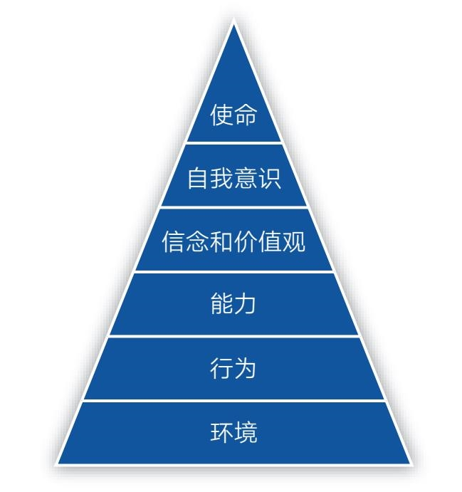
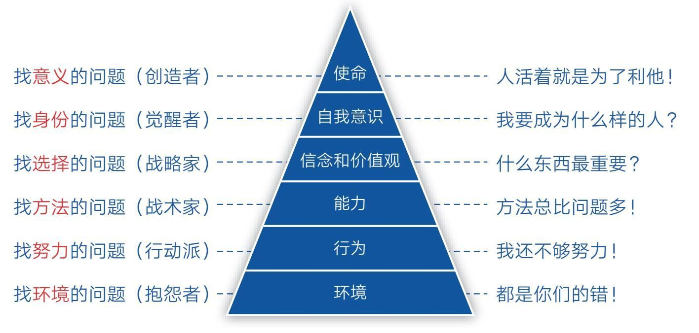
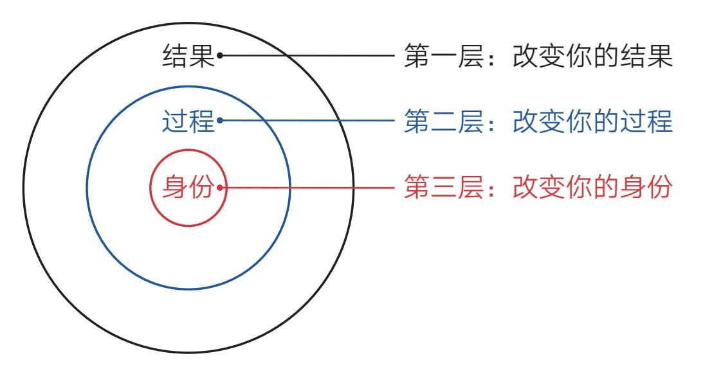
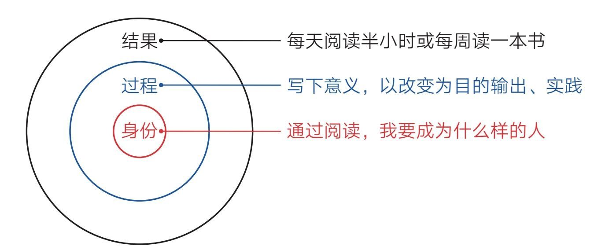
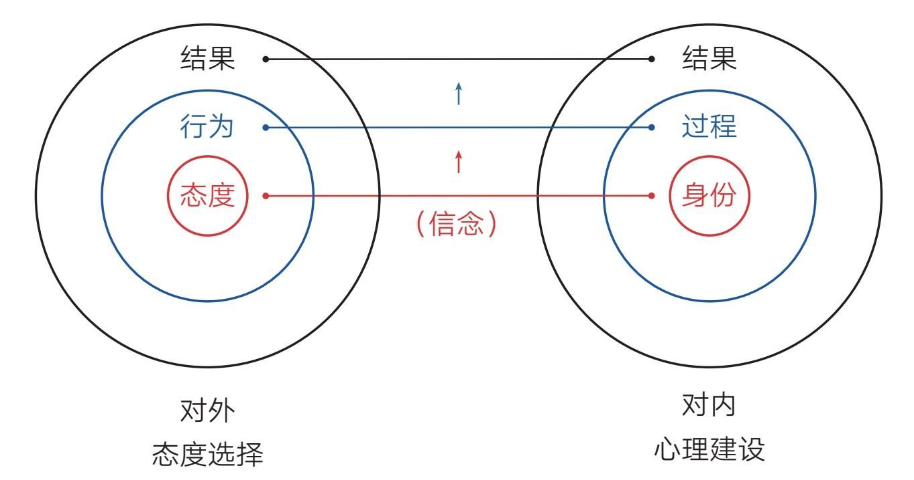
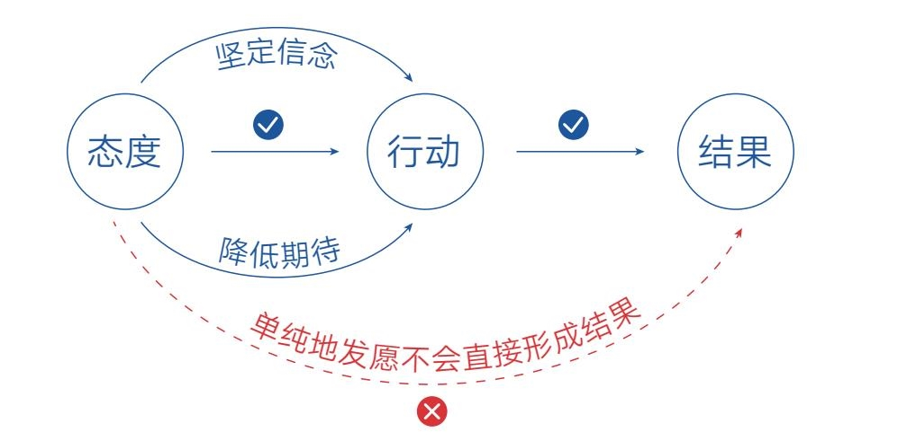
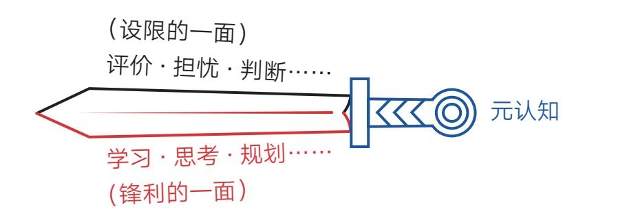
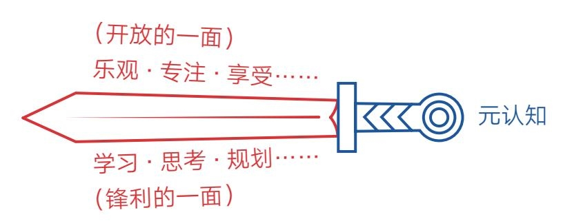

## 第二章　身份——一切从信念开始

### 第一节　层次：你在这个世界的哪一层

- 1976年，理查德·班德勒和约翰·格林德开创了一门新学问——NLP（Neuro-Linguistic Programming），中文意思是用神经语言改变行为程序。后来他们的学生罗伯特·迪尔茨和格雷戈里·贝特森创立了NLP逻辑层次模型。这个模型把人的思维和觉知分为6个层次，自下而上分别是：环境、行为、能力、信念和价值观、自我意识、使命（见图2-1）。

- NLP逻辑层次模型适用于很多领域，诸如生活、商业、情感，也包括成长领域。可每次看到某某模型，或某个模型的组成部分超过3个时，我就有昏昏欲睡之感，觉得这些东西太抽象。想必你也有同样的感觉，不过还是请你在这一页上多停留一会儿，让我把这个模型换个面貌，你就会发现它其实是个好东西。

- 下面，我以成长为例。

- 在成长过程中，我们必然会遇到各种各样的问题，此时，对待这些问题的态度就很关键了，因为从中可以看出我们的成长等级，而NLP逻辑层次模型就可以作为衡量成长等级的标尺。

- 第一层：环境。处在这一层的是最低层的成长者，他们遇到问题后的第一反应不是从自己身上找原因，而是把原因归咎到外部环境中，比如感叹自己运气不好、没有遇到好老板、怪老师教得太差……总之凡事都是别人的错，自己没有错。这样的人情绪不稳定，往往是十足的抱怨者。

- 第二层：行为。处于这一层的人能将目光投向内部，从自身寻找问题。他们不会太多抱怨环境，而是把注意力放在自身的行为上，比如个人努力程度。对于绝大多数人来说，努力是最容易做到的，也是自己可以完全掌控的，所以他们往往把努力视为救命稻草。

- 这本没什么不好，只是当努力成为唯一标准后，人们就很容易忽略其他因素，只用努力的形式来欺骗自己。比如每天都加班、每天都学习、每天都写作、每天都锻炼……凡事每天坚持，一天不落，看起来非常努力，但至于效率是否够高、注意力是否集中、文章是否有价值、身形是否有变化似乎并不重要，因为努力的感觉已经让他们心安理得了。说到底，人还是容易被懒惰影响的，总希望用相对无痛的努力数量取代直面核心困难的思考，在这种状态下，努力反而为他们营造了麻木自己的舒适区。

- 第三层：能力。处在这一层的人开始动脑琢磨自身的能力了。他们能主动跳出努力这个舒适区，积极寻找方法，因为有了科学正确的方法，就能事半功倍。但这一步也很容易让人产生错觉，因为在知道方法的那一瞬间，一些人会产生“一切事情都可以搞定”的感觉，于是便不再愿意花更多力气去踏实努力，他们沉迷方法论、收集方法论，对各种方法论如数家珍，而且始终坚信有一个更好的方法在前面等着自己，所以他们永远走在寻找最佳方法的路上，最终成了“道理都懂，就是不做”的那伙人。

- 第四层：信念和价值观。终有一天他们会明白，再好的方法也代替不了努力；也一定有人会明白，比方法更重要的其实是选择。因为一件事情要是方向错了，再多的努力和方法也没用，甚至还会起反作用，所以一定要先搞清楚“什么最重要”“什么更重要”，而这些问题的源头就是我们的信念和价值观。

- 一个人若能觉知到选择层，那他多少有点接近智慧了。在生活中，这类人一定愿意花更多时间去主动思考如何优化自己的选择，毕竟选择了错误的人和事，无异于浪费生命。

- 第五层：自我意识。如果说“信念和价值观”是一个人从被动跟从命运到主动掌握命运的分界线，那么“自我意识”是更高阶、更主动的选择。所谓“自我意识”，就是从自己的身份定位开始思考问题，即“我是一个什么样的人，所以我应该去做什么样的事”。在这个视角之下，所有的选择、方法、努力都会主动围绕自我身份的建设而自动转换为合适的状态。这样的人，可以说是真正的觉醒者了。

- 第六层：使命。在身份追求之上，便是人类最高级别的生命追求。如果一个人开始考虑自己的使命，那他必然会把自己的价值建立在为众人服务的层面上。也就是说，人活着的最高意义就是创造、利他、积极地影响他人。能影响的人越多，意义就越大。当然，追求使命的人不一定都是伟人，也可能是像我们这样的普通人，只要我们能在自己的能力范围内对他人产生积极的影响即可。有了使命追求，我们就能催生出真正的人生目标，就能不畏艰难困苦，勇往直前。

知识，让我们更好地感知世界
- 这个世界是有层次的。在NLP逻辑层次模型的帮助下，个体的成长便有了不同的呈现（见图2-2）。

- 一层的人找环境问题，他们是抱怨者，喜欢说：“都是你们的错！”

- 二层的人找努力问题，他们是行动派，喜欢说：“我还不够努力！”

- 三层的人找方法问题，他们是战术家，喜欢说：“方法总比问题多！”

- 四层的人找选择问题，他们是战略家，喜欢问：“什么东西最重要？”

- 五层的人找身份问题，他们是觉醒者，喜欢问：“我要成为什么样的人？”

- 六层的人找意义问题，他们是创造者，喜欢说：“人活着就是为了利他！”

- 现在，我们可以脱离这一模型，记住“环境、努力、方法、选择、身份、意义”这几个词就行了。有了这把标尺，我们就能意识到自己所处的位置，能够觉知自己当前的状态。

- 没有层次的指引，你可能意识不到自己还有更好的选择，因此被困在当前的层次。就像当你只知道“努力”这一个招数时，就不太可能主动去琢磨“方法”，更不太可能去主动思考“选择、身份和意义”了，甚至很可能把当前层次的焦点，诸如“努力”“方法”，当成目的去实现，以致不自觉地走偏。

- 但反过来，一旦我们清楚了全局框架，就可以成为“自由人”。在遇到问题时，我们就能主动放弃情绪化的抱怨，勤努力、找方法、做选择、建身份、明意义。

- 这正是让人感到喜悦的地方：原来我们还有这么多选择！特别是当我们能够从上至下地总览全局，能够从高维度看问题时，低维度的问题自然就消失了，所以对个体来说，最重要的事情莫过于找到人生目标和意义，想清楚自己应该成为什么样的人。这个问题一旦解决，我们自然就知道该怎么选择、找什么方法、如何努力。不用刻意追求，一切水到渠成。

- 现代社会，人人都在学知识，但我时常问自己：学习知识到底是为了什么？现在似乎有了一个新的答案：知识可以让我们更好地审视自己和感知世界。有了感知，我们便能更好地定位和应对。

- 那么，你在这个世界的哪一层呢？

### 第二节　身份：改变自己的终极力量

- 2020年3月，我结识了“剽悍一只猫”（以下简称“猫”），而结识他的缘由竟是我对他的误解——在此之前，我一直认为他是那种在网上运营社群贩卖焦虑的人。好在自己当时克制住了未经证实的偏见，抱着开放的心态读了他的新书《一年顶十年》，随后的事情也由此发生了戏剧化的转变。

- 通过和“猫”本人的交流，我了解到他是一个极致践行的人，他的书便是他实践的心得。不过在这本书中，我印象最深的是他多次提到的以下场景。

- ·我经常对自己说一句话：你是个干大事的人。

- ·刚毕业时，我觉得自己的气度不够，容易跟人斤斤计较，于是找人写了“气度”两个字挂在墙上天天看。

- ·2017年，我变得越来越焦虑，于是又请人写了“今天”两个字挂在墙上。

- ·我们办公室有一幅字，上面写着：我们很贵。

- ·若你还没富，请先让自己像一个富人。用富人的思考方式、富人心态、富人思维武装自己，改变自己的气质，让自己看起来更具“富人气”……

- 说实话，若是早几年读到这些内容，我肯定会充满怀疑和鄙夷：“这不就是鸡汤嘛！一个人怎么可能给自己画个大饼就让自己变好呢？简直太离谱了……”而现在，我不仅没有这样的念头，反而觉得这种做法很高级，因为我知道这种行为触及了我们人类成长的终极力量——心理建设。

身份—过程—结果
- 想了解心理建设，我们还得从《掌控习惯》这本书说起。作者詹姆斯·克利尔在书中描述了这样一个规律：即人的行为改变可分为身份、过程、结果三个层次，不同层次的努力会带来不同的结果（见图2-3）。

- 为了更好地理解，我们以养成阅读习惯为例（见图2-4）。

- 绝大多数人想养成阅读习惯时，都会自然地给自己定这样的目标：每天阅读半小时或每周读一本书。他们以为只要自己做到这些就可以养成阅读习惯，实际上这只是盯着最浅层的“结果”去行动，结局往往是为做而做，不了了之（相信你肯定深有体会）。

- 少部分人会把注意力放在“过程”这个层面。他们不满足于做什么（What），还要探索怎么做（How）以及为什么要做（Why）。所以他们会花时间写下阅读的意义，让自己看到阅读的各种好处；他们会以改变为目的去阅读，让自己输出、实践，使阅读效果最大化……做到这一点，其实已经非常了不起了，他们的收获会远远大于普通人，但这仍然需要消耗大量的意志力去坚持。

- 只有极少数人能看到“身份”这个层次，并主动从心理建设开始行动。他们会花大量的时间去思考：通过阅读，我要成为什么样的人。或者暗示自己：我本来就是一个以书为伴、追求新知、乐于探索的人。如此一来，阅读就会成为像吃饭、睡觉一样的基本需求，成为自己不做就会难受的事。这个时候，哪里还需要约束自己、强迫自己呢？

- 这个规律是普遍适用的，无论我们在哪个领域，想做成什么事，都会置身于这个框架之下。因此，那些能明确自己身份的人才是真正的高手，他们肯花时间进行心理建设，能从上而下或从里到外地改变自己。就像“猫”说的，要告诉自己，我是个干大事的人。因为如果连你都认为自己注定是平庸之辈，那你的内心很难强大起来。一个干大事的人，是不会与“偷懒”“嫉妒”“贪心”“恐惧”“浮躁”“自卑”为伍的。所以在遇到困惑和困难时，成事之人会主动做出不同的选择，绘出不凡的命运轨迹；而平庸之辈往往会对这种“画大饼”式的行为充满鄙视和不屑，殊不知自己才是落伍者。

- 当然，那些从“结果”层开始行动的人最终也可能做成那件事，但他们依然会在“身份”上不知不觉地进行重塑。这种从下至上、从外到里的被动重塑不仅过程痛苦、耗力巨大，也会使成功变得极不可控，甚至当成功真的来临时，他们也可能会因心理准备不足而亲手毁掉机会，因为他们内心觉得自己配不上、承受不了。而被毁掉的机会可能是财富、爱情、成功及各种好运。

- 所以，我们一开始就应该正视自己的心理建设，正视自己的身份建设，把潜意识的心理改造放到桌面上。毕竟在现实生活中，就算你不告诉自己应该成为一个什么样的人，你内心也有一个默认的身份存在。他可能是一个自卑的人、胆小的人、不敢相信自己会成功的人，只是你自己察觉不到这一身份的存在而已。这就不难解释，为什么很多成年人即使自身能力不差，但在面对生活中的困难与选择时，总是畏首畏尾，承担不起责任。因为他们内心依然是个孩子，潜意识里的自己并没有长大。而潜意识的力量是巨大的，善用之，它会成为我们成长的巨大推力；漠视之，它会成为我们成长的巨大阻碍。它是领着你跑还是拖着你阻碍前行，全看你对它的态度是否积极主动。

- 可见，信念从来都不是空的、假的，它是实实在在的力量，是特别强大的力量。我想只要你知道了这个秘密，就必然会主动改变策略，真正重视信念的力量。

态度—行为—结果
- 信念，说白了就是我们看待事物的积极态度。这态度对内，就是主动进行心理建设；对外，也同样是好用的终极力量。

- 2020年新冠疫情突发，同学们都只能在家学习，其中读者“点点”给我发来了自己的困扰，他说：“我家楼上的脚步声比较大，而且她家里有小孩，拉椅子的声音也非常响。和她交流也没有效果。有时候我甚至认为她家的拉椅子声都是故意的……每次一听到这些声音我就感觉很无力，不想继续学习，请问你对我的问题有什么好的建议吗？”

- 正好那几天我在读《思维的囚徒》，作者亚历克斯·佩塔克斯提出的“十大积极结果练习”十分应景。于是我对他说：“如果你希望有所改变，那就试着写下楼上脚步声的10个好处吧。”之后他便没了声音。我知道他心里大概在想：“从烦人的脚步声里找好处？还要找出10个，这怎么可能！”于是我给他做了个示范，我说：“你可以把椅子声和脚步声解读为‘这家的孩子真活泼呀’，或者‘还好疫情得到了控制，不然整个世界会安静得一点声音都没有，那就太可怕了，所以能听到人的脚步声真好’……”两天后，他给我回了消息：“谢谢你给我提供了另一个视角，但是我的想象力不够丰富，只能想出两点，另外，你给的那两个视角很好。”

- 不用告诉你结局，你也能猜到“点点”的情况发生了积极的变化，尽管现实环境并没有任何改变。不过，我想总有人在听完这段经历后脑海里会闪过“自欺欺人”“阿Q精神”之类的念头。可千万不要轻易下结论，因为这种看似可笑的做法极其符合“态度—行为—结果”的事物发展规律。

- 很明显，我们看待一件事情的态度会影响我们的行为，而我们的行为则会影响现实结果。在上述案例中，读者“点点”如果不改变态度，他就会一直处于烦躁和抱怨中，可能使自己的成绩在痛苦中持续下滑；而他现在可以笑对噪声，聚焦学习，甚至还能刻意锻炼自己抗干扰的能力。

- 所以在遭遇困难的时候，一定要提醒自己保持冷静，要在这种时候审视自己的态度和选择，要想方设法找到积极的一面。卡尔·纽波特在《深度工作》一书中也表达过类似观点：“你的世界是你所关注事物的产物。”“我们的大脑是依据我们关注的事物来构建世界观的。”我们选择去关注哪些事物、忽略哪些事物，会对我们的生活质量起到关键的作用。这也是我们在任何困难面前都要保持乐观的原因，只有态度和信念改变了，事情才会朝好的方向转变。

- 更好的消息是，无论我们遇到什么困境，最终我们都是有选择权的。正如《活出生命的意义》的作者维克多·弗兰克尔所说：“人所拥有的任何东西都可以被剥夺，唯独人性最后的自由，也就是在任何境遇中选择一己态度和生活方式的自由不能被剥夺。”所以，困境就是我们成长、改变的分水岭，而成长、改变也是我们和困境争夺选择权的较量：放弃选择，我们就会成为困境的囚徒；坚守选择，困难也会向我们俯首称臣。

- 现在，我们把“心理建设”与“态度选择”放在一起，就会发现对内和对外的力量其实是统一的，它们的力量源头是我们自身的信念（见图2-5）。

做最好的准备，做最坏的打算
- “心理建设”与“态度选择”从本质上说都是帮助我们挣脱环境束缚的元认知能力。但对这种能力，人们可能还会产生一种难以辨识的误解，比如读者“平哥”就曾提出这样的疑惑：“吸引力法则告诉我，要想达成一件事就得坚定信念，始终往好的方面想，这样才会有好的结果发生；而有人又说，要想做好一件事情，就要降低期待，要是结果不好，也算有所预料，结果好，喜悦就会翻倍。但是用吸引力法则来看，主动降低期待就是往不好的方面想，这样做很可能产生不好的结果。所以，坚定信念和降低期待是矛盾的吗？”

- 这是个极具迷惑性的问题，但想清楚一点，就可以走出这种认知迷宫。

- 所谓吸引力法则，并不是指单纯地在心里对想要达成的事情发愿并保持极度渴望，而是改变自己对待这件事情的态度，保持一种自信、平和的状态，这样，我们就能采取正面的行动，最终产生好的结果。如果一个人心里总想着不好的结果，让自己产生了担忧、顾虑、焦虑等情绪，那这种心态就会将自己的行动导向负面，这样一来，好的结果也会离我们越来越远。而主动降低期待并不是悲观主义，因为它的目的也是调整心态——让自己把注意力放到成长上，而不是外部评价上，这样，我们就可以让行动更加踏实，创造出好的结果。

- 所以，坚定信念和降低期待并不矛盾，因为坚定信念就是做最好的准备，而降低期待就是做最坏的打算。它们的目的是一致的：促使自己更好地行动，并最终产生好的结果（见图2-6）。

- 至此，改变自己的终极力量已全部呈现在你的面前，它们最终能否为你所用，就看你自己的行动与实践了。不过千万不要忘了潜意识的学习方式是不断重复。这就像我们学骑自行车，刚开始的时候需要不断地、刻意地提醒自己动作要领。经过无数次重复后，我们不需动脑也能轻松做到，这说明潜意识已经学会了。掌握这种看不见的力量也是如此，我们一开始需要“假装”，而后不断进行自我提醒和暗示，直到有一天可以本能地、笃定地相信自己。

- 当然，我们还要时刻保持觉知，不能执着于一个固定的身份或信念。因为随着自身能力和境遇的改变，我们往往需要新的“身份”来引领，所以成长注定是一个将内在身份不断揉碎并重塑的动态过程。

- 改变自己、让自己变得更好，是这个世界上每个人的愿望，但大多数人都不知道有“心理建设”这种力量的存在，能主动运用它来重塑自己的人更是少之又少，因此，大多数人只能在生命途中懵懵懂懂地低效前行。如今，你我终于有机会接近这股看不见的力量，去创造主宰自己命运的可能。

### 第三节　语言：美好人生从好好说话开始

- 日本著名企业家稻盛和夫有个跟随其一生的习惯。他说：“无论遇到什么事情都要感谢，即使碰上坏事、遇到灾难，也要心存感激，说声谢谢。”他甚至还强调：“必须用理性把这句话灌进自己的头脑，就算感谢的情绪冒不出来，也要说服自己。”

- 起初，我认为稻盛和夫先生能做到这些是因为他是一个品德高尚的人，但是一番研究之后，我发现这种做法不仅仅反映了他纯粹的品德高尚，其背后还极具科学精神，而且这种科学的做法可以让我们每一个人学习运用并受益。如果你也希望自己能像稻盛和夫一样成为这个世界上颇具影响力的人，那就请放慢脚步，随我一起去了解其中的奥秘吧。

语言是幸福人生的开端
- 在前一节中，我们阐述了“态度—行为—结果”这个成长法则，即一个人的态度会影响他的行为，而行为又会影响现实结果，所以我们脑中的态度、观念、思维正是我们自由漫步人间的关键所在。但我们头脑中的态度、观念和思维又受什么影响呢？不用说，人生经历、学习新知肯定都是重要的因素，但除此之外，还有一个极为重要却很可能被我们忽视的因素：语言。

- 人们往往认为语言是思维的产物，即我们心里想什么，嘴里才会说什么。但很少有人知道，我们嘴里说的，也会影响我们心里的想法。

- 没错，语言和思维之间其实是双向车道，而非单向车道。如果你知道自己还可以在思维和语言之间“逆向行驶”，你的生活就会多出很多主动的选择。比如《富爸爸穷爸爸》的作者罗伯特·清崎给我们做的“沟通示范”。

- 穷爸爸总是习惯说：“我可付不起！”而富爸爸则禁止我们说这样的话，他坚持让我们说：“我怎样才付得起？”

- 富爸爸解释说，当你下意识地说出“我付不起”的时候，你的大脑就会停止思考；而如果你自问“我怎样才付得起”，你的大脑就会动起来。

- 现在，再让我们回想一下稻盛和夫的做法。如果他不强迫自己在遇到坏事或灾难时说声谢谢，那他的思维就很可能会被糟糕的情绪束缚，然后陷入怨天尤人的境地。可见，刻意运用语言的力量，可以改变我们看待事物的视角。

- 所以，在平时的生活中，我们一定要注意自己的语言使用，遇到困难时我们可能会下意识地说“我做不到”，我们可能并不觉得这句话有什么问题，但这种绝对化的语言会无意间关闭我们大脑的能动性，让自己不再思考如何克服困难。而如果我们将这句话换成“我暂时还做不到”这样的开放性语言，就会暗示一种未来的可能性，让自己暗暗树立实现目标的信心。可见，“态度—行为—结果”这个链条可以演变为“语言—态度—行为—结果”。

- 语言学家本杰明·沃尔夫说：“语言塑造我们的思维方式，决定我们的思维内容。”德国最大的连锁超市奥乐齐（ALDI）的创始人也说：“改变你的语言，就会改变你的想法。”如果你从来没有留意过语言对自己的影响，那本节正是你“语言觉醒”的完美契机。

外部表现会影响内部状态
- 事实上，影响我们思维和态度的不仅仅是语言，其他的外部表现也会对内部状态产生影响。比如，当你用牙咬着铅笔然后不得不微笑的时候，你会感觉更高兴，因为面部表情会向大脑传送对于感觉和情感的反馈。而我们的神经元回路并不总能清楚地分辨什么是真的，什么是假的，所以假如你在困境中假装大笑，你的情绪也会变得更轻盈。当然，如果你在愤怒的时候做出暴力的姿态，也会变得更加愤怒。

- 另外，简单地呈现某种姿势，我们也能改变自己的所思所想。比如刻意保持开阔的姿势，让身体占据更多空间，能增强我们关于力量和控制的感觉。习惯舒展身体的人，更能够放远眼光，看得长远；而缩紧身体会让人眼光局限，只看当前。如果你平时是一个胆小害羞、遇事慌张的人，那不妨主动改变自己的身姿，假以时日，你会发现自己变得自信和勇敢了起来。

- 超市研究员也发现了类似的现象。当人们拿购物篮购物时会弯曲手臂，这种“收缩”的动作更容易使人满足自己迫切的需求，屈从自己的欲望，从而不自觉地选择那些能提供即时愉悦感的商品；而使用推车购物时，人们手臂向外“伸展”，在选择商品时往往更加理性。

- 如果你再细心观察，就会发现像肯德基、麦当劳这样的门店，进门时常常需要拉开门而不是推开门。因为拉门时手臂收缩，这个动作可以让我们进入一种“简单满足”的心理状态。而柜台上方展示食物的电子屏幕通常是从上往下而不是从左往右滚动，因为当人们的目光跟随屏幕从上到下移动时，像在点头称是。这种隐蔽的设计会对我们形成心理暗示，但我们很难察觉。

- 诸多研究证实，我们的行为（包括动作、表情、姿态、语言等）与思维会相互影响。其中，语言对思维的影响更加直接和可见，我们也最容易察觉和掌控。

- 那么，新的问题来了，你认为“刀子嘴”的人一定是“豆腐心”吗？

刀子嘴，豆腐心
- 从心理学的角度看，刀子嘴的人不太可能会有豆腐心。因为语言会影响思维。当刻薄的语言从嘴里说出来的时候，内心也会不自觉地变得刻薄。一个人若是长期不注意自己的语气、语态和讲话内容，就可能变得尖酸刻薄而不自知。喜欢用“刀子嘴，豆腐心”来形容自己的人，大概率是为了给自己的行为找一个理由或借口。

- 所以，提醒自己口出善言，多体察别人的感受，会让别人感觉更好，也会让自己变得更好。当然，不可避免地，在某些特殊的场合，我们需要暂时借助一些“狠话”来达成某些目的，使事态往好的方向发展。此时，我们内心也清楚地知道，自己只不过是在“假装”，而非真的这么想。

美好人生，从好好说话开始
- 人们常说：思想决定行为，行为决定习惯，习惯决定性格，性格决定命运。

- 那思想是由什么决定的呢？

- 我想，除了好好学习，好好说话必然占据了一席之地。

- 所以，请时刻觉知并审视自己的语言：

- ·无论遇到什么事情，说积极的话，不说消极的话；

- ·无论遇到什么人物，说和善的话，不说刻薄的话；

- ·无论遇到什么问题，说开放的话，不说绝对的话……

- 这并不难做到，只要我们经常提醒，刻意练习，它就能把我们带向美好的人生。毕竟从自己嘴里说出来的话，第一个听到的人是自己。听得多了，我们自己也就信了。

### 第四节　理性：成功，最怕一开始就对自己说不可能

- 从2019年开始，我就向读者倡导“你的一生，至少要主动做成一件对他人很有用的事”这一理念。很多人深受触动，决定开启自己的成事之旅，但在定下目标后又会产生这样的顾虑。

- “我的目标是不是太大了？”

- “看上去有些不切实际啊！”

- “我怎么可能做到？”

- “万一失败了怎么办？”

- 最初的雄心壮志在千思万虑之后反而令人彷徨、退却，于是一些人来寻求咨询，希望我能给出一些更加理性的建议。然而我给出的通常不是理性的分析，而是热情的鼓励。对于这样的回应，有些人并不满意，因为人们普遍认为，要想做成一件事，光有热情没用，还得用理性思维思考目标的可行性。这样的想法自然没错，只是很多人并不知道，在某些情况下，理性思维不仅不会成为达成目标的利器，反而还会成为阻碍。

- 这或许会令一些人费解，毕竟在传统的观念里，理性思维是破解问题的利器，我们努力学习也是为了让自己变得更加理性，而现在我却说“理性无用”，这到底是怎么回事？

- 如果你有这种感觉，那我要先恭喜你，因为当你习以为常的观念被颠覆时，说明你可能要进步了。

- 是的，我们孜孜以求的理性思维其实是有局限的，而且这种局限很难被人们察觉，它不仅会影响我们塑造自己的人生目标，还会在生活中的很多方面限制我们。如果我们能突破理性思维这道屏障，很多人生问题都将迎刃而解。所以大家不妨暂时放下抗拒，与我一起更新对理性思维的认知。相信我，这次更新会使你的元认知产生重大飞跃。

乐观构想、悲观计划、乐观实行
- 为了更好地理解，我们还是从稻盛和夫的故事开始吧。

- 稻盛和夫有个有趣的习惯，他每次展开新的、难度较大的工作时，都会刻意去找一些“理性不足，感性有余”的人一起商讨自己的想法。这些人对稻盛的专业往往并不在行，但对他的提案总是表现出足够的兴趣和赞同，并鼓励他一定要试试。

- 这听起来可能有些荒唐：一个人要不是虚荣心作祟，他不至于总找外行人来捧场吧？但稻盛和夫这样做是有原因的。此前，他同样信奉理性思维，每次冒出新想法、新点子，他都会向那些一流大学出来的优秀人才征求意见。可他们听了提案后常常反应冷淡，表示这样的想法是多么脱离实际、多么缺乏根据。稻盛和夫看着这些“智慧的大脑”列出的全是“不能成功”的消极理由，深感失望，他说：“再美好的想象之花，经他们冷水一浇，也难免萎缩凋零，本来可以做成的事情也做不成了。”经过几次这样的教训，他就更换了商量的对象。

- 当然，你会认为这只是个案，不足以说明问题，那我们不妨看看历史上其他精英的言论。

- ·1911年，法国军事战略家、第一次世界大战协约国军队总司令斐迪南·福煦说：“飞机是有趣的玩具，但没有军用价值。”

- ·1923年，诺贝尔物理学奖得主罗伯特·密立根说：“人类不可能利用原子的力量”。

- ·1943年，IBM公司创始人托马斯·沃森说：“我认为世界市场对计算机的需求大概是5台”。

- ·1946年，20世纪福克斯公司总经理达里尔·扎努克说：“电视机只要上市6个月就抓不住消费者了，人们很快会厌倦每天晚上盯着一个胶合板箱子看。”

- ·1957年，电子管发明者李·德弗雷斯特说：“无论未来科技如何发展，人类永远无法登上月球。”

- ·1977年，美国数据设备公司（DEC）创始人肯尼斯·奥尔森说：“让每个人都拥有一台电脑不合常理。”

- 很难想象，这些悲观的判断是从当时几乎最聪明理性、最专业权威的人嘴里说出来的，但从他们当时的处境看，这些结论似乎非常符合逻辑，因为他们的专业知识告诉他们这是毫无疑问的“事实”。

- 理性思维的局限正在于此——它只相信自己所见所闻的一切事情，对于已知之外的未知，它会主动怀疑并排斥。因此，《意念力》的作者大卫·霍金斯告诫我们：“理性，是将我们从低级本性的需求中解放出来的大救星，但同时也是一个严厉的看守，拒绝我们向智慧之上的层面逃离。”

- 可见，稻盛和夫的做法不仅不荒唐，甚至可以说是一种智慧。

- 那么，理性思维是否可以就此剔除呢？

- 也不是，理性思维自有用武之地，至于如何使用，不妨继续看稻盛和夫的做法，他说：“在事情的构想、构思阶段，需要营造大胆乐观的氛围，但是将构想转到具体计划时，情况就完全不同了。这时应该基于‘悲观论’，设想各种可能出现的风险，进行仔细、慎重的分析，制订周密的计划。”

- 之后，他话锋一转：“然而，到了计划付诸实行的阶段，就要再次强调‘乐观论’，坚定地采取行动。就是说‘乐观构想、悲观计划、乐观实行’，这是成就事业、变理想为现实时必须具备的态度。”

- 这下终于明白了！

- 原来稻盛和夫的智慧就在于他知道如何巧妙地避开理性思维的局限——在不需要的时候将其关闭，在需要的时候再将其打开。所以我们要想成事，最好不要在理性思维这条路上“一条道走到黑”，而应遵循“先感性，后理性，再感性”的模式。这与《人生算法》的作者喻颖正说的“人生最好的模式是长期乐观、短期悲观、当下愉悦”如出一辙。

长期乐观、短期悲观、当下愉悦
- 正如我开始写作的时候，根本没有想过自己会在3年后写出一本书，我只是牢牢记住了李笑来说的那句话：“持续写作很可能是锻炼学习能力、锻炼思考能力、锻炼分析能力、锻炼沟通能力最直接、最低成本的方式。”因此我内心极其坚定，坚信写作可以塑造一个全新的自己，可以打造一个属于自己的世界，于是拿起笔就开始上路了。

- 当然，在写作途中我始终坚持“价值写作和知识写作”的理念，坚持写的东西三年、五年，甚至十年后再看依然是有价值的内容，于是不自觉地把自己推到了舒适区边缘，每写一篇新文章都会刻意“保持难受”，不断阅读、关联、修改、打磨，并亲自实践那些启发和道理。这个过程并不舒适，即使如此，每当自己坐在电脑前码字时，我都能感受到创造的乐趣；每当看到读者的留言和反馈时，我都会感到动力满满。这些乐趣和动力支撑着我持续不断地写下去。

- 蓦然回首，我发现自己走的正是“长期乐观、短期悲观、当下愉悦”的道路，而且已经离起点很远了。不得不说，这又是我遇到的好运——没有被理性思维束缚在起点。

- 现在，当我再用这个概念去观察他人时，发现很多人走的是与此完全相反的路径。他们一开始总是用当前的思维预估未来的情形，在发现自己的想法简直是异想天开时便觉得悲观无比，在起点时便停滞不前。即使勉强起步了，却又在过程中过于乐观、急于求成，希望很快看到成果，结果频遭打击，以致在接下来的具体行动中萎靡不振、痛苦煎熬，没过多久就放弃了。归结起来正好是“长期悲观、短期乐观、当下痛苦”的模式。细细想来，这或许正是很多人无法成事的原因之一吧。

理性思维是把双刃剑
- 理性思维之所以被人们奉若神明，是因为人们只看到它解决问题时的锋利，但事实上，理性思维是一把双刃剑，它还有偏颇、顾虑、担忧等自我设限的另一面。

- 比如它对评价特别敏感，所以我们总是特别在意别人的眼光；它对失败特别抗拒，所以我们总是沉浸在挫折的情绪中；它对得失特别在意，所以我们总是在选择时畏首畏尾；它对标签特别认同，所以我们总是不敢相信自己可以跨界发展……它总是对自己知道的事实坚定不移，然后用这些单一的认知束缚自己，它让我们处于安全地带，也让我们远离很多人生可能性。

- 只要我们把理性思维这把“剑”拆分一下，马上就可以看到它的两面性——锋利的一面和设限的一面，而这把剑的安全剑柄则是元认知能力（见图2-7）。

- 元认知能力让我们跳出限制审视思维本身，控制剑的运行方向，让它始终呈现锋利的一面，帮助我们做成事情。就像稻盛和夫先生也并不排斥理性的力量，他同样会在各个阶段竭力运用思考的力量。

- 比如在事情开始的阶段，他会让自己睡也想、醒也想，一天24小时不断地思考、透彻地思考，让自己从头顶到脚底，全身充满“非同寻常的、强烈的愿望”。他说：“如果从身上某处切开，流出来的不是血，而是这种‘愿望’。”

- 比如在事情计划的阶段，他又会反复周密地推敲实现愿望的具体方法，将实现愿望的过程在头脑里进行模拟演练，直到像“看见了”它的结果一样才肯罢休。

- 他会用理性思维锋利的一面砍向自己的目标，同时尽量避免设限的一面影响自己的发挥。他还巧妙地把设限的一面替换成了开放的一面，让乐观开放、专注当下、享受过程成了另一种锋利，于是他无论怎么挥舞，都不会伤到自己（见图2-8）。

人生还需要浪漫、无畏和勇气
- 在电影《流浪地球》中，地球即将被木星的引力吸引坠毁，空间站上的人工智能“莫斯”以极为理性的方式计算出拯救地球的成功率为零，于是决定带领空间站逃离，但刘培强中校却做出了一个极不理性的决定。他关闭了莫斯，带着30万吨燃料冲向天际引爆了木星，最终拯救了地球文明。虽然这只是一部科幻电影，但它同样揭示了成事的奥秘：有时候，我们无法达成目标不是因为我们不够理性，而是因为我们不够感性。

- 随着社会的发展，理性思维大放异彩，人工智能、大数据等科技的运用让我们不自觉地崇尚理性的力量。但我们切不可全盘接受理性的摆布，即使我们生而混沌，要努力成为一个理性的人，但也要始终牢记获取理性不是最终目的，因为精彩的人生还需要浪漫、无畏和勇气。

- 所以，无论什么时候，我们都要告诉自己：这世上没有什么事是不可能的。至少在一开始的时候不要轻易对自己说不可能！
