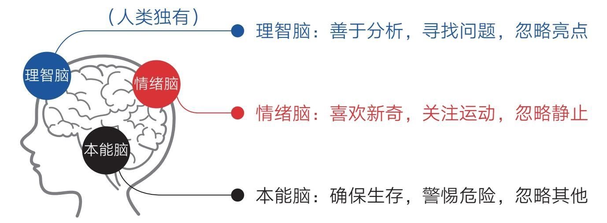
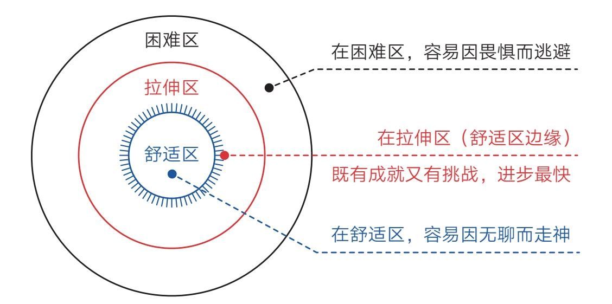
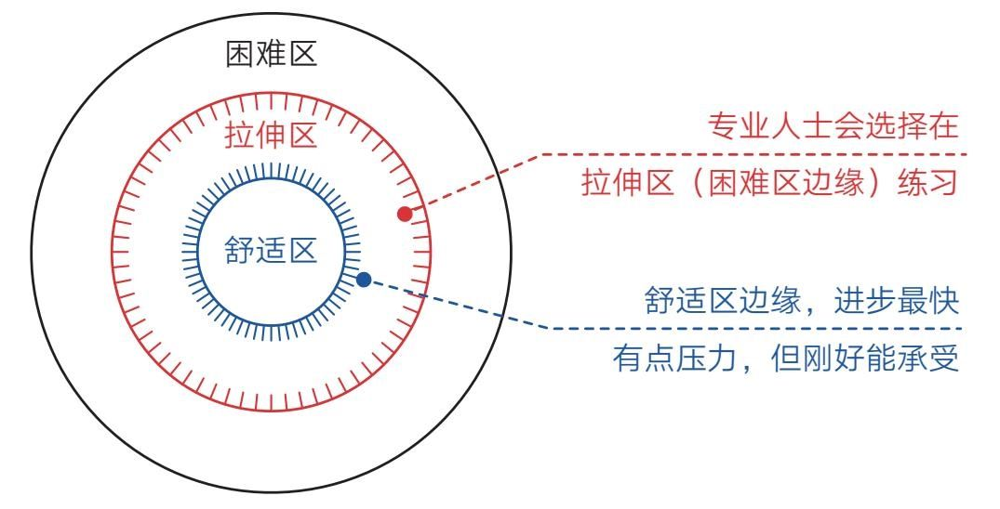
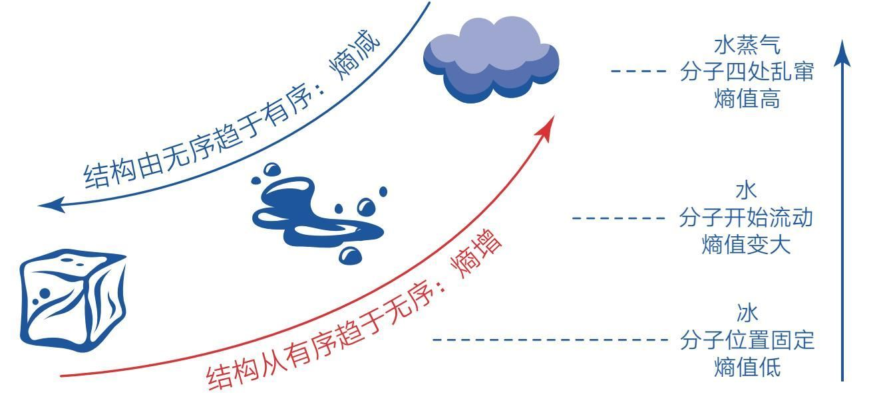
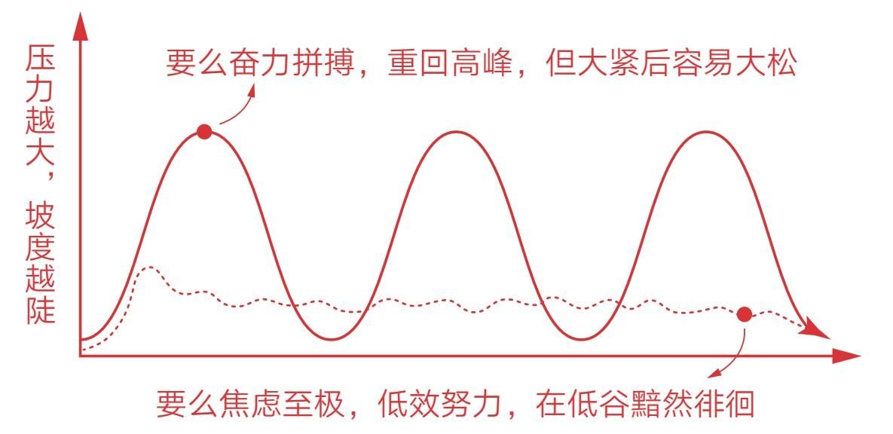
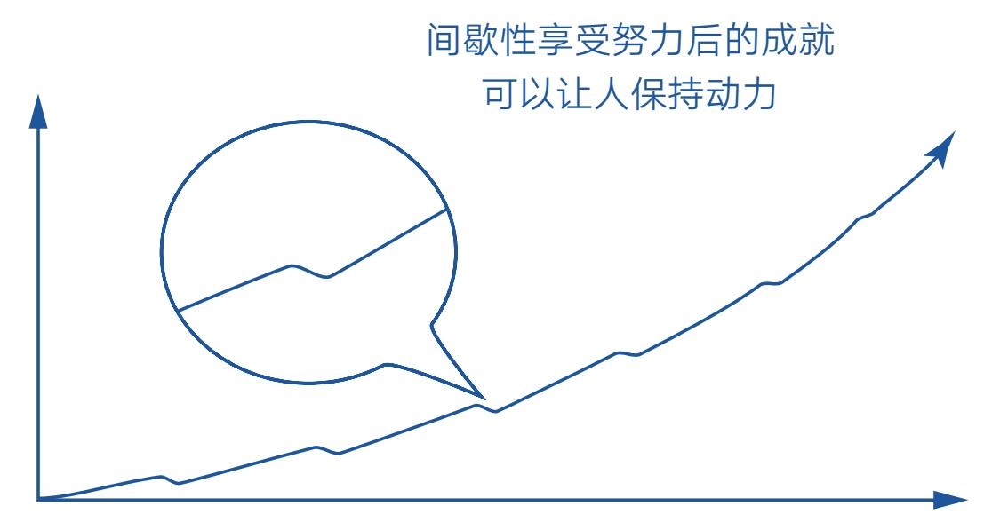
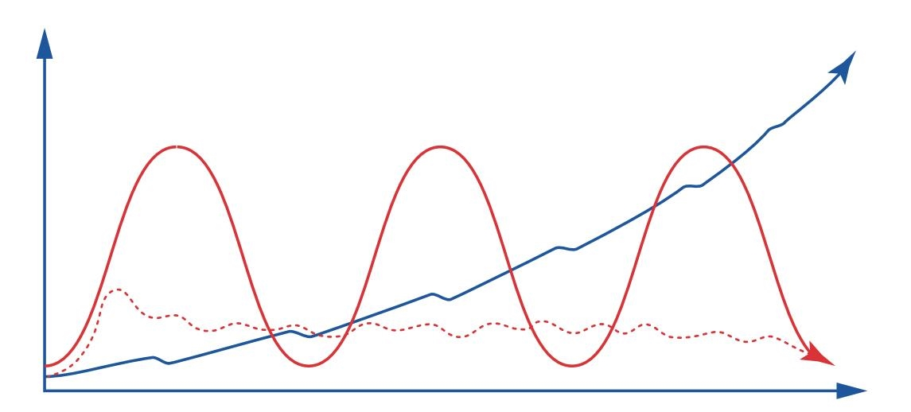

## 第三章　心理——清除成事路上的情绪障碍

### 第一节　负面偏好：为什么你总是不快乐

- 如果你可以设计生命，那么你必然会让它们对危险保持更高的警惕，因为一个生命如果对危险不够警觉，就很容易一命呜呼，因太过警觉而错失几次机会往往不会付出太大的代价。

- 这种逻辑几乎不用论证就能推断为正确，现实世界也确实如此：动物对威胁及讨厌事物的反应，要比对机会及喜好事物的反应更快、更强烈、更持久。换句话说，生命对坏事的反应要强于对好事的反应。

- 这种“负面偏好”被深深地写进了物种的基因，毕竟对生命来说，生存大于一切。我们人类也是生命，所以同样深受影响。这种影响能让我们远离危险，有机会坐在这里阅读这本书，但它也为我们变得不快乐埋下了隐患。

负面偏好
- 设想下面这样的场景。

- 如果你是一个学生，带着一张成绩单回家，上面写着“一科优秀、两科良好、一科不及格”，你的父母极有可能短暂地瞥一眼“优秀”和“良好”之后，把注意力放到“不及格”上。他们会追问原因、叹气失望，甚至动怒责怪，使空气中充满紧张的味道。你有3/4的天气是晴朗的，但这1/4的乌云却让整个天空都显得黑压压的。

- 我们都体会过这些场景：一天中大部分时间都过得平安顺利，但领导的一句训斥、客户的一句责骂、爱人的一个抱怨、好友的一个误会……便让全天的心情蒙上了一层阴影。事实上这些“不好的事情”充其量只占全天事情的几十分之一，但它就能如此霸道地占据我们的意识。还有那些过去发生的和未来可能发生的“坏事”，都会不自觉地让我们产生困扰。因为“负面偏好”会使我们更多地注意负面信息和事件，不自觉地忽略大多数正面、美好的事情。缺乏觉知的人，大多会在这种基因力量的操控下过着“身处美好中，却活在烦恼里”的生活。

- 而且，要想对冲一件坏事的影响，我们往往需要制造多件同等规模的好事。比如在夫妻关系中，一句批评的话所造成的伤害起码需要5个善意的行为才能弥补。所以要想在受“负面偏好”影响的世界里过得更快乐，我们还得学会自我调节。

幸福适应
- 有人可能会说，遇到坏事那是运气不好，如果我们生活在一个没有任何威胁和烦恼的环境里就可以每天都很快乐了。这种想法很美好，但并不现实。

- 有观点认为，当我们过上无忧的生活之后确实会快乐一阵子，但很快就会回到原来的幸福基准线。因为我们的大脑是一个极强的适应器，当新的刺激出现时，神经细胞会产生强烈反应，但之后会逐渐“习惯”，适应后，刺激反应会趋于缓和。所以不管发生什么事情，我们终究会慢慢适应。

- 从大脑内部看，“适应”其实是一种平衡。大脑不可能让自己始终处于兴奋或消沉的失衡状态，因为在这种状态下，能量会很快耗尽，进而威胁到生存。出于自我保护，大脑会主动调节内部环境使之达到某种平衡。

- 然而一旦达到平衡，也就意味着生活从动态变成了静态。静态的事物又很容易被大脑忽略，因为动态的东西往往蕴含着新奇和危险，大脑对此特别敏感；而静止的事物意味着安全和无趣，为了节省能量，大脑会将其主动忽略。换句话说，无论生活在何种幸福的环境里，你都有可能慢慢丧失觉知，视一切为理所当然，然后对其视而不见。

- 我们的大脑就是这样，在默认情况下，永远都会以现在已经适应的水平为基准来判断现实是更好还是更坏。

- 再看看我们身边的关系，我们总是对亲人的付出视而不见，理所当然地认为他们会一直对自己好；而面对陌生人时，只要他们态度不错，自己就很容易感动，但实际上，亲人和朋友对我们的付出是多过陌生人的，所以有人总结道：所有的感动都是陌生人带来的。

- 深察人心呐！

近大远小
- 联想人类的大脑构造，我们还会发现更有意思的东西（见图3-1）：本能脑的首要职责是确保生存，因此它警惕危险，忽略其他；情绪脑喜欢新奇，因此它关注运动的事物，忽略静止的事物；而人类独有的理智脑虽然很高级，但它分析思考的优势注定使其紧盯问题不放——当自己是把锤子时，看什么都像钉子。

- 无论从哪个角度看，人类的三重大脑都像问题的发现器和情绪的担忧器，而不是亮点的发现器和幸福的感受器。我们是天生的烦恼主义者——这是人类的又一大天性！

- 而根据近大远小的规律，我们越关注的东西就越庞大，当我们眼中只有烦恼的时候，就意识不到这个世界是美好的，觉得到处都很糟。所以你若是觉得自己总是不快乐，请不要沮丧，因为你并不孤独，其他人也这样，这其实是我们的常态。

快乐，就是成为那条能看到水的鱼
- 然而总有一些人能够有意无意地跳出常态，生活得更快乐，他们采用的方法也并不新鲜，无非就是运用了所有情绪高手都会遵循的共同法则：善用不同的视角看问题——既然基因和本能让我们不自觉地关注坏事，那我们不妨反其道而行之，试着多看看好事，毕竟我们生活在现代社会，生存不再是最重要的主题，生存得更好才是。

- 要想生存得更好，我们就应该主动做点什么。比如有“最有趣的理财书”之称的《小狗钱钱》就给了一个很好的提示。书中那只会说话的小狗钱钱，叫主人吉娅拿出一个本子，记录自己每天所有做成功的事情，任何小事都可以，每天至少写5条，并且把这个本子取名为“成功日记”。在成人眼里，这种做法有些幼稚，但它是对冲人类“负面偏好”的利器，因为它可以帮助我们主动发现自己和生活中的亮点，弥补我们大脑天生的缺陷。

- 吉娅就通过记录成功日记建立了自信。在她第一次做公共演讲时，心里非常抗拒和害怕，但当她翻开日记本时，发现自己原来有那么多成功的经历，立即就有了信心。

- 可不要小瞧这种做法（写下来）的威力，很多时候，人与人的差距就在于最后的一点行动，毕竟生活留给我们的东西足够多，只是我们自己不够留心罢了。

- 说到记录，我首先想到的是自己的每日反思。这个习惯让我受益匪浅，不过现在看来，它只是更好地帮我发现和解决了生活中的问题，仍然是问题视角。为了开启大脑的另一种模式——亮点模式，我在2019年11月毫不犹豫地开始实践“成功日记”，不过当自己真的去写的时候才发现，每天写5个亮点并不容易，但我坚信这样做是有用的，尽管我已经是成人了。

- 除此之外，我们还可以运用想象的力量。比如当身处平淡时，我们可以想象失去现有的东西会怎样，这会帮助我们意识到生活的可贵，把注意力集中在自己已有的事物上。如果总是盯着自己没有得到的事物，恐怕会终日活在不快乐中。而一个不快乐的人，又怎能轻装上阵去追求和体验更好的生活呢？所以，“比较是偷走幸福的贼”这句话只说对了一半，因为这要看跟谁比了，如果与那些更不幸的人相比，比较就是送来幸福的天使。

- 当自己遇到烦恼时，我们则可以想象远离。根据远小近大的原理，再大的烦恼放到远处似乎也不算什么，而再小的幸福放到眼前也会变成大幸福。毕竟就数量而言，烦心之事在一天或一生中总是少数，我们不能让它们站得太近以致遮挡众多美好。就像你要是不小心被老板“骂”了，那就提醒自己这只不过是一天中的几十分之一而已，它不应该在眼前来回晃，而应回到自己原来的位置上去。你还可以采用假设时间远离的方法，用三五年后的视角看待当前，通常你会觉得眼前的烦恼变得无足轻重了。

- 总之，我们要善于体察身边平静生活的宝贵与美好。正如人们常说的：“和平犹如空气和阳光，受益而不觉，失之则难存。”我们不能身在福中不知福，不能等到遭遇战火和动荡时才知道和平时光的宝贵。一个智慧的人不会等到自己真正失去了才后悔当初没有珍惜，他们在拥有的时候就会主动平衡注意力，更多地关注自己已经拥有的快乐和幸福。

- 列夫·托尔斯泰说：幸福的家庭都是相似的，不幸的家庭各有各的不幸。但我想说：幸福的人各有各的幸福，而不幸的人都是相似的，因为他们都是“身在水中却看不到水的鱼”。

- 要想变得更快乐，就要成为那条能看到水的鱼。

### 第二节　二元对立：恭喜你走出二元对立，来到真正的成人世界

- 孔子是公认的大学问家，从古到今，他的思想深刻地影响了这个世界，所以我很好奇他是怎么成长起来的。搜来寻去，在《论语·为政篇》找到了这句耳熟能详的话：吾十有五而志于学，三十而立，四十而不惑，五十而知天命，六十而耳顺，七十而从心所欲不逾矩。

- 寥寥数十字浓缩了一生的成长心路，但对这段话的解读却众说纷纭。翻阅了诸多版本，我觉得阐释得最好的，是湖北省云梦县王保清的一段话。他说自己以前读这段话也不知道是什么意思，但在五十多岁的时候，联系自己走过的人生历程，突然有了顿悟。我读后极度认同，遂摘录如下。

- “吾十有五而志于学”，意即到十五岁才知道下决心学习。小孩子一般七岁左右发蒙，但学习目的不明确，是懵懂的，不知专心致志地学习。从小就知道发奋苦读的小孩是极少数，孔子虽然后来成为圣人，但在十五岁之前也是不知道发奋学习的。

- “三十而立”，意即到了三十岁才懂得要立志做一件事情。即我这一生做什么，就像今天的年轻人确定做什么专业一样。一般人二十岁就确立了，孔子迟了，爱玩，他去当吹鼓手去了，直到三十岁才醒悟要干正事。三十而立，不是指三十岁就要成家立家或自立于世。

- “四十而不惑”，意即到了四十岁才不犹豫，才不疑惑。三十岁确立了要干正事，干什么正事呢？今天想干这，明天想干那，拿不定主意，有疑惑。到了四十岁才坚定要干“兴灭国，继绝世，举逸民”“克己复礼”的大事。这个“不惑”，是指对自己的理想、志向、所认定的事业不疑惑，不三心二意，不是对任何事物、任何道理不疑惑。

- “五十而知天命”，意即五十岁也没达到目标，才知道这是天意啊！四十岁坚定了目标，兢兢业业干到五十岁，在鲁国当大司寇，极力提倡“克己复礼”，但是也没干成，这不是自己不努力、不专心致志，而是天命啊！所以，知天命并不是五十岁能知道天的意志。

- “六十而耳顺”，意即到了六十岁，什么话听起来都心情顺畅，不生气，都无所谓。因为大志向没实现，埋怨的、挖苦的、侮辱的、耻笑的，等等，都来了，甚至有的人骂孔子是“丧家之犬”，听得人心烦意乱，五脏六腑充斥着怨恨之气。直到六十岁才听着那些话感到无所谓，听着就像没听着似的。

- “七十而从心所欲不逾矩”，意即到了这个岁数才真正得到了自由。大志向未实现，孔子便去研究《周易》，修订《春秋》，一直到了七十岁。这时候孔子的心理修养达到了最高境界，说话、做事想怎么样就怎么样，也不会违反道德、违反周礼。

- 我喜欢这段话，因为它并没有神话仲尼的圣人形象，而是说出了一个普通人成长的心路历程。大多数人都认为孔子三十岁自立于世，四十岁对世事没有疑惑，五十岁就知道了天的意志——这是对圣人形象的理想化畅想。

- 孔老夫子自己倒是非常谦虚和客观，他直言一生的失败和无奈，差点直说这就是人生真相了。尽管他在思想上和教育上的成就举世瞩目，被誉为万世师表，但在回顾一生时，他一直在强调两件事：一是知道自己想要什么并实现它并不容易；二是当一个人真正成熟时，他必然能在这个复杂的世界里包容万物、逍遥自在。这大概就是一个成熟的思想家在历经人生沧桑后留给我们的朴实无华的忠告。

- 时代变迁、物换星移，时至今日，这两点忠告仍然可以作为判断一个人是否成熟的标志，因为每一代人心智成长的规律几乎没有变。

- 可能你认为自己与众不同，坚信自己年纪轻轻就能功成名就，毕竟在机遇无限的新时代，有很多这样的励志故事。但如果仔细观察和体会现实，你会发现这样的故事只是极小概率事件。大多数追求“一夜成名”和“一夜暴富”的人，最终得到的往往不是绚烂的巅峰，而是沮丧和痛苦。可见，先贤的忠告是何等睿智。

- 对于“做成一件事并不容易”这个观点，我们会在本书研习很多遍，现在我们来谈谈“做成一件事”需要的另一个特质：包容万物。包容万物这个词太高、太大，用来形容圣人倒是合适，但对于我们初级成长者来说，这个词很容易让人不知所措。为了更接地气，我们还是从最接近的“二元对立”开始吧。

我们来自非黑即白的世界
- “二元对立”这个词看起来很专业，但基本上属于那种不需要费力解释就能懂的概念。黑和白是对立的，好和坏是对立的，对和错是对立的……在二元的世界里，一切都非常简单，只有“是”和“否”。正因为简单，这种模式非常适合我们在孩童时期了解和适应这个世界：看电视，眼里只有好人和坏人；交朋友，心中不是喜欢就是讨厌；玩游戏，结局不是赢了就是输了……总之，好了就心满意足，不好就号啕大哭，很难有第三种可能，毕竟孩童时期的我们既理解不了复杂，也接受不了复杂。

- 非黑即白的二元对立如此简单，所以它构建了一个极为确定的世界，让我们可以快速轻松地认知这个世界上的大多数事物——它们几乎都可以用二元法来分类：男女、老幼、高矮、胖瘦、春秋、冬夏、晴雨、昼夜……

- 通常能解释越多现象的概念就越底层，二元对立自然也是一个底层规律，所以在这一点上，东西方文明不约而同地走到了一起：东方文明孕育出了“阴和阳”的太极思想，西方文明演化出了“0和1”的计算机器，它们都极其简单和稳定。

- 比如在计算机的世界里，只有“0和1”（电路关或开）这两个最简单的逻辑门，所以尽管机器没有智慧，它也能非常稳定地工作，不容易出错。如果再增加哪怕一个基础变量，这个世界就可能呈现出指数级的复杂和不确定。

- 碰巧人类的天性也是追求确定的，面对不确定的事物，我们心里总是会感到不安或不适，所以在人类孩童时期，非黑即白的世界很简单也很安全，于是全世界都在帮助孩童营造这种氛围——童话有确定而美好的结局，试题有确定而标准的答案，而父母也经常这样教育孩子：“你管好自己的学习就行了，其他的事不用你操心。”

我们终究要走向复杂的世界
- 我们的身体会如期成熟，长出喉结和体毛，丢弃奶声和稚嫩，当我们以准成年人的身份对待这个世界的时候，这个世界也会慢慢用真实的面貌对待我们。

- 父母和师长也不再过度保护，希望我们能更快地适应真实而复杂的世界。但现实中，人们会关注你外表的变化，忽略你内心的转变，有谁会注意到我们的思维模式仍然停留在二元对立状态呢？几乎没有！因为很多成年人自己也没有这种意识，他们都是从懵懂中硬走过来的，所以这种内外错位会导致年轻人在面对复杂世界的时候变得非常纠结和不适。

- 比如读者“小杨仔”（高三学生）曾在咨询时说：“我觉得周围有些同学特别假，开玩笑也是有的没的乱讲一通，很无聊，自己想插话又不能，独处又显得很不合群，很痛苦。我愿意帮助别人，但如果知道对方有缺点，特别是熟人，就一点帮忙的欲望都没有了。”另一位高三女生“ou”也说：“如果三人同行，其中两个人突然聊得很开心，我就会觉得第三个人被冷落了，很尴尬，所以会极力避开这种场面。”

- 而在成人世界，我们常常会这样说。

- “他讲他的笑话、他拉他的手、他聊他的天，这不挺好吗？只要大家开心，我也喜闻乐见……”

- “每个人有每个人的活法，只要没有影响到他人，犯不着为他不爽……”

- “我自己还有一大堆正事儿要做呢，哪有心思去看不惯别人……”

- 成人可以忽略复杂和忍受混乱，甚至积极地改变自己，去发掘不利中的有利，比如忽略对方的情绪化但学习对方健谈的品质，或是尝试创造契机，营造所有人都和谐、亲密的氛围。这样一来，讨厌的事情不仅消耗不了你，你还能从中得到成长和滋养，或者说你根本就不会对这些事情感到厌烦——这才是高级的逍遥自在。

- 但是在二元对立模式下，人们习惯只选取一端，完全排斥另一端，如果碰巧排斥的那件事是自己无法逃离和避开的，就会束手无策。因为在非黑即白的世界里，人们只能容纳自己喜欢的事物，只能接受自己喜欢的秩序。稍有扰动，外界局面就会让自己感到非常棘手，而内心世界也很容易滑向崩溃的边缘。

- 真实世界原本就是复杂的，如果一直活在二元世界中，我们的生存空间就会变得非常狭窄，因为越深入生活和社会，我们就会接触越多自己不喜欢的人、不喜欢的事。我们会遇到不喜欢的老板、不喜欢的同事、不喜欢的工作，会对年迈父母的唠叨不耐烦、对年幼孩子的哭闹心烦……如果对一切只有厌恶和排斥，那岂不是要郁闷一辈子？

- 所以一个人的成熟必然要从“二元世界”走向“多元世界”，我们的思维也必然要从“二元对立”走向“多元互存”。如果不主动走出二元对立的世界，我们永远也认识不到这个世界的真实样貌，无法应对复杂和混乱的局面。

- 毕竟，这个世界是有层次的。

- 正如东方文明所云：无极生太极，太极生两仪，两仪生四象，四象生八卦，八卦衍万物……也如西方文明所示：0和1的逻辑门可以演化出操作系统、办公软件、精美的游戏、宏大的互联网……

- 非黑即白的二元世界（两仪世界）只是在底层，它之上还会衍生出很多层次的世界，越往上越复杂。而复杂，意味着更多的变化和不确定，同时也意味着更多的丰富和精彩，我们要想领略生命的丰富和精彩，就要学会应对变化和不确定。

- 好在只要知道了“世界是有层次的”这个事实，我们就能从二元世界中跳出来了。我们甚至不需要知道具体该如何做，只要去审视、去反思，就能慢慢发生转变。

- 当然，有些提示还是值得参考的，比如读者“Leo”在问我学习时如何处理输入和输出的关系时，他就陷入了另一类二元对立的思维陷阱。他总是纠结于“是先大量输入再输出，还是通过输出倒逼输入”，似乎输入和输出必须分出先后，否则无法开始学习、提升。在分析他人的学习方法时，他认为“一部分人靠题海战术，另一部分人靠结果回溯”，这种观点将两种方式对立起来，似乎一个人只能使用其中一种方法。

- 我反问：“输入和输出为什么要有先后呢？为什么不能同时进行呢？输入和输出原本就是一个闭环，就像一个圈，要想让这个圈转动起来，输入和输出需要同时进行。如果只输入不输出，就会堵塞；如果只输出不输入，就会断流。而那些在学习上十拿九稳的佼佼者，虽然看起来各有侧重，但都脱离不了题海训练和总结思考。只依靠其中一条腿赶路，肯定走不稳，甚至还会摔跤。”很多时候我们受二元对立的思维影响之深，连自己都意识不到，但只要能觉知并从中跳出来，我们马上就会眼前一亮。

- 再比如，坚持非黑即白的人往往是没有耐心的，他们需要马上知道结果才能安定下来，否则就会六神无主、不知所措，因为他们忍受不了不确定性，所以作为恋人时会伤神、作为父母时会焦虑、作为孩子时会哭闹……背后原因无非就是希望马上得到明确的解释和答案。

- 而在复杂世界里，事情的演变需要一个过程，结果往往会有延迟，当下的局面往往并不是最终的结果，所以成熟的人并不急于得到即时结果，不会让当下的不确定束缚自己，而是保持适当的沉默和耐心，继续专注于手头的事情，等待最佳时机的到来。

- 归结起来，二元对立的人往往有以下特征：

- ·不喜欢，就厌形于色；

- ·找方法，却只取单一；

- ·要结果，总急不可耐……

- 如果保持观察，我们还可以把这个列表继续拓展下去，限于篇幅，这里不再赘述。只要我们持续思考、持续练习，复杂和混乱就会为我们所用，一个广阔的精彩世界就会呈现在我们的面前。到那时，我们就能与几乎所有人和事相处，在相处过程中不仅能情绪平和，还能成为认知上的智者。

在复杂的世界里做一个简单的人
- 很多人早已走出校园，在社会上闯荡多年，但未必敢说自己的心智真正成熟了。即使你现在是部门领导，手下管着一批人，或者为人父母，管教着下一代，如果没有自我觉知，你可能依然生活在那个简单的世界里，眼中依然有太多看不惯的人和事，终日烦恼缠身。

- 如果你确定自己已经看到了二元对立之外的多元世界，那请接受我的恭喜，因为这是成长的一大步。不过，在你迈出下一步之前，我觉得有必要明确两个误区。

- 第一个误区是试图抛弃二元对立。二元对立虽然让我们十分纠结，但它依然是这个世界的重要组成部分，是我们应对这个世界的工具。很多时候，二元对立思想依然很有用。比如当你在千头万绪中无法平衡和取舍时，可以将难题简化为“做与不做”两个选项，然后快刀斩乱麻，迅速决策并行动，这样可以防止我们在复杂的世界里犹豫不决。

- 对于二元对立观点，我们没有必要唾弃它、抛弃它，我们要学会在简单世界和复杂世界中来回穿梭，而不是只取其一，否则就又陷入了二元对立的思维陷阱。二元对立本身没有好坏，关键看我们如何对待和使用。

- 第二个误区则是担心失去自我。很多人认为，在追求个性的年代里，保持自我就是只接受自己的观点和想法，因此，他们会有以下担心：一旦接受了别人的观点和想法，或是强迫自己去做不愿意做的事，会不会丧失自我呢？自己要是和每个人都合得来，那岂不是很没有个性？

- 我理解年轻人的心情——要做纯粹的自己，不想跟看不惯的人“同流合污”，因为丧失自我是不可接受的。不过，走出二元对立并不是要你成为别人心目中的样子，它既不需要你和对方成为密友，也不需要发自内心地喜欢对方，你只需在观念上接受他们，允许自己不喜欢的人、事出现在自己身边，能够忽略或忍受一定程度的混乱，与之和平共处，仅此而已。

- 如果更进一步，你还可以从他们身上发掘值得学习的品质，或从不利的环境中找到对自己有利的因素。这样的反转可以让自己无往不利，但前提是你要走出二元对立，接纳某些自己不喜欢的事情。

- 至于究竟该怎么做，现实会给你答案。无论你选择做自己也好，接纳他人也好，还是二者兼有，最终能让你发自内心地感到愉悦和平静，并让你稳步提升的，就是最好的方式。

- 不用担心失去自我，因为你不必成为一个复杂的人。你只要能够觉知复杂、接受复杂、拥抱复杂，便能享受这个复杂世界中精彩的一面，从而在这个复杂的世界里做一个简单的人。

### 第三节　一劳永逸：想要一劳永逸？还是死了这条心吧

- 下次你吃花椰菜的时候，记得多关注它一下。

- 因为，它有毒！

- 是的，这个被普遍认为味道鲜美、富含维C，还具有抗癌功效的蔬菜，竟然有毒！我知道这样说肯定会惊掉一些人的下巴，就像我自己最初也被惊到一样，为了避免被人说是造谣，我还是具体解释一下。

- 花椰菜虽然富含抗氧化物，但通过饮食摄入的抗氧化物水平，远远无法起到抗癌的作用，人们食用花椰菜之所以会更健康、更长寿，是因为其含有的毒素——萝卜硫素。这些毒素原本是为了阻止昆虫或其他动物啃噬植物的，但蔬菜被我们食用之后，毒素便随之进入了人体内，不过由于剂量很小，对人体的伤害并不大。但毕竟是毒素入侵，身体依然会拉响警报，激活细胞内的应激反应，这些应激反应包含酶促反应，而酶促反应会增加抗氧化酶的含量。这才是吃花椰菜使我们变健康的真相。

- 当然，大多数人即使知道了这个真相，也不过是多了一个知识点而已，但这背后还隐藏着一条重要的成长路径，如果我们能意识到并深挖它，就能主动改善自己的生活态度，减少人生路上的愁云困苦，保持生命活力。

好的生活是始终游走在舒适区边缘
- 通过花椰菜的知识，我们知道影响人健康的关键不在于是否有危害，而在于危害程度如何，换句话说：太大的压力和没有压力都不是好事，适度的压力才是。

- 这是一个非常重要的启示！

- 生活中，人人都在追求一劳永逸的无压生活，但长久的无压生活显然不是最佳选择，毕竟没有压力的伴随激励，我们很快就会陷入生理退化、精神空虚、思维衰退的境地，所以从成长角度看，压力其实没有好坏之分，但有轻重之分，适度的压力反倒是我们保持活力的重要基石。

- 这与我们内心追求一劳永逸的思想多少有些出入，但接纳了这一点，我们面对压力的态度会发生有益的转变。毕竟，在漫长的人生中，压力无从避免，现在，我们终于可以通过上述观点来正视压力、运用压力了。如果运用得当，我们甚至还会乐于面对压力。当然，这里的压力特指“适度的压力”，就是那种既不是很大也不是很小的压力。

- 读过《认知觉醒》的朋友一定还记得图3-2中的内容。

- 能力圈法则告诉我们：一个人成长进步最快的区域在自己能力舒适区的边缘，太困难或太舒适的区域都容易让我们止步不前。

- 如果我们把能力圈替换为压力圈，这个规律同样成立：太大的压力或没有压力都会使我们生活不幸，适度的压力则能让我们的人生获得源源不断的幸福。

- 换言之，好的生活是始终游走在舒适区边缘。让自己处于有点压力但刚好能承受的状态，这或许才是我们应该追求的常态。所以生活中有点小压力、有些小约束、有点小焦虑……或许是好事，这会让我们的相关机能保持警觉，不会因麻木而退化，还能因此变得更好、更强。

- 当然，那些专业人士，比如音乐家、运动员等，他们想要快速走到专业领域的前沿，必然会选择在靠近困难区的边缘练习，每次练到力竭。尽管他们在承受更大压力的同时会收获更多的进步，但原则还是一样的：不贸然进入困难区，否则也可能产生反作用。对我们普通大众来说，只要敢于在舒适区边缘游走，再辅以时间的力量，就足够了（见图3-3）。

无压的世界不值得留恋
- 尽管我对压力的利弊做了理智的分析，但估计你在情感上也不会买账，毕竟谁不希望自己永远或长期生活在没有压力、没有焦虑的舒适环境中呢？就连童话故事也会用“王子和公主从此过上了幸福的生活”来结尾，这显示了人们对永恒幸福的潜意识追求。虽然我们都知道童话故事只是一种理想化的畅想，但对一劳永逸的无压生活依然十分向往：我们希望找到一份事少、钱多、离家近的工作，最好是“铁饭碗”，从此高枕无忧；我们希望找到一个容貌佳、家境好、性格优的伴侣共度余生；我们希望实现财富自由，从此随心所欲。

- “等我哪天实现了这个目标，就可以告别辛苦，开始享受了！”这种思维模式极其符合我们追求确定性的天性，但它就像一个毒苹果，初咬一口觉得很甜，但很快就会神经麻痹，滑向危险之地。这并非危言耸听，因为它违背了一个基本定律：一切事物都会自然“熵增”。

- “熵”这个字太过专业，对于一些读者来说显得很不友好，尤其组合为“正熵”“负熵”或“熵增”“熵减”之后，更让人一头雾水。不过，当你知道熵是表示无序程度的量度时，就能理解了：因为正值大于负值，所以正熵表示更无序，负熵表示更有序；而熵增和熵减自然是指趋向无序和趋向有序的过程。

- 比如冰是水的固体形态，它的分子位置固定，井然有序，熵值最低；变成液态水后，分子开始流动，秩序消失，熵值变大；变成水蒸气后，分子四处乱窜，一片混乱，熵值最高（见图3-4）。

- 熵增的本质其实就是热力学第二定律。热力学第二定律指出，能量会自发地从多处向少处、从高处向低处传递。传递过程中，事物的浓度趋于降低，结构趋于消失，有序趋于无序。也就是说，如果我们不主动输入能量去维护，这个世界上的万事万物会趋于混乱和无序、瓦解和消亡，包括我们的身体、技能和认知。这个世界上并不存在固定不变的舒适区，只要中断新能量（物质、信息）的输入，舒适区就会逐渐消失、瓦解。

- 所以，一些人有了稳定工作后逐渐开始消磨自己的奋斗意志，而这种心态导致他们停止学习、浑噩度日，以致在面临新的挑战时无所适从；一些人找到满意的伴侣后，觉得没必要再持续完善和提升自己了，这种心态导致他们成长停滞，无法与对方同步，以致出现情感危机；一些人实现财富自由后，觉得没必要再克制节约，开始沉迷享受，以致失去目标、空虚无聊，最终跌入低谷。

- 进入了舒适区，我们可以暂时松一口气，但不能一松到底，因为舒适区的消逝瓦解“不以人的意志为转移”。很多时候我们意识不到这一点，因为这个消解的过程往往并不明显，特别是在增长大于消解的时候，我们更是难以察觉实际状况，这一点可以从我们身边的很多现象中观察到。

- 一个很有意思的现象是：假如你劝二十几岁的年轻人早起锻炼、少吃垃圾食品或不要熬夜，通常都会被他们当成耳边风，因为他们新陈代谢和恢复精力的能力正处于顶峰，此时，增长大于消解，即使不运动、吃垃圾食品，他们仍能保持匀称的身材和紧致的皮肤；即使通宵熬夜，睡一觉也能立马恢复。一旦到了一定年龄，就算没有人催，一些人也会主动想着锻炼和养生，因为此时其生理顶峰已过，能力曲线开始下行，消解开始大于增长，即使每天清汤寡水也很容易发福发胖，稍不注意就会有肚腩。

- 可见，舒适区的消解无时不在、无处不在，不仅生理上如此，技能和认知上也是如此。《刻意练习》的研究者指出，训练引起的认知和生理变化要想持续，就不能停止训练，一旦停止训练，它们便开始消失。也就是说，我们通过辛辛苦苦的训练培养的绘画、演奏、写作等技能一旦荒废，就会退化。因为大脑中相关脑区的神经不再受到刺激，神经关联就会减弱，原先建立的连接也可能慢慢断开。所以这个世界上没有能够长期逗留的舒适区，贪恋舒适区必然会走向退化。当我们长时间觉得生活没有压力和挑战时，危险可能已经潜伏在身边了。

刻意保持适度的难受
- 古语说，人无远虑，必有近忧。这句话反过来说也是成立的：人无近忧，必有远虑。

- 当我们长时间处于舒适区时，各项机能退化消解，直至遇到真正的危机，我们才会逼迫自己从低谷开始努力，但巨大的压力会迫使我们想要更多、想要快速见效，于是我们又陷入了巨大的困难区。在这种情况下，我们要么焦虑至极，低效努力，始终在低谷黯然徘徊；要么奋力拼搏，重回高峰，但也元气大伤。当我们再次达成目标后，可能又会大松一口气，然后待在新的舒适区内等待恢复，毕竟没人愿意持续高强度地拼搏。周而复始，形成了大起大落的波浪式成长轨迹（见图3-5）。

- 聪明的成长者会采用更加合理的策略——无论自己面临巨大的外部压力还是处于舒适区，他们都会刻意保持“适度的难受”。比如当自己面对巨大的外部压力时，他们会放弃一些欲望、降低一些期待、调整一些目标，或换个环境来减压。

- 我的一个减压秘诀就是尽量不要同时设定很多目标，主动降低期待，不急于看到成果。这一秘诀非常奏效。因为不管是外部的还是内部的，只要目标或欲望一多，我们必然会焦虑丛生、急于求成，而面对强大的惰性时，我们也要学会主动跳出舒适区，通过持续输出和创造给自己加压。

- 因此，我极力提倡大家无论干哪一行都要想着去创造点什么。有了创造意识，我们就会主动走到舒适区边缘，无论身体、技能还是认知，只要有作品的引领、反馈和激励，我们就会乐此不疲，精进不止。这样的努力虽然不会快速见效，但可以让人在高峰期和低谷期都保持耐心、稳健，避免大紧后的大松，最终形成持续积累的上升曲线（见图3-6）。

- 如图3-6所示，我们会发现它呈现了一个相对平缓但持续上升的状态，但过程中我们并非没有享受。因为每达成一个小目标或小成就时，我们都会间歇性地获得一些正面反馈。这些反馈带来的成就和动力，让我们愿意再次走到舒适区边缘，继续行动。正如我在写作过程中体验到的那样：每次打磨一个主题，我都逼迫自己在舒适区边缘待一到两周；而每次发布一篇深度文章，我就能收获大量的正面反馈，激励自己继续向前迈进。如此反复，乐此不疲，我既能忍受这样的“痛苦”，又能持续扩大舒适区。这种成长模式没有一劳永逸的保障，却有享用不尽的乐趣，长久坚持，它就会与一劳永逸的模式形成鲜明对比（见图3-7）。

- 可见，适度的难受是成长提升的催化剂，真正的美好也在于努力之后的收获与成就，而非长久的无压。只要我们刻意建立这种心态，就能从这个策略中长久受益。

控制的艺术
- 这是一个控制的艺术——把压力控制在舒适区边缘，让自己处于有点压力，又刚好能承受的状态。

- 不过总说“有点压力”还是太笼统，到底什么程度才算处在舒适区的边缘呢？我们不妨参考罗伯特·威尔逊等人的研究。他们在《最优学习的85%规则》这篇论文中计算得出：生活和学习的最优值是15.87%。即无论生活还是学习，其“甜蜜点”是每次加入15.87%的难度和意外。或者说，好的状态（熟悉的部分）约占85%，困难的状态（有挑战的部分）约占15%。

- 当然，这只是个参考数值，如果不追求精确，我们可以借用“二八法则”，即每次做到当前最佳水平，再加一到两成的吃力程度，比如跑步跑到有些气喘，阅读读到有些烧脑，写作写到有些力竭。

- 总之，必须让自己的身体、思维和认知都受点挑战和“伤害”，这样，它们才会启动警觉和修复机制，就像通过运动锻炼了肌肉（产生酸痛感），身体修复之后我们会变得更强壮。

- 尽管这一到两成的附加努力无法在短时间内给我们带来可观的变化，但可不要小看它，因为从长远看，它产生的收益会非常可观，而我们的成长也正好是一件长久之事。

- 

[1] 请允许我用自己的经历开始本节的讲述。这样做只是希望用自己的实践证明价值理念的正确性，并无自夸之意，为避免误解，特此说明。

