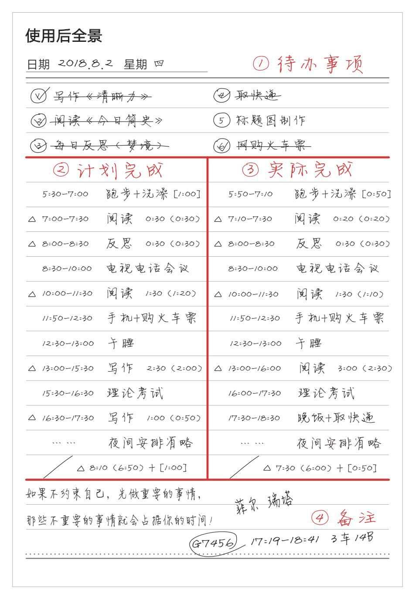
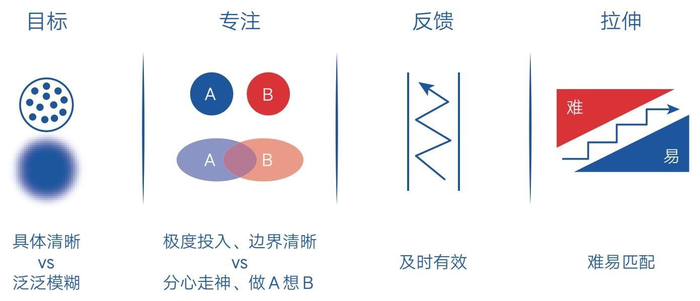

# 下篇　做成一件事的技法

## 第四章　策略——方法和路径

### 第一节　认知驱动：做一个真正的长期主义者

- 每到新年伊始，人们就开始暗下决心，制订来年的目标和计划。对此我通常是不鼓励的，甚至我还经常劝人不要在新年的时候做计划，因为真正的目标和动力来自我们对一件事情清晰而长远的认知，而非某个特殊的时间点。

- 热衷于在新年制订目标和计划往往基于对过去的不满，我们希望来年会有所不同，但多次失败的经历告诉我们，新计划出炉的那一刻确实让人动力满满，但过不了多久，我们就会陷入苦苦的毅力支撑，然后不了了之。

- 如果你真想让自己有所不同，不妨用这些时间来做另一件事——运用认知的力量驱动自己。这比毅力驱动要好，而且很可能让你达成目标，成为一个真正的长期主义者。

看清机制
- 说起认知驱动，我自认为还是很有发言权的，毕竟我在这个领域已经写了不下百篇深度文章。然而当我试着去解释它的概念时，却发现原以为可以脱口而出的东西在开口时竟吞吞吐吐，这种“心里知道但又说不出来”的尴尬让我很怀疑自己是否真的理解了。

- 就在我一筹莫展的时候，一本名叫《这书能让你戒烟》的书点醒了我。作者亚伦·卡尔这样介绍戒烟法。

- 大多数人无法成功戒烟的主要原因是不清楚烟瘾形成的真正机制，只好依靠意志力戒烟。单纯依靠意志力的努力往往是盲目的，所以人们会反反复复地起念，又反反复复地失败。只有当一个人彻底了解了烟瘾的来龙去脉、看清了吸烟这件事的本质之后，才会从心底里觉得抽烟是一件极不划算的事情，才能不靠意志力轻松把烟戒掉。

- 这让我一下子回过神来。想当初我也是一个做啥啥不成的人，但开始写作后，我竟一口气坚持做了早起、冥想、阅读、写作、跑步这5件事。这不是因为别的，而是因为通过写作我彻彻底底地学习了相关理论，清楚了背后的机制，比如，从《4点起床》这本书中我知道了REM睡眠理论和关于睡眠节点的知识，于是早起逐渐成了我的默认选择；从《财富自由之路》这本书中我知道了冥想与元认知能力的关系，于是冥想也慢慢成了我的必修课；从《运动改造大脑》这本书中我知道了运动最大的好处不是健身而是健脑，自然我也不愿意错过这个“人生正相关”的起点……

- 事实上，真正开启我主动成长机制的契机是我从《暗时间》这本书中得知了人类大脑原来是由本能脑、情绪脑和理智脑构成的。这个三重大脑理论，让我一下子看到了人们成长过程中面临的几乎所有的困惑，诸如缺乏耐心、急于求成、无法专注、沉迷娱乐、低效学习等，这些问题都能从中得到解释。

- 这种清楚原理机制后的恍然大悟，会让人忍不住走向探索和实践之路。因为当我们通过原理机制彻底看清做一件事的好处时，便会觉得不做这件事是一种损失。知晓了原理机制，我们自然也就有了具体的方法论，这会实实在在地增强我们做成这件事的信心，因此，行动、持续行动并成为一个长期主义者也就成了自然而然的事。

- 如果你也希望成为一个长期主义者，那就应该多花时间去了解这件事。至少去读一读相关书籍，了解一下相关领域的专业人士，而不是在新年的时候用10分钟写下一年读50本书这样的目标和计划。看不到具体好处和方法的目标非常单薄，它无法支撑你度过一年，甚至三个月。

寻找意义
- 看清机制还不足以定义认知驱动，毕竟这仅仅是智力层面的力量，成为长期主义者还需要第二种力量的加持——寻找意义。它可以激活情绪层面的力量，让情绪脑这台动力强劲的发动机为我们所用。

- 《有效学习》的作者乌尔里希·伯泽尔在谈到如何学习时曾说：“我们都愿意从事自己认为有价值感和意义的事情，因为动机是学习活动的终极动力，也是掌握任何一项技能的第一步，而获得独特的价值感和意义最好的方法就是主动去描述目标与自己的关联，换句话说就是调整看待事物的角度，看到这件事情的长远意义。”

- 如果没有意义的加持，那么就算我们知道做这件事情很有好处，内心也不会真的接受。比如读者“徐紫衣”在咨询时告诉我，她曾经坚持早起3年，因为早起在大家眼里是个很好的习惯，但3年后的某一天，她突然不愿意早起了，因为她始终不清楚早起对自己到底意味着什么，很多时候早上起来她甚至不知道用这些时间来做什么。可见，如果我们只看到目标本身，就会为做而做，动力不会长久；如果我们看到目标之外的更多意义，动力会完全不同。

- 就我自己而言，写作这件事的意义绝不仅仅是保持每天输出、思考、写出“10万+”，或是写出一本属于自己的书。写作的意义是让我建立起属于自己的认知世界，并借此唤醒更多希望改变的人。如果有很多人能够从我的文字里受益并改变，我便愿意写上一辈子。所以我也相信：乔布斯的真正目标不是生产苹果手机，而是为了改变世界。

- 一个人的成就往往在他的眼界之内，一个人在现实世界中能走多远，其实在他心里早就标记好了。就像史蒂芬·柯维在《高效能人士的七个习惯》中说的：“任何事都是两次创造而成的——先在脑中构思，然后付诸实践。”我想，这种构思不仅仅包括如何实践，更包括如何思考意义并进行自我心理建设。这涉及你想通过这个目标成为一个什么样的人，你希望给这个世界带来什么样的价值和贡献。如果你愿多花时间去思考这些事情，你就能调动自己的潜意识力量帮助自己行动。

- 这一点非常重要！因为潜意识由本能脑和情绪脑掌控，它的力量比意识的力量要强得多，所以我们的成长其实可分为显性的“能力成长”和隐性的“心理成长”，当心理成长滞后于能力成长时，会限制能力的突破。这也是为什么当我们变得更好，而潜意识没有接受的时候，我们就会搞砸计划，变成原来的自己。

- 寻找意义就是在训练我们的潜意识，让它领先于我们的能力，牵引我们前进，而不是躲在舒适区拖后腿。所以，要想成为一个长期主义者，就要刻意、主动地多花时间，建设内在的自我，而不是别人说什么自己就信什么。

- 现在反思一下你自己的目标和计划，是不是只看到了目标本身呢？如果是，那就去寻找意义，而寻找意义的一个好办法就是下一节说的“写下来”。

感受好处
- 看清机制、找到意义确实可以让人眼前一亮或心潮澎湃，但万物都受时间流逝的考验。

- 正如亚伦·卡尔说的：“每一个戒烟的人都知道戒烟的理由是什么，问题在于第二天，第十天，第一万天，当你的理由不是那么充足时，如果手边碰巧有一支烟，你就会突然恢复之前的状态。”

- 没错，在时间的力量下，机制会变得疲软，意义也会变得模糊，日复一日的重复会使我们不可避免地陷入“例行公事”的境地。你肯定觉得第158天早起不如刚开始那样有趣了；你肯定觉得第275天跑步更像一种坚持，而不是一种享受；你心里或许早就没有当初的那种动力了，坚持只是不愿让自己内疚，不愿被人视作言行不一的人。

- 那如何在重复中感受乐趣和动力呢？这的确是长期主义者需要解决的“最后一公里”。好在亚伦·卡尔依然给了我们解决这个问题的提示，他说：“戒烟的核心在于意识到戒烟不是一种牺牲，不是一种权利被剥夺，而是一种收获与解放。”换言之，如果你在做一件事情的时候感觉到自己是在坚持，其实就有牺牲感了。你会觉得早起是在牺牲温暖舒适的被窝，阅读是在牺牲手机娱乐的轻松，锻炼是在牺牲舒适慵懒的时间……

- 然而这种视角其实是错误的，因为我们的注意力天生受负面偏好的支配，会不自觉地忽略习以为常的好处，并盯住痛苦不放。所以我们应该学会转换视角，把注意力主动放到收获上：每早起一次，就又可以让自己享受一次宁静的世界；每阅读一次，就又可以让自己的思维密度增加一点；每锻炼一次，就又可以使身体里的各种激素水平达到平衡，充满活力……

- 这些好处不是假想出来的，而是确实存在的，只是我们不自觉地忽略了。而当我们关注了好处时，那些阻力仿佛变小了。这一小小改变可以让我们尽情地活在当下，提升生命质量。

- 当然，以上说的只是培养习惯的场景，如果我们的目标是培养一项技能，那感受好处的最好方法就是不断用这项技能去产出作品、打磨作品，然后换取正反馈。无论你的目标是弹琴还是画画，总之，想办法去产出作品，并利用这个时代最大的福利——互联网去展示自己，获取别人的肯定。一味地学学学只会让你觉得索然无味，但只要你用作品示人，你就会想办法打磨它。尽管创造的过程会让你感到有些困难，但最终换来的正反馈会让你在精进的路上乐此不疲。

成为一个长期主义者
- 人生最好的模式是长期乐观、短期悲观、当下愉悦。看清机制、寻找意义，就是让自己长期乐观；而短期内，我们需要在舒适区边缘持续拓展，这必然会令人悲观痛苦；但只要学会转换视角、换取反馈，我们就能时刻感受好处，让自己保持当下愉悦——这正是一个长期主义者最好的人生模式。

- 然而，不是所有人都有机会成为长期主义者，大多数人只能在短期内反复尝试。他们不知道做成一件事的方法论，只能凭感觉行事，任由欲望驱动自己——别人说什么好，自己就也想要，然后简单地制订一个目标和计划，再凭毅力苦苦支撑，最后又在新年伊始时暗下决心，如此周而复始。

- 现在，我们终于有了认知驱动这个武器，即无论在开始，还是在过程中，我们都要多花时间在这3件事情上：看清机制，防止盲目努力；寻找意义，注入长久动力；感受好处，体验当下愉悦。

- 有了这样的指导，我们就会持续学习、持续思考、持续行动、持续感知，同时也必然会把自己的目标导向那些少量的、有真正价值的长远目标，并最终成为一个真正的长期主义者。

### 第二节　写下来：我们都低估了“写下来”的力量

- 在接受了诸多咨询和提问后，我发现一个很有意思的现象：很多问题的解决方案竟然是一样的，而且都很简单，那就是写下来。比如以下场景。

- “无法掌控自己的情绪怎么办？”我：“写下来！”

- “经常分心走神不专注怎么办？”我：“写下来！”

- “行动力不强总是拖延怎么办？”我：“写下来！”

- “没有自己的人生目标怎么办？”我：“写下来！”

- “想问题很肤浅没深度怎么办？”我：“写下来！”

- 这样的对话很多，不过当我只是简单地抛出“写下来”这个结论但并没有说明原因时，你肯定觉得这只是我个人的经验之谈，不足为信。事实上，“写下来”背后有丰富的科学原理支撑，如果你能从根源上了解这一方法，或许就会发自内心地实践运用，从而快速摆脱困境。现在就让我们一起来看看，为什么“写下来”会有“包治百病”般的神奇魔力。

“写下来”是情绪的调节器
- 首先申明，这里说的“写下来”是指“把想法写下来”（包括用笔写下来和用键盘打出来），而不是专业的“写作”。实践这一方法不需要什么文笔或基础，只要会写字或打字就可以拥有这种力量。那么对于普通大众来说，“写下来”最大的好处是什么呢？我想莫过于它能化解自己的糟糕情绪了。

- 2019年1月，读者“王棋”和我说过这样一段经历。

- 有一次，我朋友被领导批评，情绪特别低落。在自己无法消化情绪的时候，她就用笔一条条写下自己真实的想法，写下自己到底在难过什么。当把真实想法一条条写下来并想清楚之后，她就觉得没有那么难过了，觉得领导的批评是有道理的，是在帮助她改掉问题、提升专业能力，只不过这种事实被批评后的难过情绪包裹了。我当时特别吃惊：竟然还可以用这种方法消解自己的情绪！我被批评后总是一直陷在情绪中，从来没有理性分析过自己到底在难过什么。看来高手解决问题的方式都是相通的。

- 为什么“写下来”会有这样神奇的作用呢？因为当情绪产生时，理性便会退居第二位。我们都知道，人类情绪脑的力量比理智脑要强大得多，所以情绪在大脑中处理的优先级远高于理性思维，但情绪脑在智能上又远远落后于理智脑，它只能将遇到的事情粗糙地分为“有利的”和“有害的”，所以情绪一旦极端化，它就会在模糊的“有害端”反刍那些负面事件，也就是我们说的陷在情绪里走不出来。

- 但是，书写自己当前面临的负面事件，就可以调动更多的理性资源帮助我们整理思路，使处理情绪思维的优先级暂居其后，同时，书写这一行为可以激活大脑皮层的语言区和书写区，使我们对当前遇到的负面事件有一个更为具体和清晰的认识，所以书写可以让负面情绪得到一定的缓冲，使人慢慢地恢复理智或理性。

- 我在平时的每日反思中也深深地体会到了这一点，因为无论当天遇到什么难过的事，我都会把它们写下来复盘，所以即使没人帮助，我也能疏导情绪，而且往往还能从负面事件中产生积极的视角和看法。

- 《开放心胸》的作者杰米·彭尼贝克通过幸福实验也发现，运用书写来表达自己情绪的人更加健康。因此，他同样建议：一旦你的生活出现了问题，就拿出笔和纸把事件的经过、自己的感受、为何会有这样的感受，一五一十地写下来。过程中不用修改，不用检查，更不用管语法或句式对不对，只要放手去写就好了。

- 同时他还强调，写下之后一定要回答自己以下两个问题。

- 一是这个事件为什么会发生？

- 二是我能从中汲取什么教训？

- 书写的意义不只是宣泄怒气，更在于找出意义，所以表达即消融，表达即清醒。无论你遇到什么不愉快的事情，如果想更好地解决问题，那就拿出笔纸或键盘来疗愈自己吧。

“写下来”是专注的聚焦器
- 其实就算没有极端情绪的影响，我们也未必总能够集中注意力去做重要的事。随便回顾一下生活中的片段就会发现，大多数时候我们都会杂念丛生，心中翻腾着各种欲望、担忧、顾虑或焦虑。

- 2005年，美国国家科学基金会通过调查发现：普通人脑海里每天会闪过1.2万至6万个念头，其中80%的念头是消极的，95%的念头与前一天完全相同。[1]

- 可见分心走神是我们的常态，而且人有负面偏好，会不自觉地把注意力放到那些“坏事”上，所以在日常生活中，我们会天然地陷入分心走神状态，很难进入心流状态。那如何在生活和工作中保持专注呢？

- 写下来。无论在什么场景中，如果你无法静下心来做事，那就坐下来写下你心中的念头，想到什么就写什么，连续写上5分钟，你就能集中注意力了。如果你在学习的过程中，总有杂念闪现，也没关系，把它们写在边上的本子上，哪怕只用一句话描述也可以，因为这样做可以启动元认知，清空我们的“工作记忆”。

- 所谓“工作记忆”，就是我们所有可用的脑力资源。它非常有限，大概只有7个单位，也就是说，每个人脑中大概只有7个脑力小球可以帮助自己进行思维活动。而那些烦恼、顾虑、担忧等无用的念头会轮流占用这些资源，就像一台电脑在后台运行了很多程序。所以要想让大脑集中精力、火力全开，就得想办法结束这些无用的进程，而结束进程通常只有两个办法：

- 一是在现实世界中完成它，让事情闭合；

- 二是在虚拟世界中审视它，让进程结束。

- 显然，很多念头是无法在现实世界中立即完成的，所以“写下来”就成了在虚拟世界中打消它们的不二之选，因为它可以帮我们开启元认知，审视这些念头存在的理由和必要性。只要把可信的理由“说”给它们听，它们就能接收信息，认识到自己没有存在的必要，从而主动释放进程，退出工作记忆。而工作记忆一旦被清空，人的精神熵就会迅速降低，于是就具备了进入极度专注状态的条件。

- 这也是人们常说“先整理心情，再处理事情”的原因。

“写下来”是行动的发动机
- 就算你心中毫无挂念，就一定能拥有强大的行动力吗？

- 未必！

- 因为真正的行动力不是意志力，而是清晰力[2]。也就是说，即便我们清空了工作记忆，如果不清楚下一步具体应该做什么，同样会行动模糊。在这种状态下，我们会觉得做这个也行、做那个也行，最后往往会在强大天性的支配下选择做那些最简单、舒适的活动——娱乐。

- 这也是为什么很多没有生活压力的人活得并不幸福，因为他们虽无压力，但也无力做成那些能够成就自己的困难之事。要想在顺境中主动掌控命运，就要防止自己陷入“选择模糊”的状态。而消除“选择模糊”最好的办法就是把下一步的行动或计划写下来（见图4-1）。

- 通过写下具体的日程，把自己约束在特定时间内的特定事件上，我们就不需要在过程中再花脑力做选择了。而且写下明确的日程相当于和未来的自己达成了一种协议，这种协议就是一种承诺。人一旦许下承诺，潜意识就会倾向于保持前后一致，所以这种写下来的习惯会让行动力大大提升。

“写下来”是目标的出发地
- 对于成长来讲，消除情绪、保持专注、提升行动力其实都是细枝末节，真正重要的是找到自己的人生目标。一旦我们找到那件茶不思、饭不想都愿意去做的事，我们的生活就会自带平和、专注、高效的属性。然而找到自己的人生目标并不容易，很多人都没有意识到自己始终活在无目标的状态中。

- 比如在一次关于人生目标的咨询中，我要求读者“贺Y”告诉我他的人生目标，结果他沉默了一周才回复我：“那天你问我改变的目标时，真的一下子蒙了，原来不知不觉中，我已经过上了得过且过的生活，我居然一直处于这样的状态。”另一位读者“落F”也这样回复：“我思考了两天，还是没能写出清晰的人生愿望。”

- 不信的话，你可以自己试试。可能你觉得心里有目标，但真到动笔的时候就不是那么回事了——要么写不出，要么写不清。

- 因为写下来要求你把那些模模糊糊的想法变成非常清晰的文字，这个从模糊到清晰的过程就是“想与写”之间的距离。如果你能清晰地写下来，往后的人生或许会变得些许不同。

- 当然，做这件事最大的困难是，你不确定写下来的是不是自己真正的目标，或者根本写不出来，停在那里不知如何继续。如果你遇到这种情况，请谨记一条原则：一定要先假设一个最接近的目标。这个目标是否正确并不重要，只要它是目前最接近的，那它就可以帮助我们先行动起来，然后带领我们走向下一个更接近的目标，直至真正的目标出现。

- 实际上多数人的人生目标都不是一开始就出现的，而是在持续的实践试错中慢慢浮现的。所以这种利用假设来消除模糊和不确定性的方法，是一种极好的成长策略。除了上面的日程规划，这条假设原则也同样适用。如果你不确定下一步该做什么，那就按照最大的可能性先假设一个。你会发现仅仅一个假设也会大大增强你的行动力。

- 当然，如果你希望自己更进一步，那我建议你再花点时间写一写对人生目标的认识。也就是想办法从各个角度发现做这件事情的好处与意义，因为当我们看到的好处和意义越多，做成这件事情的概率就越大。而发掘好处和意义最好的方式就是用笔或键盘描述自身与目标之间的关联。

“写下来”是思考的挖掘机
- 最后，再说一说如何用写下来的方式提升自己深度思考的能力。深度思考的能力从本质上来说其实就是输出的能力。

- ·没有输出能力的人只会在脑中想，但不会说；

- ·输出能力弱的人可能会说，但不一定能说清楚；

- ·输出能力强的人通常都会写，而且还能写清楚。

- “想、说、写”之所以代表不同程度的思考能力，是因为这三种活动关联知识的数量和密度是不同的。很多时候，你会发现一件事情或一个道理自己脑子里想得挺明白，但让你说的时候你会磕磕巴巴；如果再让你写下来，你就会无所适从，感觉逻辑非常不清晰，所以书写是锻炼深度思考能力最有效的方法之一。

- 无论是把心中的困惑写下来（表达清楚问题），还是把脑中的想法写下来（表达清楚思考），都会最大限度地调动脑中的知识储备，产生更多的关联，让我们不断突破自己的脑力局限，让那些模模糊糊的、呼之欲出的、似是而非的、捅破窗户纸就可以洞察的时刻，变成我们的“啊哈时刻”[3]。

- 可见，写下来的力量是强大的，时常这样练习，你的思考能力和表达能力都会在潜移默化中得到锻炼和提升。如果你还能把每次新学的知识通过自己的语言重新描述出来，那你就可能在深度学习的路上领先他人。

- 写下来还有另一个好处，就是可以反复修改，直到能用最合适的语言表达最多、最准确的含义。就像本节一开始也只有几个零星的思考点，我甚至担心篇幅不够，但经过数周的持续打磨，我竟查阅了4篇文章、6本书、20多个读者咨询的对话，最后把“写下来”这个主题翻了个底朝天。“写下来”这三个字在我这里又有了全新而独特的意义，清晰又深刻。

- 如果你真正体会到了写下来的好处，我相信你肯定会对这种能力爱不释手。而且你一定会越来越不满足，然后在某一天拿起手中的笔，迈向写作的殿堂，用它去创造一个属于自己的世界。毕竟“写下来”只能让自己变得更好，而“写作”还可以对外产出有价值的作品，让他人变得更好。

- 不要低估“写下来”的力量，更不要低估“写作”的力量。只要你写下了第一笔，就有机会开启人生的无限可能！

### 第三节　假设：什么能力可以让自己快速进步

- 一个人要想变好，不仅要有强烈的愿望，还要有科学的方法，二者缺一不可。如果光有愿望没有方法，人们的欲望就会变成焦虑；而只知道方法但欲望不强，人们的行动也会变得机械，陷入为做而做的境地。所以只有愿望和方法同时具备，一个人才能快速进步。

- 然而现实中的大多数人都是愿望有余而方法不足，他们强烈地希望自己变好，但总是苦于自己能力缺失，诸如：缺少独立思考，凡事缺乏主见，没有人生目标，学习效率低下，情绪波动无常，遇事逃避退缩，总是急于求成，无法做成事情，等等。

- 这些困境就像一个个怪圈，使人们无论怎么努力都像在原地打转。不过在我看来，这些困境其实不难打破，因为它们的解决方法都涉及两种基本能力：“敢假设”和“看现实结果”。如果我们能有意识地掌握并运用这两种能力，就可以将类似的困境一网打尽。

- 这听起来有些夸张，毕竟“假设”和“现实结果”这两个关键词看起来并不起眼，但我可以先告诉你结论：它们威力巨大。如果你不信，那就听我细细解说，相信它们一定会成为你快速改变的有力抓手。

假设，是一切进步的开始
- 阻碍我们进步的原因众多，但其中最主要的，通常是我们所做之事有很多模糊性和不确定性。这点毋庸置疑。如果摆在我们面前的都是清晰确定的路径和明确可期的结果，想必每个人都能大踏步地向前迈进，而实际生活中，这种情形少之又少。我们总是处在复杂而困难的事情中，不确定自己想的是不是对的，不确定自己说的是不是对的，不确定自己做的是不是对的……所以我们止步不前，因为逃避模糊和不确定性是人类的本能。

- 但困难之时正是进步之机。如果此时有人敢直视模糊、敢于对不确定性做出脑力范围内最大程度的“假设”，那他就能更大概率地突出重围，获取更多人生优势。

- 这么说还是太抽象，不如看些例子吧。

- 比如，我每次写文章都是这样开始的。起初脑子里非常模糊，难以下笔。但即使如此，我也会假设那个极其简单甚至没有逻辑的想法是对的，然后“逼迫”自己写下能描述它的句子。这些句子可能是一些文法不通的话，也可能只是几个关键词的组合，但没关系，对我来说，只要写下来就是进步。接下来要做的，就是在这个基础上再次进行“假设”，一点一点地修改、丰富、完善，最终它总能呈现全新的面貌。如果我担心自己写不好，不敢假设性地写出第一句话，恐怕写作路上早就没有我了。

- 我也经常用这个方法辅导女儿学习。比如，她写作业遇到阅读理解或作文时就会习惯性地卡在原地并向我求援，但我不会直接帮她，而是让她先说一个自己认为的答案，或者口述一下作文的大致想法。此时，她总是畏惧地摇摇头说：“我真的想不出来。”我再鼓励她：“没关系，你再想想，哪怕能说出一个词也行，不管怎样，你得先有一个自己的答案。”然后她慢慢地开始动脑，说出一两个词或一个粗糙的小故事，我再继续鼓励她想出更多的词。渐渐地，她开始找到思路，最终凭借极少的外界帮助自己完成了作业。

- 我还将这种方法用在读者的咨询中。以前读者向我提问的时候，我都会直接把想到的“答案”告诉对方（当然，我的“答案”也是我自己做出的假设）。后来我改变了策略，请读者就自己的问题先提出一个可能的原因或解决方案。有趣的是，很多时候还没等我给出建议，对方就会恍然大悟：“噢，我明白怎么回事了……”这时，我就会特别得意，因为这个“假设策略”既节省时间和精力，又让对方收获了思考和答案。

- 事实上，在向读者提供免费咨询的近三年时间里，我个人分析问题、解决问题的能力得到了极大的提升。因为遇到了很多超出认知范围的咨询，所以我常常尝试调动所有知识去假设一个可能的答案。

- 比如读者“酒酿”（一名实习护士）就问过我一个困扰她很长时间的奇怪问题，她说：“不知道为什么，我的行动总是快于脑子，就是在医院做事的时候，脑子还没有想好，脚就开始不受控制地乱跑乱窜起来，等我反应过来的时候，我就会很疑惑自己刚才在干嘛……”

- 作为局外人，第一次听到这样的描述时我也很疑惑，但我还是尽量调动自己所学，并结合之前与她聊天的信息给出了一个假设性的回答：“我想，这个下意识的习惯可能与你在实习时受到的压力有关。记得你之前说护士长经常批评你，特别是当她说你手脚不利索的时候，你心里会特别恐慌，所以为了改变外界对自己‘笨手笨脚’的印象，你的下意识会让身体第一时间动起来，这样至少不会让自己看起来是待在原地没反应的状态。”结果她惊讶地说：“我的妈呀，我要哭了。您说得对，就是这样的，我自己都没有意识到。”

- 这样的结果让我也感到意外，虽不一定完全符合事实，但让双方都得到了好处——她解决了问题，我收获了经验。

- 假设策略不仅可以用在学习、思考上，也可以用在生活、成长中。比如很多读者在读了《认知觉醒》后都开始实践“每日反思”“日程规划”或开始寻找自己的人生目标。但在实践的过程中，他们总是因很多“模糊和不确定”卡在某处，诸如以下情景。

- ·每次反思复盘的时候，想不清问题的原因怎么办？

- ·进行每日规划的时候，总有不确定的干扰怎么办？

- ·寻找人生目标的时候，怎么都找不到方向怎么办？

- 事实上，这些问题通通可以用“假设”这个利器来解决：

- ·反思的时候想不清问题的原因，那就本着极度坦诚的态度，先假设一个自己认为最可能的原因；

- ·规划日程的时候如果有很多随机干扰，那就以最大可能为标准，先假设一个具体的计划；

- ·找不到人生目标的时候，不妨将所有选项列出来，并将那个目前认为最可能实现的选项假设为目标。

- 关键不在于对错，而在于你得先有一个“想法”。只要我们能够依据当前所有的知识和可用信息，先做出一个假设，我们就不会卡在原地，就能够继续向前迈进。更多新信息必然会在后续的行动中慢慢浮现，如此，我们就有了快速进步的可能。

- 掌握了这些要领，我们就可以自主解决很多生活中的实际问题。比如当你意识到自己在生活中是一个缺乏主见的人，想改变，怎么办？很简单，你只需在每次需要表态的时候，利用当前所有可用的理由和依据，先假设一个自己认为最正确的观点。即使它不一定正确，即使你不一定要说出来，但你必须有一个。时常这样练习，你的主见就会慢慢变强。

- 可见，假设可以消除模糊，让你的思考更深入；假设可以消除阻碍，让你的行动前进一步。经常进行假设练习，可以提升你的分析能力、判断能力、解决问题的能力，进而提升你掌控生活，甚至是创造幸福人生的能力。

- 当然，你肯定很担心自己的假设会出错。关于这一点，我认为你完全不必担心！因为从某种角度而言，这世间所有人的想法其实都是假设，即使是对你最有帮助的想法也只是假设，而不是板上钉钉的事实。《好好学习》的作者成甲也说：“我们所有的观点、结论，本质上都是一种假设。观点和结论的好坏，取决于我们的假设与事实相符的程度。”所以我们无须盲从他人的态度和观点，也不必盲目否定自己的态度和观点，反正大家都是在假设嘛。重要的是，我们得有敢于假设的意识，无论对错，先练习起来。即使假设错了也没关系，只要我们多总结、多修正，保持头脑开放，始终用最新、最可靠的理由和依据来支撑自己，就可以不断革新自己的假设，使自己的态度和观点越来越接近事实。

- 这也是为什么我们要持续阅读、持续学习。因为书中的观点虽然也是作者们的假设，但他们的正确概率通常更大。所以当我们自己的假设能力还不是很强的时候，学会“借用”书中高人的假设就非常明智，这可以使我们少走很多弯路。

- 在《认知觉醒》中，我也强调过这个理念。

- 如果你觉得别人讲的道理有理有据，而自己暂时无法反驳，碰巧自己又非常想做这件事，那就相信他们说的是对的，然后笃定地行动。在实践途中，你自然也要保持思考，用行动反复验证他们的理论，不适则改，适则用，直到自己真正做到为止。

- 可见，假设，是一切进步的开始，是快速进步的阶梯。如果你勇于跨出这一步，并有意识地将假设的方法运用到生活各处，你的生活必将有所不同。

- 那么，一旦我们做出假设，又该如何判断它是否正确呢？

- 答案很简单：看现实结果。

现实结果是最好的评判师
- 这是我经常对人说的一句话，因为生活中很多人做事不看现实结果。这么说或许让人难以接受，但这确实是阻碍人们进步的另一大原因。

- 比如在读书这件事上，很多人总是对读完书之后记不住内容感到很痛苦，他们经常发现，一合上书就忘记读了什么，有时读到最后，自己能想起来的只有一两个点。这与他们期待的“全盘记住、全盘吸收”落差巨大，导致他们对阅读这件事的体验极差。

- 事实上，如果我们能学会“看现实结果”，就会发现“记不住或忘记大多数”其实就是现实常态，这就是我们的真实能力。不信的话，你现在可以去看看那些自己阅读过的书，你会发现在合上书的情况下，能想起书中的某一句话或某一两个观点就很不错了。如果你的生活因某句话或某个观点发生了真实的改变，那这本书对你来说就已经非常值了。

- 我自己的成长就是从看到并接纳了这个现实后开始突飞猛进的。大概在开始写作半年后，我就放弃了“全盘记住、全盘吸收”的妄念，假设每次阅读只能记住一点点，然后主动降低心理期待，告诉自己：只要书中有一个点触动了自己，并让自己的生活发生了真实的改变，这次阅读就是有效的，这本书就是超值的。于是阅读这件事立即变得轻松愉快起来，我也能把注意力从阅读量转到改变量上，这样的转变反而加速了我的成长进步。

- 再比如，很多人做每日规划的时候都喜欢把计划排得满满的，甚至连休息娱乐的时间都没有。结果一天天下来，发现自己总是完不成任务。一盘点，十件事可能只能完成两三件，因为很多任务的用时都大大超出了自己的预期。这必然会让人沮丧，甚至让人破罐子破摔，直接放弃计划去娱乐了。但即便如此，下次做每日规划的时候，他们可能依然不吸取教训，依然坚持之前的模式，结果再次事与愿违。

- 事实上，只要我们多看几眼现实结果就知道自己每天能做多少事情。此时我们应该主动接纳现实，降低心理预期，只做两三件最重要的事，并给生活留出足够的闲余。只有这样，我们的生活才会变得更加从容、高效、平衡和愉悦。

- 现实似乎总在提醒我们不要高估自己的能力，告诉我们能学的东西其实很少，能做的事情也很少，当现实一次又一次给我们相同的反馈时，我们就应该静下心来关注这个事实。因为这背后很可能就是我们人类急于求成的天性在作祟，所以一个清醒的人应该对现实结果保持坦诚，接纳每次进步微小的现实，接纳行动初期笨拙的现实。只有开始接纳现实，真正的进步才会到来。

- 此外，“看现实结果”还可以提升我们的判断力和决策力。比如很多想学写作的人常问我要不要报名参加网上的写作训练营，我通常都这样回答：“你可以报一门喜欢的课尝试一下，但一定要注意现实结果，因为在没有训练营的时代，很多人同样可以成为写作大师，而现在很多人即使报了训练营也没有写出什么名堂，可见参加训练营并非写作的核心条件，千万不要将全部希望寄托于此。”

- 这个道理同样适用于报其他网课的人。比如很多人为了提升自己买了很多网课或专栏，多到自己根本学不完。虽然他们心里清楚这样做不好，但每每有新课出来的时候，他们依然纠结要不要去购买。如果一个人对现实结果坦诚，他就能轻易做出决定——不买。因为现实结果已经告诉他很多次了，买了课也没时间全部学完，学了也无法将其全部用到实际生活中去，买的课学不完反而会让自己变得更焦虑。

- 包括那些希望实践早起、断食、跑步的人，如果对此犹豫不决，那就看看现实结果。因为这世上很早就有人在实践这些事了，他们不仅活得很好，还在广泛传播这些好习惯。当然，最好的办法是亲自去试一下，看看自己的实际变化和感受，看看自己的体检结果，这比任何说理更直接有效。一旦我们能借助现实结果看清本质，就不会被表象蒙蔽了。

注意事项
- 毫无疑问，“敢假设”和“看现实结果”就是促使我们快速进步的奥秘。如果你愿意深入实践它们，那我建议你再看看以下几个注意事项，因为你早晚会用到它们。

- 一是学会将观点与情绪分离。

- 这一点主要是指：当我们在“借用他人假设”的时候，不要因为对其本人的主观偏见而否定他的有益思想。比如觉得某些人行事作风不符合自己的认知标准，就对他们的思考嗤之以鼻。如果抱有这种心态，我们将错失很多成长进步的机会，因为这好比“把孩子和洗澡水一起泼出去了”。

- 同理，当你读到一本口碑很差或评分很低的书时，也不要鄙夷地将它拒之门外。更好的做法是，保持开放的心态去翻一翻、读一读，或许书中有那么一两句话触动了你、改变了你，那也是很有价值的。就算没有什么收获，自己也不会有什么特别的损失，至少你知道了不应该把文章写成这样，同时你增加了识书选书的经验。学会将他人观点与主观情绪分离，那么你眼中就不会有所谓的“烂书”或“烂人”，就能从万事万物中学习。

- 二是明确培养习惯和技能不能马上看到真正的结果。

- 比如跑步的真正好处就不是马上能体现出来的，我们不能用一两天或者十几天的现实结果来评判跑步这件事有没有用。如果你实践的活动是为了培养习惯或技能，那它们都需要相对长时间的持续行动才能看到真正的变化与好处。所以在这些活动的行动量没有达到一定程度之前，不要轻易将眼前的现实当作判断依据，因为它们并不准确。

- “敢假设”和“看现实结果”是一对绝佳的组合，它们几乎适用于所有场景。无论是治国、治商，还是治学、治人，都会用到这个底层方法论。所以在你前行的路上，请一定记住这句话：假设是一切进步的开始，现实结果是最好的评判师。

### 第四节　降低期待：命运一定钟爱那些愿意慢慢变好的人

- 今年春节，我见到了刚满周岁的小外甥。他刚会站立走路，这让我有机会观察人学步时的情景。

- 一开始，他只能站立，而且站着的时候会紧握双拳、颤抖不止，像是要抓住什么东西好让自己保持平衡一样。看得出，一个非常简单的站立动作在他眼里也是相当困难的，稍不注意就会一屁股坐到地上。

- 几天后，他能踉踉跄跄地走起来了，但转弯的时候必须像圆规一样，以一只脚为圆心，另一只脚一点一点地转，稍快一点就会立即倒地。不过，他对自己的笨拙和跌倒毫不在意，也不理会旁人的笑声，双手一撑又起来继续朝想去的地方走去，如此反复，乐此不疲。

- 在一起度过的二十多天里，我能感到他稳了起来，但变化不是很明显，走路时依然跌跌撞撞。不过可以肯定的是，几年后他一定会像我们一样走得既快又好，可以轻松准确地控制自己的身体。

- 这让我不得不感叹，原来我们最初就是这样做成一件事的：在面对一个全新的领域时，我们能毫不着急、毫不畏惧、毫不气馁，始终欢快地往前走，并且最终成功了。长大以后，我们却总是在学习一项新技能或进入一个新领域时遭遇焦虑和失败。因为我们总是想要太多、急于求成、害怕被嘲笑，遇到打击就觉得自己肯定做不好，于是没走几步就停下了。

- 从幼儿到成人，很多时候我们竟从“成事者”沦为“失败者”，这真值得我们好好反思一番。虽然成年人的世界不像孩童的世界那样无压和宽容，但不得不说，儿时的两个品质非常值得我们学习。

- 一是只做刚需之事。正如走路这件事对于孩子来说就是生活的刚需，因为他们必须学会走路才能拥有行动自由。所以他们有很强的学习欲望，愿意持续练习；又因为真正的刚需并不多，所以他们的目标也很聚焦。

- 二是没有期待之心。由于孩子是懵懂的，不知道什么是害怕与恐惧，所以他们既不在意前进的挫折与失败，也不在意他人的眼光和评价，更不要求自己在短时间内必须掌握。他们只关注自己当下的点滴进步和喜悦，在时间的加持下，最终掌握了诸如走路、说话这样的全新技能。

- 这其实就是普通人成事的秘密，但当我们长大之后，这些宝贵的品质却不知不觉地被丢掉了。我们总想同时做很多事，又想马上看到结果，还特别在意他人的评价，以致看不到进步就会烦躁，遇到退步就自我否定。如此说来，现在的我们要想更好地改变自己，还得回头向幼时的自己学习呢。

- 不过这没什么丢人的，这只是一种回归罢了。如果我们能主动回归幼时的自己，回归那种允许自己慢慢变好的状态，那我们依旧可以从容地做成任何想做的事情。

主动降低期待，是欢快行动的窍门
- 稍微观察一下就会发现，我们长大后的多数烦恼都来自对自己和他人的过高期待。不信的话，你可以觉察一下自己的焦虑情绪，其原因无非就是自己当下的期待超出了实际能力。而且这些原因都可以被归结为“数量”和“难度”两种类型。

- 就“数量”而言，很多人都是同时想要很多，才导致自己心神不安、无法专注工作或学习。比如很多读者的烦恼都是这样的。

- 最近积压了很多任务，感到时间不够用，心里越想高质量地完成所有的任务就越完不成，对此很焦虑，该怎么办呢？

- 既想一次性完成论文答辩，又想提前找工作，结果哪头都无法投入，很纠结……

- 凡遇到这类情况，我都会建议他们主动降低期待，放弃或暂时搁置那些不重要、不紧急的任务。因为很多任务其实都是我们自己的欲望强加给我们的，就算暂时放弃天也不会塌下来。相反，当我们主动放下那份不切实际的期待后，反而可以安静下来，专注于眼前最重要的事情。

- 当然，你可能会说有些事情是自己没办法选的，比如考试压力，我们总不能放任不管吧？事实上，如果我们对某一次考试真的心有余而力不足，那还不如降低期待，告诉自己最差的结果无非就是没考好，然后本着重新开始，能学多少就学多少的心态，把多出来的都当成惊喜，这样我们反而不再担忧害怕，能静下心学习。类似的，当我们遇到畏惧的人和事时，不妨假设自己最担心的事情已经发生了，此时心理预期在低谷，我们反而能放平心态，从容面对。

- 主动削减欲望、降低期待的目的在于让自己丢掉精神包袱、轻装上阵，毕竟焦虑只会让我们停滞不前。

- 另外，就“难度”而言，很多人无法成事都是因为忍受不了最初阶段的笨拙和失败。比如读者“江风”说：“冥想好难啊，我每次都分心走神，感觉自己好没用。”我问他练习多久了，他说：“7天。”读者“Yang”说：“早起好不适应啊，感觉每天上午都会犯困。”我问他早起多久了，他说：“4天。”我听后的第一反应就是：这才几天啊，做不好当然很正常！

- 不过我也没有资格去批评他们，因为急于求成是人的天性，我自己也经常陷入这种境地。比如前段时间为了陪女儿玩三阶魔方，我们一起学习了“基本公式”——用这种方法可以在2分钟左右复原魔方。后来我看到魔方达人用“高级公式”在30秒内将魔方复原，觉得很酷，于是付费购买了视频教程开始自学三阶魔方的高级公式。

- 高级公式共有119条，其中相对简单的F2L公式就有41条，虽然它们之间存在规律，老师讲得也很好，但对我这个新手来说还是很抽象，我经常记混。学到第三四天的时候，我发现自己的速度非但没有提上去，反而更慢了。复原过程中不是反应不过来就是弄错，手指也非常笨拙，还不如用基本公式来得快。当时我感到非常懊恼，甚至开始自我否定，觉得这41种情况简直太复杂了，自己根本记不住。

- 就在我准备放弃的时候，我想起春节期间小外甥学走路的情景，猛然意识到自己真是太急于求成了。为什么才几天时间，我就想要突飞猛进呢？为什么不允许自己反复失败呢？为什么不能用更长的时间去掌握呢？

- 几个反问之后，我焦急、低落的情绪立即消失了。我回想起技能学习的本质就是通过大量的练习使大脑中相关神经元产生连接并形成强关联的过程。这个过程在初期必然是非常缓慢的，因为它们之前还没有形成顺畅的通路。但只要持续练习，这些连接就会越来越多、越来越强，最终形成一张高效的网络，使自己在某天开始加速并突破。所以，我坚信只要给自己足够的时间去练习，就一定会对41种场景形成肌肉记忆，达到不用动脑也能自动上手的程度。就像我坚信小外甥长大之后一定能轻松准确地控制自己的身体一样。

- 从那以后，我开始降低期待，决定用至少1个月的时间去学习F2L公式，且每次只要求自己学会一条，再用3～6个月的时间去练习。如果想不起来就反复看视频讲解，直到把它们牢牢记住，然后一有空就把魔方拿出来练习（正好可以打发很多碎片时间）。

- 事实上，20天后我就能快速识别大多数场景，手指的灵活度也提升了很多。现在我对手中的三阶魔方已经有了轻松的掌控感和浓厚的兴趣，再也没有之前的挫败感了（本书定稿时，我已经掌握了全部119条公式）。

- 这段经历也让我对今后学习掌握其他技能有了巨大的信心和指引，因为只要我在遇到困难时能主动降低期待，允许自己一次只做好一件事，允许自己在开始的时候进步缓慢，甚至反复失败，允许自己花更长的时间去练习，就一定能做成这件事情。

- 这个方法论对大多数人适用。如果你认真实践，就一定会对“少即是多，慢就是快”和“无欲则刚”这两句话有更深、更新的理解。

主动降低期待，是长久幸福的秘诀
- 针对以上内部场景，主动降低期待可以说是我们获取成就的窍门。对于外部的人际、婚姻、生活、成功等场景，主动降低期待同样是我们获取幸福的秘诀。

- 关于这一点，还是从我和女儿的故事说起吧。一个周末，她叫我陪她打乒乓球，但我心里并不愿意，因为她连发球都不会，只喜欢胡乱地打来打去。如果陪她玩，那整个过程基本上不是在丢球，就是在捡球，这对我来说实在是太无趣了。但说好要好好陪伴，我也只能硬着头皮陪她玩。

- 就在我机械挥拍的时候，我察觉到了这种低落的情绪并开始审视。很快，我找到了原因——我对女儿的心理预期太高了。因为在心里，我总是希望与一个和自己水平相当的人玩，正是有了这种预期，我才会在陪女儿时有一种成年人玩过家家的感觉。

- 想到这里，我立马开始调整心态，主动降低期待，把这场陪玩当成一次入门教学。我把自己当成教练，给她创造最好的接球条件，并鼓励她达到连续10次不丢球的目标。结果她打得越来越好，我也越来越投入，最后两个人都很有成就感，玩得非常开心。

- 由此，我也意识到所谓的耐心或好脾气很多时候就是适当降低期待，无论是对孩子还是爱人，都是如此。我们平时对孩子的责骂、对爱人的抱怨，归根结底都是在以自己过高的心理预期去衡量对方、要求对方，忽视了对方的能力和感受。

- 有趣的是，对越亲密的人，我们的期待往往越高，要求也越苛刻，因为我们总是希望他们更好，容不得一点错误。但这种期待往往让我们变得不够幸福，经常会被一点小事弄得鸡飞狗跳，导致不必要的情绪消耗和波动。特别是在婚姻生活中，一方的期待越高，其幸福感就越低，因为他（她）总觉得对方应该对自己怎样怎样，如果对方不符合自己的预期，自己就会不开心。

- 所以很多过来人都这样劝诫后来者：你要一开始就把自己想成是一个人，没有父母、没有子女、没有配偶、没有朋友、没有任何人的帮助，这样，后面的一切都会让你觉得无限惊喜。这种主动把自己的心理预期降到最低的做法其实就是对“心理锚定”的积极运用——幸福取决于你锚定的对象是谁。

- 《清醒思考的策略》的作者罗尔夫·多贝里在书中说过他在修道院经历的一次“心理锚定”。他说那里的餐具都放在一个棺材造型的黑盒子里，吃饭时人们必须打开“棺材”的盖子才能拿出餐具。这个过程会向人们传达这样的信息：你其实已经“死”了，现在发生的一切对你来说都是额外的馈赠。有了这样的心理预期，人们就会更加珍惜光阴，不会将时间浪费在激动的情绪上。

- 叔本华也说过：“人生的幸福不是寻求快乐，而是没有痛苦。”即使我们在某一领域取得了成功，也应该时刻保持觉察，时常对不断上调的心理期待进行清零。因为世间获取幸福最简单的方法就是主动降低心理期待。

主动降低期待，不是自我放弃
- 你心里肯定早就有了这种怀疑：主动降低期待不会让自己丧失斗志、活在自己的舒适圈里吗？不会让自己成为一个无原则的顺从者吗？

- 其实不会，因为任何观点都有适用范围，都需要满足前提条件才能成立。而“主动降低期待”的前提条件就是：我们本就是希望变好的人。如果我们不求上进或不希望自己幸福，这点当然就不适用了，相反，我们还得想办法激发自己的欲望和期待。而你现在正在读这本书，说明你有强烈的成长欲望。

- 不过，“主动降低期待”和“希望自己变好”看起来相互矛盾，这又作何解释呢？关于这一点，我们应该听听美国作家菲茨杰拉德的观点，他说：检验一流智力的标准，就是看你能不能在头脑中同时保留两种相反的想法，还能维持正常行事的能力。我认为检验一流心理的标准也是如此——看一个人能不能在心中同时容纳两种相反的期待，还能正常行事。

- 事实上，当我们能够同时容纳两种相反的想法和期待时，我们往往能把事情做得更好。因为一个人如果只有欲望（希望自己变好），则会急于求成或暴躁刻薄；只有理智（主动降低期待），则会动力不足或顺从纵容；但如果能让二者同时在线、协调作战，就可以取长补短、相互成就。

- 这样的人必定心态开放，并表现出这样的品质：既强烈地希望自己变好，又能稳住自己慢慢前行；既能做最好的准备，也会做最坏的打算；既能好好地爱他人，也能好好地爱自己。

命运一定钟爱那些愿意慢慢变好的人
- 诚然，这世上有人会得到命运的偏爱。他们天赋异禀、能力超群，可以不费吹灰之力做成某些事情，但这样的人必然是少数。如果你确定自己不是那类人，那就及早坦承接纳，主动降低期待，像一个刚会走路的孩子那样，允许自己慢慢变好。

- 虽然成年人的世界并不容易，但从一生这个尺度看，我们还有足够的时间允许自己慢慢改变。只要你愿意在一个有价值的领域持续经营，并对自己和他人降低期待，命运也一定会特别钟爱你。

### 第五节　深度练习：跨越从普通到卓越的分水岭

- 从某种意义上说，要想获取人生幸福，最简单直接的方式就是练就一项技能，让自己在某方面拥有独特的优势。如果你在某一方面比绝大多数人都擅长、出色，在成就感的加持下，你做这件事时一定会更加从容和幸福。

- 然而在获取人生优势的道路上，多少人的心境是求而不得呀！无论自己内心多么希望变好，无论怎么用功努力，有时就是无法让自己变得与众不同。那感觉就像面前横了一道无形的分水岭，难以跨越。

- 如果你有这种体验和感觉，那很正常，因为普通与卓越之间确实存在一道无形的分水岭，只是大多数人看得并不清楚。现在，就让我用两个人的逆袭故事帮你勾勒它的模样，然后一起想办法跨越它。

史诗般的高考逆袭[4]
- 某年5月的一个下午，一位高二男生在学校操场上焦虑地绕圈踱步。此时上课铃声已经响起，但他没有走向教室，反而走到了更僻静的地方。

- 他在思考一个问题，而且下定决心要把它想清楚。因为他当时的成绩只有400多分（总分750分），前程堪忧。让他更焦虑的是，不管他变好的欲望多么强烈，无论他怎么努力，都无法明显提高成绩。这种“求而不得”的残酷现实让他走到了崩溃的边缘，而此时距离高考只有1年零2个月了，所以他必须找到问题的根源。

- 一番苦思冥想之后，他逐渐把困惑缩小到了这个问题上：“我今天的学习是为了什么？”终于，他得到一个让自己眼前一亮的答案：“今天的学习就是为了进步！如果明确知道自己努力学习一天不会有任何进步，那还不如去玩！现在之所以听课、预习、做作业、做卷子、看参考书，全都是为了一个目的：进步。”

- 想到这里，他的头脑清晰了起来。但是新的问题马上来了：“既然每天学习是为了进步，那如何知道自己每天进步了多少呢？”他发现自己根本回答不出来，但也意识到这就是问题所在：“如果连一天中有哪些进步都不清楚，那说明自己在过去的时间里都是在糊里糊涂地学习。”此时他恍然大悟，确定这就是自己没有明显进步的根本原因，于是当即决定建立一个“进步本”，把每一个学习收获都记下来。

- 从那天开始，他把每天新学到的各种知识、不会做的题、搞明白了的错题，还有关于学习的一切总结、思考都记录在进步本上。这样，只要一看本子，就知道当天有多少具体的进步，一目了然。

- 当然，仅仅记录是不够的，因为记录不等于进步。“如果同样的错误再犯，同样的题型又不会了，同样的知识点下次遇到又模糊了，这些都不意味着进步。只有记在脑子里，不忘记，才是真正的进步。”

- 遵循这样的原则，他每天抽出专门的时间，把本子上面的题拿出来重新做、反复做，不懂就问同学、看参考书，直到把所有学到的知识完全无误地记住、理解了每一个步骤的细节，并达到了任何时候都能快速做出且不出错的程度。

- 通过实践，他终于明白为什么之前听课、做作业、看参考书等学习方式无法让自己真正进步了。因为这些学习过程的效果不能被直接检验，唯有将转化的结果清晰地记录在进步本上，才可以检验学习方法是否有效。

- 由此，他确认了这样一个事实：进步本的完整操作是快速进步的有效方法。如果犯过的错误下次还犯，做过的题目下次还错，那说明这根本不是学习，或者是效率极低的学习。相反，保证出过错的题不再出错，搞明白之后不会忘记，才是学习的底线。

- 在进步本的加持下，他的学习成绩和名次开始飞速跃升。最终在高考时考出了全班第一、全校第一、全市第一的好成绩，如愿拿到了北京大学的入学通知书，实现了高考的逆袭。

- 他就是“核聚老师”（以其公众号名称呼），如今他用自己的方法论帮助很多考生走上了逆袭之路。

- “核聚老师”的方法表面上看是个人经验，其实背后有科学的脑神经理论作支撑。所以这样的方法论适用于各个领域，并不局限于在校阶段被动式的有压学习。当然，如果你还想继续了解离校后自主式的无压学习，那就随我一起看看韩国作家张同完的人生翻转之路吧。

自学英文翻转人生
- 张同完是《我在100天内自学英文翻转人生》一书的作者。在书中，他自曝自己在初中时就是一个差生，对学业丝毫不感兴趣，不懂为什么要读书，成绩落后到差点没机会读高中。后来侥幸上了高中，英文成绩垫底，他对未来没有任何想法，但在一个偶然的机遇下，他萌发了“讲一口流利英文”的强烈愿望。

- 经过不断摸索，他终于发现了100LS训练法，在几乎零基础的状态下，做到了6个月开口说地道英文，1年达到口译水准。这种学习方法与学校的教学完全不同——不学语法、不刻意背单词，但效果惊人，很多母语是英语的人都以为他在国外生活过。凭借一口地道流利的英文，他不仅获得了卡塔尔的高薪工作，之后又以同样的方法学会了法语、日语和汉语，并以特招生的身份进入釜山大学法语系，让自己的人生焕然一新。

- 张同完的经历听起来非常神奇，就像热播剧里的虚构故事。事实上，他的100LS训练法并不神秘，说起来还很简单，就是找一部自己喜欢的电影，然后跟着听（Listening）和说（Speaking）。

- 说到这儿，你肯定会认为这不就是“看美剧学英语”的方法吗？有什么神奇的？确实，粗看起来没什么神奇的，但仔细观察就会发现，张同完的方法还是与众不同的。

- 普通的方法通常会带着这样的诱惑告诉你：只要看完这100部美剧，你就会在不知不觉中成为英语达人。但张同完的方法是：只看一部剧，但这一部剧要看100遍！

- 他还提供了这一方法的具体步骤。

- 第一步，关掉所有字幕观看第一遍；

- 第二步，打开母语字幕观看第二遍，确认之前没有听懂的部分；

- 第三步，换成英文字幕，把刚才没听懂的片段抄下来；

- 第四步，反复练习听不清楚的片段，听完马上跟读；

- 第五步，关掉所有字幕，观看剩下的97遍。

- 这其中，关键要领是弄清楚每一句台词的意思，听完马上跟读，对不熟练的片段反复练习，使语气、语速、语调尽可能与剧中一样。换句话说，就是将剧中的情景对话强化为“大脑的肌肉记忆”，直到在类似的场景下不用思考就能脱口说出极为准确和地道的外语。

- 张同完直言，这其实就是我们每个人学习母语的方法。而且用这种方法学习外语并不需要看很多部电影，只需要把几部经典“背下来”，就足够赶超绝大多数人的外语水平。

- 现实也证实了这一点，我们绝大多数人从小学起就开始接触英语，不断学语法、背单词、做卷子。如此学上十几年，结果可能连十句正常的对话都接不下去，更别提流利、准确、地道了。一些人也用看美剧的方法来学习英语，甚至用海量的影视剧来“浸泡”自己，指望自己的英语水平能在这种无痛的娱乐环境中轻松提高。可惜他们只是沉浸在轻松的剧情里，并不注重扎实的练习和具体的收获，最终的效果往往也是水过鸭背。

- 如果我们进一步探寻根源就会发现，这正是我们人类急于求成、避难趋易的天性在作祟。所以在默认状态下，我们总是不看现实结果，一味追求轻松、简单、新鲜、快速，以致迷失在没有实效的自我欺骗中而不自知。在这种状态下，即使我们有变好的强烈愿望，就算愿意付出持续的努力，最终收获的结果可能还是两个词：平庸和普通。

学习即练习，有一是一
- 结合“核聚老师”与张同完的经历，我们不难发现他们的学习有一个共同的理念和标准，那就是：学习即练习，有一是一。

- “核聚老师”没有沉迷于对各种资料的泛泛复习，张同完也没有醉心于各种美剧的泛听，他们都把知识当成技能去练习，只关注自己能真正把握的那些点滴细节，最终成就了自己。奇怪的是，普通人对这种学习方式往往不屑一顾，而高手们却极力推崇。

- 比如曾国藩在家读书时，他父亲要求他，不读懂上一句，不读下一句；不读完这本书，不摸下一本书。因此他也在家书中留下了“一书未完，不看他书，东翻西阅，徒徇外为人”的忠告。事实上，曾国藩年轻时资质非常普通，进步也非常慢，但凭借步步扎实的积累，得以做出一番成就。

- 再比如诺贝尔物理学奖获得者理查德·费曼教他14岁的妹妹琼学习天文学教科书时，曾这样指导她：“你从头读，尽量往下读，直到你一窍不通时，再从头开始，这样坚持往下读，直到你完全读懂为止。”最终，琼成为一名天文学家。而在此之前，她的母亲曾告诉她，女子的大脑达不到从事科学工作的程度。

- 可见，上乘的学习方法就是这样原始、简单。不需贪多求快，只要一步一步、一点一滴地扎实推进即可。谁在这方面耍小聪明，谁就会吃亏。而这种盈亏关系在一位研究生给“核聚老师”的反馈中也被形象准确地描述了出来：“在使用‘进步本’之前，我学得虽快，但忘得也快，相当于用沙子建房子；在使用‘进步本’之后，我惊恐地发现自己真正掌握的没有多少，发现之前的学习基本没有让自己产生实质性的进步……但此后的学习相当于用钢筋混凝土建房子，不留一点漏洞，让人感到很踏实！”

- “沙子”和“钢筋混凝土”的对比真是形象又准确，因为这其中暗含另一层寓意，即前者开始时容易，后期困难；后者开始时困难，后期容易。这解释了为什么那些学习成绩一般的人会越学越痛苦。因为前面的学习有很多漏洞和盲区，所以后面所有建立在这些基础之上的知识就会摇摇欲坠。之前的漏洞和盲区若是得不到彻底的解决，之后会一直受此影响，那么学习上的新问题和新漏洞就会越来越多。

- 而那些使用了类似“进步本”的学霸，则越学越轻松，因为他们每一步都走得很扎实，因而在后期需要面对和解决的难点会越来越少。巨大的学习优势还会让他们自信满满、乐此不疲，甚至学习上瘾、停不下来。所以对一些人来说，学习这件事永远是难的，无论学什么都学不好；而另一些人却学什么成什么，显得特别聪明。背后的原因很可能就在于这个最基本的学习观。

速度，也是一种能力
- 再看“核聚老师”和张同完的学习方法，我们会发现它们都非常符合刻意练习的基本原则（见图4-2）。

- 比如“核聚老师”会不断明确那些自己不会或不熟练的部分，将学习范围划定在一个极小的范围内，然后反复咀嚼、反复琢磨，直到融会贯通，再开启下一个章节；张同完也会对不熟练的长句进行拆解，然后对各个小片段进行反复练习，直到可以将整句流利、连贯地表达出来。他们在练习时不仅目标明确，而且都善于将大目标拆解为小目标。

- 采用这样的学习方法，他们也能得到最及时的反馈，比如“核聚老师”会通过测试衡量自己的学习效果，而张同完则直接与地道的发音进行对比。这些学习规律使他们能始终在舒适区边缘拓展，而非在舒适区内低效重复。

- 除此之外，还有一个重要的因素拉开了普通与卓越之间的距离，那就是速度。很多人正是忽略了这一点，才陷入了很努力但就是不见明显进步的境地。

- 比如高三读者“木多”就有这样的困惑。她自述在学业上非常吃力，尽管自己内心很想变好，但巨大的学习压力和糟糕的学习体验使她终日被低落、沮丧的情绪缠绕，甚至开始信心崩溃。

- 当问及她具体如何学习时，她说：“基础的东西我也可以做出来，只是花的时间要久一点。比如一页地理习题可以只错一题，但要花45分钟才能完成。”我当即意识到，她的学习观里缺少一个概念，那就是速度也是一种能力。

- 很多人和她一样，以为学习就是理解知识的过程，以为理解了就是掌握了，然后止步于此，殊不知，对知识运用的频率、速度及熟练度也是学习能力的一部分。所以很多人在学习之初感觉并不吃力，但越往后，就发现自己越来越搞不定学习了。而那些成绩好的人，往往会有意无意地把“做对”和“做快”同时列入自己的学习标准。他们不满足于会做，还追求快速做出且不出错。“核聚老师”也提到过这样一个学习铁律：凡是遇到卡壳、学不下去的情况，只有一个原因——你对此前学过的东西不熟练，没有达到掌握的程度。

- 那些卓越者正是在这一步下足了功夫才真正拉开了与普通人的差距。如果张同完说的每句英语都磕磕巴巴的，那即使他说的都正确，也没有人会认为他是英语达人。他之所以能让别人刮目相看，正是因为他不满足于能说，还反复练习，达到了能脱口而出的程度。如果一位钢琴练习者弹的每首曲子都断断续续，那么即使他会弹100首曲子，也不会有人认为他是钢琴高手。而一个人即使只会弹一首曲子，但如果他能闭着眼睛把那首曲子弹好，也一定会让众人惊叹。可见，只有达到非常熟练的程度，一个人才能真正创作出自己的成绩或作品，获取真正的优势和影响力。

- 无论是学习知识还是学习技能，我们都应该在脑子里牢牢树立这个观念：速度，也是能力的一部分。有时候它比理解更重要，甚至是后期竞争中唯一重要的因素。所以千万不要忽略学会之后的练习，并且要明确练习的标准，因为真正的对手不怕你会一万招，就怕你把一招练一万次。

- 另外，如果你经常观察那些卓越者，会发现他们平时行动的速度也很快：

- ·能用一分钟做完的事，绝不花两分钟；

- ·一旦投入学习，就直奔目标，快速进入状态；

- ·用学校考试的标准来写家庭作业；

- ·刻意提高阅读速度，强迫自己集中注意力……

- 这些快速的习惯会把他们带入极度专注的状态，让他们在学习时能聚集穿透问题的能量，所以他们不仅学得更好，还能留出很多时间让自己检查、复习、拓展，甚至放松娱乐，以此保持优势的正循环。而普通人习惯在学习途中慢慢悠悠、磨磨蹭蹭，半天进不了状态，即使开始学习了，也极容易分心走神。这都是因为他们缺乏“快速”这个意识和技巧。

- 快速和优秀之间似乎存在一种因果关系，但这种关系这样表述才更加准确：一个人不是因为学习好才动作快，而是因为动作快才学习好。

- 归结起来，我们在心态上要“慢”，允许自己学得少、学得慢；在动作上要“快”，要求自己熟练、迅速。

- 想透了这些，我们就能让自己的卓越之路变得更加清晰。

开启深度练习
- 学习无非两种：一种是认知上的学习，另一种是技能上的学习。

- 对于认知上的学习，我曾在《认知觉醒》的深度学习主题中总结过三点：

- ·获取高质量的知识——获取并亲自钻研一手知识；

- ·深度缝接新知识——用自己的话把所学的知识写出来；

- ·输出成果去教授——让自己的实际生活发生改变。

- 对于技能上的学习，我们现在至少可以归结出两点：

- ·学习即练习，有一是一；

- ·速度，也是一种能力。

- 为了更好地记忆并传播这个概念，我把技能学习的方法论命名为“深度练习”。我相信，当你手中有了“深度学习”和“深度练习”这两个认知武器后，就能应对学习过程中的种种困难，获取自己想要的人生优势。

穿越而非跨越
- 至此，你肯定已经能清楚地看见普通和卓越之间的分水岭长什么样了，但此时我的脑子里又冒出一个神奇的画面——那道分水岭不是跨过去的，而是穿过去的。

- 那些习惯浅学习的人总是试图轻松翻越障碍，于是沉迷于体验各种不同的路径，尽管开始时走得很轻松，但每到半山腰总会无路可走；而那些愿意深度练习的人就好比在打隧道，虽然每一步都走得不容易，速度也不快，可一旦将其贯穿，那就是一劳永逸的轻松了。

- 比起那些每天都要费力爬山的人，那个坐拥私人隧道的人可不就拥有了巨大的人生优势嘛！有了这种人生优势，他怎能不幸福呢？

### 第六节　跨界：如果你想与众不同，不妨试着跨界潜行

- 德国哲学家叔本华说过这样的至理名言：“人类幸福的两个死敌就是痛苦和无聊。当我们成功远离其中一个死敌的时候，也就在同等程度上接近了另一个死敌，反之亦然。所以，我们的生活确实就是在这两者之间或强或弱地摇摆。”

- 我建议你出声朗读并细细品味一遍这句来自150多年前的哲学观察，你会发现它正确得几乎无可反驳。

- 不过在叔本华生活的时代，人们的烦恼普遍集中在“痛苦”这一端，因为在生产力落后的19世纪，为了缓解生存压力，绝大多数人都要将生命消耗在无穷无尽的体力劳动上；但在如今这个时代，人们的烦恼已逐渐倾向于“无聊”这一端，因为身处物质和信息极度丰富的世界，人们的基本生存压力已经得到极大的缓解，而生命给予我们的自由和闲暇却越来越多。

- 在缺乏觉知的状态下，我们会本能地将时间用于刷新闻、玩游戏、打麻将、看短视频等娱乐消遣，这些消遣刺激因为无法产出价值、带来成就，所以并不能给我们带来长久的快乐，时间一长，反而会让我们感到自己在空耗生命、虚度光阴。尤其是当身边人或同龄人都开始变得成就满满、更加优秀的时候，这种失落感和痛苦感会越发强烈。

- 如此说来，叔本华的名言就真就成了一句“诅咒”——人们似乎只能在痛苦和无聊之间来回摇摆。但显然，这世上仍有很多人是幸福的，他们是如何摆脱“摇摆诅咒”的呢？答案其实并不难找，那就是他们始终有一个人生的B计划。

B计划是人生幸福的保障
- 所谓B计划，就是我们在主业之外还有另一个人生目标或追求，它可以让我们填充闲暇、排解无聊，甚至创造成就。由于这个时代给了我们告别生存压力、远离“痛苦”的福利，那我们就有可能在B计划的加持下同时远离幸福的两个死敌。你此前若从未想过人生的B计划，那我建议你现在开始考虑。

- 设想一下，如果你有一件只要有空就会想着去做的有益且有趣之事——无论是研究一个课题、培养一项技能，还是创造一个作品，那么，生活中的闲暇将不再是你要“杀掉”的时间，而会成为你不可多得的宝贵资源。在经年累月的精进下，这个B计划甚至可能给你带来意想不到的收获。

- 比如成为某一领域的专家、产生不可代替的个人影响力，或者得到不菲的收入，等等。这样的可能性，光是想想都让人激动！所以如果你现在有了做B计划的念头，那恭喜你，你已经成功走出了告别“摇摆诅咒”的第一步。

- 当然，我的建议不止于此。因为这世上有B计划的人也很多，他们虽然不会被生活的无聊所侵袭，但也常常因为一些技术原因被焦虑侵扰，比如欲望太多，不知道自己想要什么；急于求成，总是想很快看到结果；方法不当，以致自己忙忙碌碌却总是一无所获，等等。不过，这些常见问题的对策我们已经在《认知觉醒》这本书中做了详细的阐述，所以今天我们只从另一个角度谈谈如何更好地做B计划，要领就是：这个B计划最好要跨界，而且跨得越远越好。

要跨界，而且跨得越远越好
- 按常理，人们普遍会选择自己擅长和熟悉的领域来开展B计划，毕竟相对熟悉的领域不仅容易上手，胜算也更大。但事实上，跨界，特别是遥远的跨界能带来更多的好处。

- 第一个好处就是，它可以帮助我们更好地“换脑”休息。试想，当你忙完了一天的主业，如果还继续做和主业相关的事，身体和精神往往是疲惫、抗拒的。因为大脑的相关区域已经持续工作了很久，它们需要休息调整才能恢复能量。此时，如果你能通过B计划投入一个完全不相关的领域，那大脑就会启用完全不同的脑区进行工作，原来疲劳的脑区则会解除任务进入休息状态。

- 比如一个文字工作者可以选择舞蹈或弹琴作为自己的B计划，这样可以激活大脑中负责运动的脑区，同时关闭已疲惫不堪的抽象逻辑脑区。这种交替使用脑区的积极休息使大脑的利用率更高，比起单纯地看手机、玩游戏等消极休息，它也能使大脑得到更好的放松。所以，当你听到有人说“学习才是最好的休息”这样的话时，千万不要想当然地认为对方在“打鸡血”。如果对方遵循类似“一文一理、一动一静”的搭配方式，那他很可能是个学习高手。

- 不过话虽如此，但对于一些从事严肃职业的人来说，用业余时间去做一件和本职工作毫不相关的事会使他们在情感上难以接受，因为这很容易被外界说成是不务正业。

- 然而这种不明就里的观念很可能使其错失跨界B计划的第二个好处：B计划不仅不会削弱我们的主业，甚至还可能为我们的主业带来更多的竞争优势。毕竟我们是将原本用来看手机、刷视频的时间加以利用，而由此培育出的新思想、新技能或新作品很可能与我们的主业复合形成意想不到的竞争力。因为在主业这个圈子里，大家通常只在同一个维度进行能力比拼。无论你是练体操、学画画还是做销售，想单纯地在技能和能力上做到第一或名列前茅是很难的，但如果有另一项差异极大的能力与自己的主业进行两个维度的复合，情况就不同了。

- 比如公众号“混知”的作者就把历史知识和漫画技法两个维度的技能复合在一起，由此创造出了独具风格的历史漫画主题，还出版了一系列历史漫画畅销书。如果单从历史知识上看，他肯定不是最厉害的；只从漫画技法上看，他也不是最出色的，但当他把两个看似不相关的能力复合在一起的时候，就拥有了他人难以模仿和超越的优势，因为能同时做到这两点的人很少。

- 所以我们最好也通过B计划打造另一个维度的能力，且这个能力与主业越不相关越好，相关、相近都要尽量避免。不管在工作中还是在生活中，当你的主业已经足够好的时候，另一个不相关的优势往往更容易让你脱颖而出，且他人很难超越，如此一来，你便能更好地平衡工作和生活。

- 我自己就有过这样的经历。几年前，我用业余时间自学编程，这个兴趣与我当时的主业看起来相隔甚远、格格不入，但在之后的工作中，我很自然地将它与主业结合了起来，在单位里架设了业务论坛，并开发了一套业务系统，解决了工作中的一大痛点。

- 虽然业务系统的代码是请专业的程序员写的（我当时的编程能力还达不到开发系统的水平），但这并不影响我在单位里脱颖而出。因为主业的专业性太强，外部的IT人才无法了解我们行业的痛点，而我们行业里也少有懂编程知识的人，于是我就成了两个领域之间的桥梁。两个维度能力的结合使我成了单位里某个不可替代的环节，也让我在工作中变得更为投入，因为对我来说，所做之事都是所爱之事。

- 李笑来也在《财富自由之路》中详述了这个让人从平庸走向卓越的最佳策略。

- 在某个技能（或者说“某个维度”）上死磕，确实是一个策略，但更好的策略是“多维度打造竞争力”。因为在单个维度上，比的是长度；在两个维度上，比的是面积；在三个维度上，比的是体积。所以每次跨界，都是给自己拓展一个新的维度，维度多了，竞争力自然就强了。

- 如果你也想与众不同，那么请一定要思考与实践“维度”和“跨界”这两个概念。一旦实践成功，这两个概念就会让你在生活中“轻松”和“胜出”。

- 当然，以上这些仅仅是跨界B计划看得见的好处，事实上，它还有很多隐藏的好处等着我们去发现，特别是当我们选择一个人潜行的时候。

独自潜行，走得更快也更远
- “独自潜行”这样的字眼很容易被现代人排斥，因为在遍地社群的互联网时代，人们更认同“一个人走得快，一群人走得远”这样的抱团理念。

- 然而再正确的话都有其特定的适用前提或场景，正如“一个人走得快，一群人走得远”这句话在个体成长初期或商业领域可能是适用的，但在个体成长的后期却未必适用。因为在通往卓越的道路上很多同行者会中途掉队或退出，所以当一个人在某个领域走得很远的时候，他必然是孤独的。如果我们想在某一方面变得卓越，最好从一开始就做好孤独前行的准备，始终混在人群或队伍里则大概率会成为平庸的一员。

- 但“独自潜行”并不意味着与行业隔离、闭门造车，而是与业内人士保持一定的距离。换句话说，就是我们虽然要学习B行业内顶级的知识和思想，但也要游离在B行业的大圈子之外。这种游离状态可以给我们带来很多看不见的好处，能更好地帮助我们实现B计划。

- 首先，独自潜行可以让我们保持圈外人的独特视角，防止自己的思想或风格被主流同化。这一点对于创意工作者来说尤为重要，因为创新或创造的本质是想法的连接，而越遥远的连接，往往越有意思。如果我们太关注圈内的热点、熟悉圈内的套路，往往创造不出更新的东西，但当我们不与圈子有太过密切的交流时，反而能保留一些独特性，而独特性才是我们胜出的关键所在。研究证明，有时候做个不怎么跟人交流的孤独者也能提高创造力，因为没有互相模仿，多样性反而更强。

- 其次，作为圈外人，没有身份标签的限制反而更能创新。这一点，我在写《认知觉醒》这本书的时候感触颇深。

- 2017年，当我第一次拿起笔开始写作的时候，我就是一个写作的门外汉，我的本职工作和写作也毫不相关；而在成长领域，我也是一个圈外人，既没有学术背景，也没有学术基础，所有知识都靠自己学习和实践。但正因为如此，我没有被各种学术流派的身份束缚。我只是盯住一个个实际痛点，用心关联各个领域内的可用知识，无论是脑科学、心理学、社会学，还是认知科学、行为科学，只要是有理有据、能解决实际问题的，我都会拿来使用。

- 与此同时，我也没有拘泥于文笔和术语限制，让自己在写作时使用各种修辞或张口闭口“某某思维模型”。我只是尽量朝着心中认为满意的作品，不断地修改打磨，想尽办法用自己的语言将想法、观点表达得简单清楚些。基于此，《认知觉醒》反而跳出了市面上认知成长类书籍的条条框框，被很多读者誉为一本“深入浅出、通俗易懂的书”，甚至有读者留言说：“这是一本小学生也能读懂的自我认知书籍。”所以当我们进入一个全新的领域时，不必顾虑害怕，因为陌生虽是劣势，但也可以成为优势。

- 最后，圈外人更容易保持好心态。因为我们不需要和B圈内的人正面竞争，不用在意他们的评价和认可。对于我们来说，在B圈内游荡只是在“玩”而已，这样反而使我们能放下功利心去做这件事。我们也不需要过分遵守B圈内的标准和规范，甚至在需要的时候，我们还可以试着设定自己的标准。这种不急功近利但打破常规的心态，往往更有利于我们做成这件事，而一旦做成这件事，我们便能体会到另一个巨大的好处：终有一天，你会一鸣惊人，并同时收获圈内、圈外的双重肯定。

秘密前行，阻力更小也更幸福
- 设想一下，一个在工地打工的年轻人如果能在工友休息时跳一段酷炫的街舞；一个平时默默无闻的“书呆子”如果能在聚会时弹上一曲动听的钢琴曲，必然会让众人眼前一亮、刮目相看。圈内人会说：“哟，这家伙不赖嘛，没想到这么多才多艺！”圈外人也会说：“哇，没想到圈外还有这样的人才！”特别是当这个技能与主业很不相关的时候，这种反差效应会越明显，即使你的水平没有达到B圈内的专业水平，你仍会收获掌声。

- 四川泸州的“90后”小伙贺元凯就是这样的一个人。他高中毕业后就开始四处打工，但他并没有把业余时间用来玩游戏、刷视频，而是用来自学舞蹈。7年后，他在建筑工地上秀出精湛动感的舞技，看呆了工友，在网络上迅速走红。舞蹈不仅缓解了他工作的辛苦，也让他的生活不再无聊，甚至还给他的人生带来了新的可能。

- 贺元凯的经历再次说明了打造一个人生B计划的必要性与好处，不过在实践B计划的过程中，有一个小策略你最好关注一下。那就是B计划最好是一个秘密的项目，至少在开始的时候是这样的。因为一个严肃技能的磨炼往往需要时间的积累，在它还没有成熟到足以一鸣惊人的时候，众人给出的反馈与上例往往是相反的。圈内人会说：“你弄的这都是啥，别一天到晚不务正业！”而圈外人也不会抱以惊叹的目光，只会把你当成一个普通的路人罢了。

- 所以在开始时不妨自己悄悄地练习精进，尽量在圈内保密，这样可以最大限度地减少自己行动的阻力。或者只在圈外展示自己当前最佳水平，换取陌生人的认可与反馈。这是互联网时代的一个可行策略，也是“独自潜行”的另一种含义。

- 万维钢在《学习究竟是什么》这本书中也提倡读者秘密前行，他说：“你应该有个秘密项目，这种感觉很好。平时该上班上班，自己私下干一件大事。这个项目不是普通的业余爱好，你非常严肃认真，每天都取得进展，达到很高的水平。白天的你有一个身份，晚上的你还有另一个身份。没人真正了解你，只有你自己知道你在做的是什么……”

- 我想，身怀一个秘密计划不仅可以减少我们初期的行动阻力，而且会让我们更有幸福感。毕竟做好了来日可以在他人面前放个大招，做不好也不会遭受打击，随时可以从头开始。

用B计划打造外界无法剥夺的价值与优势
- 叔本华的名言如今已经被读者简化成了“人生就是在痛苦与无聊之间摇摆”。不过在如今这个世界，我倒是更愿意将其演化为：人活着就是为了对抗无聊。

- 不信的话你可以观察一下自己和身边的人，有多少时候我们能够真正忍受无聊呢？如果手机不在身边，很多人怕是连一分钟的独处都无法忍受吧！所以不管在什么时候，我们总会忍不住给自己找点事情做，无论是外部的娱乐刺激，还是内部的学习创造，其实都是我们对抗无聊的方式，只不过前者是在满足人的娱乐需求，而后者可以让人变得与众不同。

- 当然，也有人会说“我现在还在为了生存奔波挣扎，哪有时间考虑B计划……”或者“我现在是业务骨干，工作很忙，根本没有必要去考虑什么人生B计划”。其实，越是处于这种状态越应该考虑。从一生的跨度看，终有一天你会停止奔波，放下工作，面对晚年的大量闲暇。如果我们的注意力始终被外部的生计和工作牵着走，等有一天不需要为此奔波时，我们就会自然陷入“摇摆诅咒”的“无聊端”。

- 很多退休的人正是因为没有提前准备B计划，才会在脱离岗位后变得手足无措、失落沮丧，甚至迅速衰老，而一直有准备的人则会变得非常从容，甚至更加享受那些闲暇时光。毕竟工作终有一天会离我们而去，甚至某些不可控的外部因素都有可能将其夺走，所以无论何时，我们都要在本职工作之外培养一个甚至多个全新的技能，去创造一个或多个外界无法剥夺的价值和优势。

- 别说自己没有时间。只要你有空看手机、玩游戏、聊八卦、打麻将，你就有时间运作自己的人生B计划。

- 关键看你想要什么样的人生。
