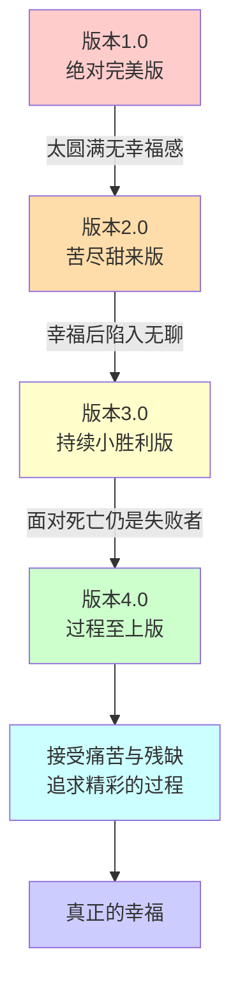
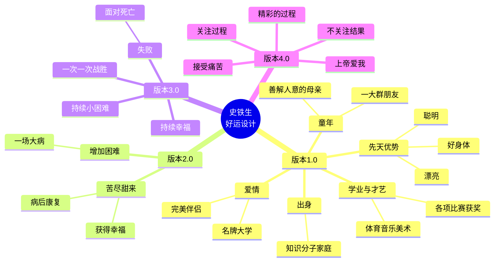

# 史铁生《我与地坛》

## 概述

今天突发奇想，想和大家一起来读一篇散文，是史铁生的《好运设计》。这篇散文堪称一个沉浸式的转世投胎指南。史铁生在这篇散文里，仔仔细细地带着读者来设计我们的下一世，怎么完美怎么来，怎么好怎么来，然后经过四个版本的更迭，会发生什么呢？

> [!info] 阅读方式
> 放松心情，当做是和史铁生一起做一个白日梦。

---

## 好运设计版本演进

### 版本 1.0：绝对完美版

#### 先天优势设计

| 优势 | 说明 |
|------|------|
| 聪明 | 天赋异禀 |
| 漂亮 | 容貌出众 |
| 好身体 | 健康体魄 |

#### 出生地选择

> [!quote] 史铁生的选择
> 最好的地方就是出生在一个普通知识分子家庭，你既能知晓人类文明的丰富璀璨，又能知道普通生活我们在活着有多么的坎坷和艰辛。

**优势：**
- 博览群书，进入高等学府深造的机会
- 可以浪迹天涯，可以自己去社会上闯荡

#### 童年设计

你从小有一大群男孩女孩做朋友，你们认认真真的吵架，翻脸，又哭着和好。你们会策划各种冒险，在外面玩得不亦乐乎，忘了回家。等你回家的时候，你父母却不会打你一顿。

> [!important] 母亲的教育方式
> 他教育你的方法不是来自于教育学，而是来自他对一切生灵乃至天地万物由衷的爱，由衷的站立与祈祷，由衷的镇定和激情。

#### 学业与才艺

**小学阶段：**
- 成天就是玩，成绩大概马虎过去就行了

**初高中阶段：**
- 天赋显现，各种比赛得奖
  - 物理竞赛
  - 化学竞赛
  - 奥数比赛

**特长：**
- 音乐、美术
- 体育：游泳、滑雪、溜冰、打篮球、踢足球、铁人三项

#### 爱情设计（18岁）

就读于一所名牌大学的王牌专业，所有的姑娘成群结队的来追你，或者所有的帅哥从这里排到了法国来追你。你一个眼神就让他们神魂颠倒，你随便说一句拒绝的话，他们就回到宿舍里哇哇大哭，但是你对他们都不喜欢。

就在这时，你遇到了一个真正心爱的人，你被他的美丽和自信所震慑了，被他优雅的灵魂和茁壮的身体惊呆了。几天之后，你们再次偶遇，终于认识，相爱，终成眷属。

> [!warning] 完美的阴影
> 太圆满，太顺利了，没有任何的挫折和坎坷，没有望眼欲穿的盼望，没有撕心裂肺的等待。既然这样，成功来的时候，你会有感慨万端的幸福吗？恐怕是不会的。

---

### 宇宙视角的思考

> [!quote] 史铁生
> 地球如此方便，如此称心的把月亮搂进了自己的怀中。没有了阴晴圆缺，没有了潮汐涨落，没有了距离，便没有了路程，没有了赤力，也就没有了引力。那是什么呢？很明白，那是死亡。

**结论：**
$$
\text{真正的幸运} = \text{享受着追寻与等待} + \text{波澜壮阔的挥洒} + \text{精彩纷呈的燃烧}
$$

> [!tip] 核心观点
> 恰恰死亡之前这波澜壮阔的挥洒，这精彩纷呈的燃烧，才是幸运者得天独厚的机会。

**幸福感的本质：**

所谓的幸福其实是**幸福感**，而没有痛苦和苦难，就无法有幸福感。我们刚才所设计的一切看似非常完美，但那只是舒适和平庸，而不是幸福。

---

### 版本 2.0：苦尽甜来版

#### 设计思路

给你增加一个困难，让你经过这个困难之后得到幸福。

#### 缺点的选择

| 缺点 | 是否可行 | 原因 |
|------|---------|------|
| 笨 | ❌ | 笨是终生的不幸 |
| 丑 | ❌ | 丑是无可挽回的局面，搞不好还会殃及后代 |
| 残疾 | ❌ | 残疾肯定也不行 |
| 狡猾 | ❌ | 存心算计别人的人是不懂得爱的 |

#### 最终选择：一场大病

这个病刚开始非常痛苦，你已经在病榻上躺了好多年了，没有办法起床，你非常绝望。你看见任何一个健康的人，你都羡慕他。你发誓，只要病好了，再怎么苦你都不会觉得苦。

> [!success] 奇迹降临
> 默默无闻又怎么样？一贫如洗又怎么样？只要病好了，你会爱这个世界，你会爱所有的人。

奇迹降临了，你恢复健康。不仅恢复了健康，你还精力旺盛，健步如飞。

> [!quote] 史铁生
> 大劫大难之后，人不该失去锐气，不该失去热度。你镇定了，但仍在燃烧；你平稳了，但更加浩荡。

**关键结论：**

- 只要能苦尽甜来，其实都不算坏事
- 其实都用不着甜得很厉害，只要苦尽也就够了
- 其实都用不着什么甜，苦尽了也就很甜了

> [!tip] 引用
> 马东：其实很苦的人，给他一点点甜就够了。

---

### 版本 3.0：持续小胜利版

#### 设计思路

不断给你设置小困难、小阻碍，又让你能够一次一次地战胜它们，就像卡 bug 一样，通过这种关卡的设置，让你一直获得幸福感，让你一直是一个胜利者。

> [!bug] 致命问题
> 一个人一直胜利，一直幸福，他就会认为自己是生命的主宰，乃至是宇宙的主宰，他无限膨胀，直到他遇到了一个再也无法战胜的问题。

**无法战胜的事物：死亡**

死神告诉你，你和芸芸众生一样，无法幸免，你前半生所谓的胜利，不过是一些运气，一些偶然，是完全微不足道的东西。

> [!danger] 最终困境
> 命运在最后跟你算总账了，他以一个无可逃避的困境勾销你的一切胜利。这时候，你就会变成最痛苦的人，你甚至比一生不幸的人还要痛苦。

---

### 版本 4.0：过程至上版

#### 对付绝境的办法

> [!quote] 史铁生
> 对付绝境的办法只剩他了：**过程**。

我们之前想象的什么光荣、伟大、壮烈、博学等等，所有你能想到的美好的词汇都聚焦在结果，而无论什么结果，都不是绝境的对手。

> [!important] 核心观点
> - 只要你最最关心的是目的而不是过程，你无论怎样都得落入绝境
> - 只要你仍然不从目的转向过程，你就别想走出绝境

**一个只想使过程精彩的人是无法被剥夺的：**
- 死神也无法将一个精彩的过程变成不精彩的过程
- 坏运也无法阻挡你去创造一个精彩的过程
- 相反，你可以把死亡也变成一个精彩的过程
- 坏运更利于你去创造精彩的过程

#### 最终设计

> [!quote] 史铁生
> 为了让你幸福，我们要给你痛苦。不仅要给你小痛苦，还要给你大痛苦；不仅要给你一时的痛苦，还要给你一世的痛苦。

**结尾：**

> 我看出来了，我们的设计只能就这样了，我不知道怎么办了，我不知道怎么办了，不知道还能怎么办。**上帝爱我，我们的设计只剩这一句话了。** 也许从来就只有这一句话吧。

---

## 结论

史铁生坐在轮椅上苦苦思索得出来的最终结论：

> [!success] 最终结论
> **生活只能是这样，最好的生活也只能是这样。幸福必须和遗憾和残缺并存。**

---

## 《我的梦想》

### 刘易斯：全世界最幸福的人

因为双腿不能走路，史铁生非常喜欢看各种体育比赛，尤其是田径比赛。他很喜欢美国一个黑人运动员，叫刘易斯，跑步跑得飞快。

> [!quote] 史铁生
> 当你看刘易斯跑步的时候，你会觉得他是从人的原始中跑来，要跑向人类的未来。在史铁生眼里，刘易斯就是全世界最幸福的人。

### 失败的启示

在一次奥运比赛上，刘易斯输了，成了第二名。看着刘易斯茫然的眼神，史铁生感到完全不可接受。

> [!important] 史铁生的思考
> 为什么他好像自己心里也失败了，甚至比刘易斯败得更厉害？

**我看见了所谓最幸福的人的不幸。刘易斯那茫然的目光，使我对最幸福的定义动摇了，继而粉碎了。**

> [!quote] 史铁生
> 上帝从来不对任何人施舍"最幸福"这三个字。他在所有人的欲望面前设下永恒的距离，公平地给每一个人以局限。如果不能在超越自我局限的无尽路途上去理解幸福，那么史铁生的不能跑与刘易斯的不能跑得更快就完全等同，都是沮丧和痛苦的根源。

### 最终领悟

在百米决赛的第二天，刘易斯在另外一个项目又胜利了，史铁生终于放下心来。

> [!success] 史铁生的感悟
> 看来他懂了，他知道奥林匹斯山上的神火为何而燃烧。那不是为了一个人把另一个人战败，而是为了有机会向诸神炫耀人类的不屈。

> [!tip] 核心格言
> **命定的局限尽可永在，不屈的挑战却不可须臾或缺。**

---

## 流程图

---

## 核心概念图

---

%%%
Internal Notes:
- 这篇文章关于《好运设计》，不是《我与地坛》，但笔记标题写的是《我与地坛》
- 需要确认是否是文章合集，还是标题有误
- 文章核心是关于幸福的本质思考
- 通过四个版本的"好运设计"来探讨什么是真正的幸福
%%%
