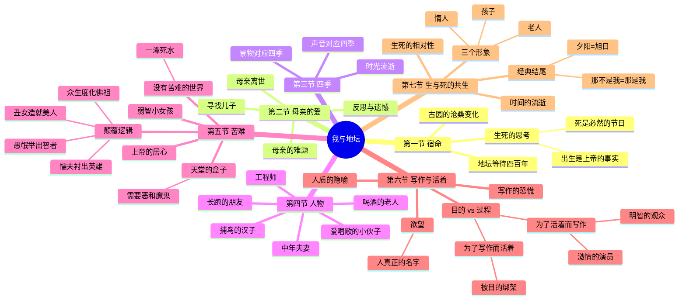
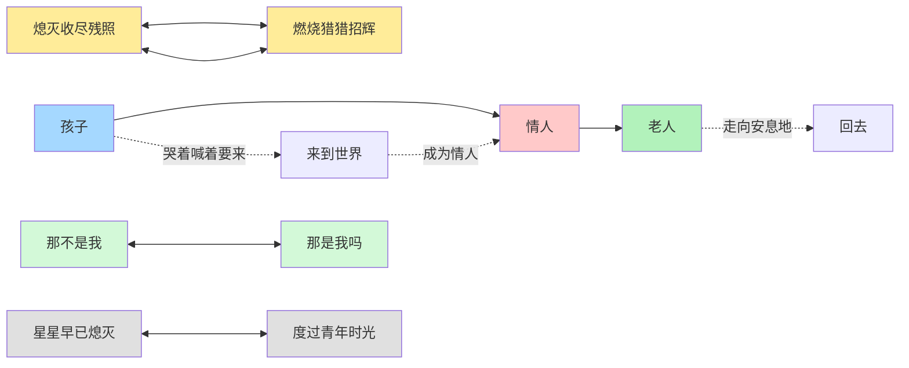
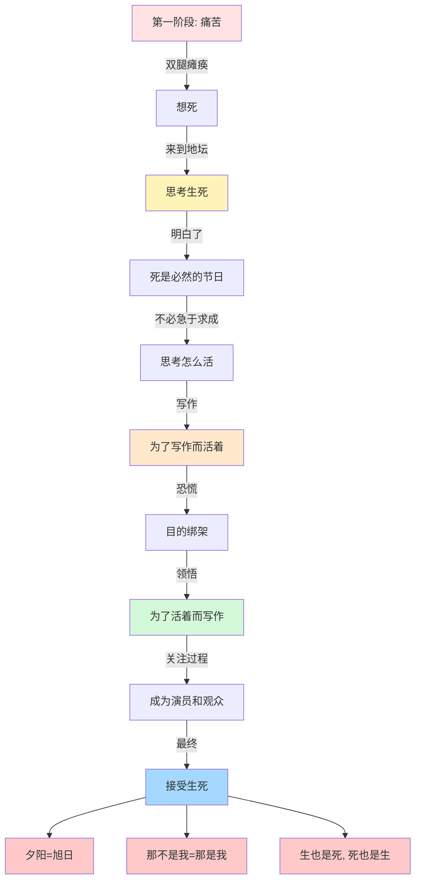
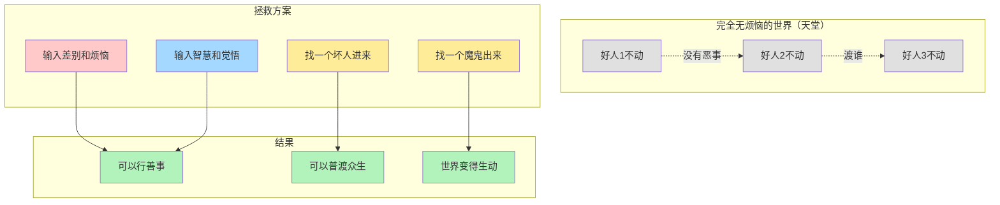

# 我与地坛

> [!info] 阅读须知
> 这篇文章读过再多遍，都不敢说已经理解了其中全部的奥义。短短的一篇文章，浓缩的是一个痛苦的生命长达十五年的求索。他带我们受苦，又带我们领悟，即使我们只能读懂其中的三分，也足以构筑一座坚固的避难所。

---

## 背景

史铁生是在**二十一岁最鼎盛的年纪**，双腿瘫痪。

- 痛苦不甘，无数次想到去死
- 死不了，只好摇着轮椅从早到晚呆在地坛里
- 地坛接纳了他的秩序，也回答了他毕生追问的问题：**人要不要死，又为什么活着？**

---

## 第一节：宿命般的联系

### 地坛的等待

> [!quote] 史铁生
> 地坛离我家很近，或者我家离地坛很近，因为地坛四百年前就坐落在那里了。

- 五十多年间，史铁生家搬过多次家，搬来搬去总在他周围
- 常觉得这中间有着**宿命的味道**
- 这古园仿佛是为了等我而历尽沧桑，在那等待了四百多年

### 古园的沧桑

四百多年里，地坛的变化：

| 变化 | 原貌 | 现在 |
|------|------|------|
| 古殿檐头 | 浮夸的琉璃 | 剥蚀了 |
| 门壁 | 炫耀的朱红 | 褪色了 |
| 高墙 | 完整 | 坍圮了 |
| 玉砌雕栏 | 精美 | 散落了 |

> [!quote] 史铁生
> 祭坛周围的老柏树愈渐苍幽，到处的野草荒藤也都茂盛的自在坦荡。这时候，想必我是该来了。

### 生死的思考

在地坛经年累月地想着生和死的问题：

$$
\text{出生} = \text{上帝交给的事实} \quad (\text{不再是可以辩论的问题})
$$

$$
\text{死} = \text{必然降临的节日} \quad (\text{不必急于求成})
$$

> [!success] 想明白了
> 一个人出生了，这就不再是一个可以辩论的问题，而是上帝交给他的一个事实。上帝在交给我们这件事实的时候，已经顺便保证了他的结果。所以，死是一件不必急于求成的事，死是一个必然会降临的节日。

---

## 第二节：母亲的爱

### 母亲的难题

瘫痪时，史铁生才二十一岁，黄金一样的年纪，却被宣判永远站不了、跑不了。

| 史铁生的状态 | 母亲的状态 |
|-------------|-----------|
| 痛苦、崩溃、发疯 | 不敢拦，也不敢问 |
| 拿着电线要电死自己 | 在园子里悄悄寻找儿子 |
| 把脾气撒在家人身上 | 儿子的不幸在她那儿加倍 |

> [!quote] 史铁生
> 那时，他的儿子还太年轻，还来不及为母亲想。他被命运击昏了头，一心以为自己是世上最不幸的一个，不知道儿子的不幸在母亲那儿总是要加倍的。

### 寻找儿子的母亲

有一次，史铁生坐在矮树丛里，就看到了母亲来找他：

- 找得非常着急，步履茫然又急迫
- 不知道母亲找了多久，还要找多久
- 出于莫名的倔强，出于莫名的羞涩，他没有喊住母亲
- 眼睁睁看着母亲在园子里一圈又一圈，茫然无措

> [!tip] 核心感悟
> 这么大一座园子，要在其中找到他的儿子，母亲走过了多少焦灼的路。多年后，我头一次意识到，这园中不单是处处都有过我的车辙有过我的车辙的地方，也都有过母亲的脚印。

### 母亲离世后的反思

当史铁生的第一篇小说发表的时候，母亲已经不在了。他满心哀怨又跑到地坛，质问地坛：

> 为什么母亲就不能多活两年？为什么他的儿子终于要碰开一条路的时候，他却不在了？难道他活着就只是为了受苦吗？

地坛的回答：

> 是上帝看母亲太痛苦了，看她受不住了，所以召她回去了。

---

## 第三节：四季的象征

> [!quote] 史铁生
> 他感到万事万物都是时间的象征，都是四季的象征。

### 园子里的声音与四季

| 季节 | 声音 | 景物 |
|------|------|------|
| 春天 | 祭坛上那个鸽子的哨声 | 一径小路，上空摇荡着串串杨花 |
| 夏天 | 蜻蜓的蝉鸣和杨树叶子哗啦啦的对蝉的取笑 | 一条耀眼而灼人的小凳，或者爬满了青苔的石阶 |
| 秋天 | 古殿檐头的风铃响 | 一座青铜的大钟，上面挂满了绿叶 |
| 冬天 | 啄木鸟随意而空旷的啄木声 | 林中空地上几只羽毛蓬松的老麻雀 |

---

## 第四节 & 第五节：园中的人物

### 中年夫妻

总是在薄暮时分来到园子里散步，逆时针绕着园子一圈又一圈。

> 在这十五年里，他们可能也注意到一个小伙子从青年步入了中年，而他们也从中年走到了老年。

### 其他人物

- **爱唱歌的小伙子**
- **总是穿行过去的女工程师**
- **喝酒的老人**
- **捕鸟的汉子**
- **致力于长跑的朋友**：无论怎么跑，无论跑多少名，都没有办法上榜

### 漂亮而不幸的小女孩

史铁生第一次来到园子里的时候就看到了她：

- 大概三岁，长得很漂亮
- 一个人在大栾树下面咿咿呀呀自说自话
- 捡从树上掉下来的像小灯笼一样的花簇
- 旁边还有一个七八岁的哥哥，捡各种小虫子哄妹妹开心

#### 苦难的降临

多年以后，史铁生再见到这个女孩，才发现：

> 这个女孩是智商有问题的，智力有问题的，一个弱智的小孩。她又在那棵大树下被一群孩子围攻、欺负、嘲笑。

> [!danger] 史铁生的心声
> 史铁生在心里惊叫，或者说哀嚎。他说世上的事常常使上帝的居心变得可疑，为什么他要造这样的一个世界？为什么他要播撒这么多的苦难？

### 关于苦难的思考

> [!question] 思考
> 那个小女孩肯定没有办法把这个世界想明白，可是又有谁能想明白呢？包括史铁生，他也说可是世界上如果没有苦难，世界又会变成什么样呢？

**没有苦难的世界：**

| 如果没有... | 就没有... |
|-----------|----------|
| 愚钝 | 机智 |
| 丑陋 | 美丽 |
| 残疾 | 健康的光荣 |
| 苦难 | 维系命运的纽带 |

> [!warning] 史铁生
> 如果在人间消除残疾，消除丑陋，所有人都一样健康、聪明、漂亮，那么世界将是一潭死水。

### 天堂的盒子

史铁生在另一篇文章里写过一个非常有意思的情节：

> 有几个人在对话，其中一个人拿出了一个盒子，这个盒子里是一个完全没有烦恼的世界，是消除了所有烦恼的世界。

**智者的回答：**

```
没有恶事，他们还要去行什么善事呢？
他们还要去渡谁呢？
```

**解决方案：**

```
输入无量的差别和烦恼进去拯救他们
同时输入无量的智慧和觉悟进去拯救他们
要找一个坏人进来，哪怕只有一个，去拯救这些好人
要找一个魔鬼出来，哪怕只有一个，去拯救圣者
```

> [!success] 史铁生的接受
> 所以，史铁生接受了一件事情：我们需要差别，我们需要苦难。人类全部的剧目需要它，存在的本身需要它。

### 谁来充任苦难的角色？

> [!danger] 最令人绝望的结论
> 由谁去充任那些苦难的角色？又有谁去体现这世间的幸福、骄傲和快乐？

**只好听凭偶然。偶然是没有道理好讲的，就命运而言，休论公道。**

### 颠覆过往逻辑的论证

> [!quote] 史铁生
> <p dir="auto">我常以为是丑女造就了美人。
> 我常以为是愚氓举出了智者。
> 我常以为是懦夫衬出了英雄。
> 我常以为是众生度化了佛祖。

$$
\begin{cases}
\text{丑女} \rightarrow \text{美人} \\
\text{愚氓} \rightarrow \text{智者} \\
\text{懦夫} \rightarrow \text{英雄} \\
\text{众生} \rightarrow \text{佛祖}
\end{cases}
$$

---

## 第六节：写作与活着

### 人质的隐喻

他把人生比作一场剧目，或者是一个阴谋：

$$
\text{身处其中的人} = \begin{cases}
\text{一场阴谋里的人质} \\
\text{一场剧目里的演员} \\
\text{一场剧目里的观众}
\end{cases}
$$

### 写作的开始与恐慌

起初他偷偷地写，但没想到很快就有了成就：

- 玩命的写，一腔热血
- 每天绞尽脑汁找灵感、找素材
- 觉得自己就是为了写作而活着的

**恐慌的降临：**

> 要是哪天没有素材了怎么办？要是哪天灵感枯竭了怎么办？

### 人真正的名字

> [!info] 史铁生
> 人为什么活着？为什么他要选择活下来？说到底是因为你还想要点什么，你还想图点什么。不管是爱情也好，成就感也好，价值感也好，**人真正的名字叫做欲望。**

### 目的 vs 过程

> [!success] 史铁生的领悟
> 活着不是为了写作，而写作是为了活着。

| 方式 | 追求 | 结果 |
|------|------|------|
| 为了写作而活着 | 目的 | 被目的绑架，变成一场阴谋里的人质 |
| 为了活着而写作 | 过程 | 成为人生剧目里有激情的演员和明智的观众 |

$$
\text{目的} = \text{虚无} = \text{永远无法到达的彼岸}
$$

$$
\text{过程} = \text{观察世界} + \text{提炼素材} + \text{思索情节} + \text{斟酌文字}
$$

> [!tip] 核心转变
> 当你的目光从目的转向过程，恭喜你，你就变成了人生这场剧目里一个有激情的演员和一个明智的观众。

---

## 第七节：生与死的共生

### 时间的流逝

有一天，史铁生在园子里碰到了一个老太太：

> 老太太看到他就很惊讶，说："呦，你还在这呢？"

> 我不记得你，我可记得你。有一回你母亲来这找你，看到我就问我有没有看见一个摇轮椅的孩子？

> 我忽然觉得，我一个人跑到这世界上玩，真是玩的太久了。

### 唢呐声的启示

他听见祭坛里传来一阵阵唢呐声，时而悲怆，时而欢快。

> 我想必有一天，我会听见有声音喊我回去。

### 三个形象

> [!quote] 史铁生
> 那时候，你可以想象一个孩子，他在那里兴高采烈的玩，还没玩够。你也可以想象一个老人，正平静的拄着拐杖走向自己的安息地。或者你可以想象一对情人，他们依依不舍，但终究要分离。很可能就是这样，**我同时是他们三个。**

$$
\text{我} = \text{孩子} + \text{情人} + \text{老人}
$$

### 生命与凋零

> 当牵牛花初开的时节，葬礼的号角就已吹响。生命从开始时就注定要凋零。

> [!important] 史铁生
> 但这不是一个悲观主义者的呻吟。相反，史铁生看到的是生和死的共存共生。

### 生死的相对性

> 生和死，不过都取决于我们的观察，取决于观察的远和近。

**例证：**

> 就比如一颗距离我们数十万光年的星星，其实早已经熄灭，他早已经死了，他却正在我们的视野里度过他的青年时光。

$$
\text{生也是死} \quad \text{死也是生}
$$

$$
\text{生和死} = \text{欲望牵引} \rightarrow \text{人间周而复始} \rightarrow \text{生生不息}
$$

### 经典结尾

> [!quote] 史铁生《我与地坛》结尾
> 但是太阳，他每时每刻都是夕阳，也都是旭日。当他熄灭着走下山去，收尽苍凉残照之际，正是他在另一面燃烧着爬上山巅，步散猎猎招辉之时。
>
> 那一天，我也将沉静着走下山去，扶着我的拐杖。有一天，在某一处山洼里，势必会跑上来一个欢蹦的孩子，抱着他的玩具。
>
> 当然，那不是我。
>
> 但是，那不是我吗？
>
> 宇宙以其不息的欲望，将一个歌舞练为永恒。这欲望有怎样一个人间的姓名，大可忽略不计。

$$
\text{夕阳} = \text{旭日}
$$

$$
\text{熄灭下山} = \text{燃烧上山}
$$

$$
\text{那不是我} = \text{那是我吗}
$$

---

## 思维导图



---

## 生死关系图



---

## 核心思想演化



---

## 天堂盒子示意图



---

%%%
Internal Notes:
- 这是一篇关于生死、母亲的爱、苦难意义的深度散文
- 分为七个部分，每一部分都充满哲思
- 核心思想：关注过程而非目的，生死共生，苦难赋予世界意义
- "那不是我，那不是我吗"是极其精彩的结尾
- 史铁生通过地坛这个空间，完成了对生命的思考
%%%
